I am a big believer in [Shape Up](), the up-and-coming method for agile software development. [In my current gig as a tech lead for an IIot product, I implemented this by hacking the established scrum process.]()

There are substantial possible gains in developer/product/designer collaboration. This a topic close to my heart since starting my first company in 2010. With Shape Up on the horizon, it is the first time in ages that I see the light at the end of the tunnel to deliver on promises made by the agile manifesto in its original manifestation.

Shape Up realizes this by reversing the Scrum approach of “Estimates” (fixed scope, variable time) and using an “Appetite” instead. Appetite means fixed time and variable scope.

For a feature with a “variable scope” to be implemented powerfully, the idea must be “shaped” accordingly (hence the name). With the cooperation of all relevant crafts, the idea is brought into a Shape that solves all open questions but is not so concrete that there is no room for flexibility.

Only then can it be implemented by small, autonomous teams.

## Quick start / Educate yourself

Because more and more questions come to me, how to get started and what resources are available, I have created this learning path in which I usually recommend the currently available resources.

```mermaid
graph TD
    subgraph Realization
        U("😭 Unhappy with the current state of things")
    end

    subgraph Education
        A("🍿 Shaping in a Nutshell")
        SDDC("🎧 Shape Up - Für alle, die Scrum nicht mögen")
        B("📚 Read the free Book")
        AL("🎧 Ryan Singer // Creator of the Shape Up Method")
    end

    subgraph Implementation

        P("🍿 YouTube Playlist")
        M("🧑🏻‍💻 Shape Up Practitioners Remote Meetup")
        R("🤙 Shaping in Real Life Course")
        S("🍿 Ship work that matters with Ryan Singer & Chris Spiek")
        F("✏️ Shape Up Forum")
    end


U --> A
A -->|german?| SDDC
SDDC --> AL
A --> AL
S--> M
B --> R
B --> S
S --> F
S --> P
AL --> B

click AL "https://alphalist.com/podcast/65-ryan-singer-creator-of-the-shape-up-method" _blank
click A "https://www.youtube.com/watch?v=h_8M23wVjXk" _blank
click SDDC "https://superdev.club/podcasts/shape-up/" _blank
click B "https://basecamp.com/shapeup" _blank
click M "https://www.meetup.com/de-DE/shapeup-practitioners/" _blank
click R "https://feltpresence.com/srl/" _blank
click F "https://youtu.be/jnW0fAIpLbo" _blank
click D "https://discourse.learnshapeup.com/" _blank
click P "https://youtu.be/h_8M23wVjXk" _blank
click S "https://www.youtube.com/watch?v=jnW0fAIpLbo" _blank
```

- [It would be best if you started by watching this short introduction from Ryan.][3] It convinces everybody why Shape Up is a good idea.
- [Next, you should read the online book available for free.][4]
- [If you are more into reading something german, there is also a podcast I did with SDDC.][5]
- Once you have a basic understanding, you can keep up to date with further resources in the [Shape Up Forum][6] or on youtube.
- [I started a playlist to filter out the relevant content][7] – I will add more things here as more content comes.
- There is also a Shape Up Practitioners Remote Meetup for real-time exchange. Every past episode is recorded and [available on YouTube][8].

For advanced learnings on how to transition to Shape Up from Scrum, there is a (recorded) Session with me as part of this format: [From Scrum to Shape Up – Grey Areas During Transit][9].

(Feel free to create a pull request if you know more resources, the repo link is down below.)

## Sparring with me

In the cozy Shape Up community, exchanging how exactly one implements the method is frequent. I am personally in exchange with practitioners from Argentina to New Zealand and love to connect with even more.

Therefore I am open to sparring and discussions with everybody who plans to implement the method and eager to learn from everybody who has already implemented it. Just book a slot in my calendar.

To serve this purpose, I keep my Friday afternoons free. [If you are interested, book a slot.][11]

## Hands-on / Consulting

For cases that need more attention than fits in a 1h sparring session, I also offer paid hands-on help to implement the method in organizations of all sizes and industries.

Just drop me a line: [consulting@v01.io][12].

## Keynote / Lightning Talk

If you want to introduce Shape Up to your company/team without getting too real, you can book me for a lighting talk or keynote.

After a short briefing talk, I will put together slides and give a presentation (remote or in person) for your situation based on my existing resources and experience.

This also goes to: [consulting@v01.io][13].

[3]: https://youtu.be/h_8M23wVjXk
[4]: https://basecamp.com/shapeup
[5]: https://superdev.club/podcasts/shape-up/
[6]: https://discourse.learnshapeup.com/
[7]: https://www.youtube.com/watch?v=h_8M23wVjXk&list=PLh2qZ3Zp-Xw2Q-H3lSjkEPhBYzvkDt6mY
[8]: https://www.youtube.com/channel/UCmIlKaQFptBeYmVcybA7yaw
[9]: https://www.meetup.com/shapeup-practitioners/events/289874608/
[10]: https://github.com/klausbreyer/shapeup-learning-path
[11]: https://calendly.com/v01_io/shape_up
[12]: mailto:consulting@v01.io?subject=shapeup-handson
[13]: mailto:consulting@v01.io?subject=shapeup-keynote
