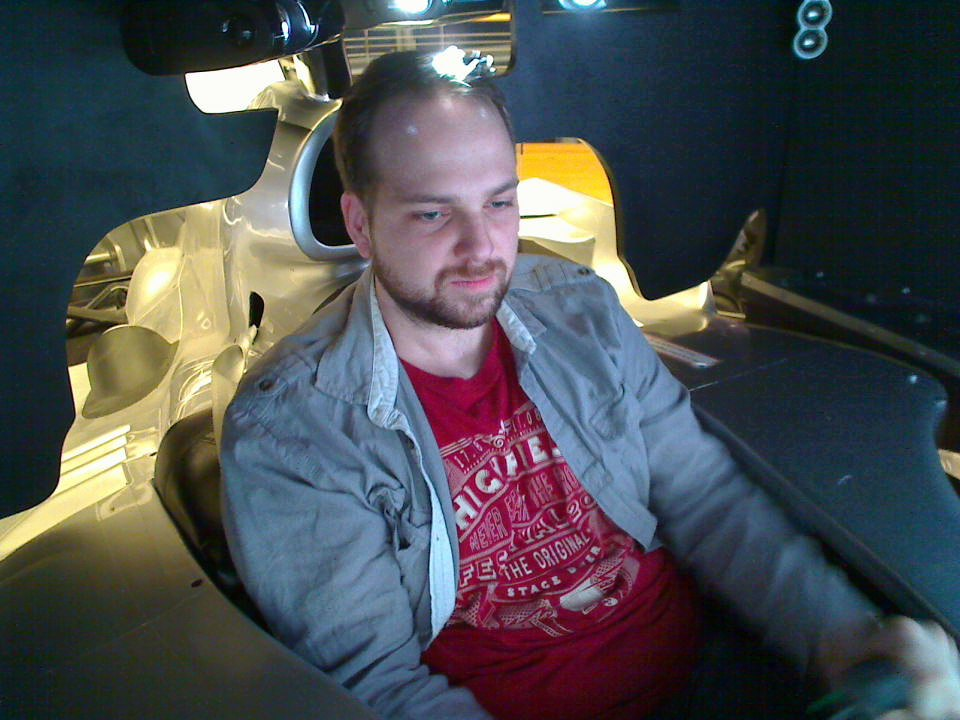
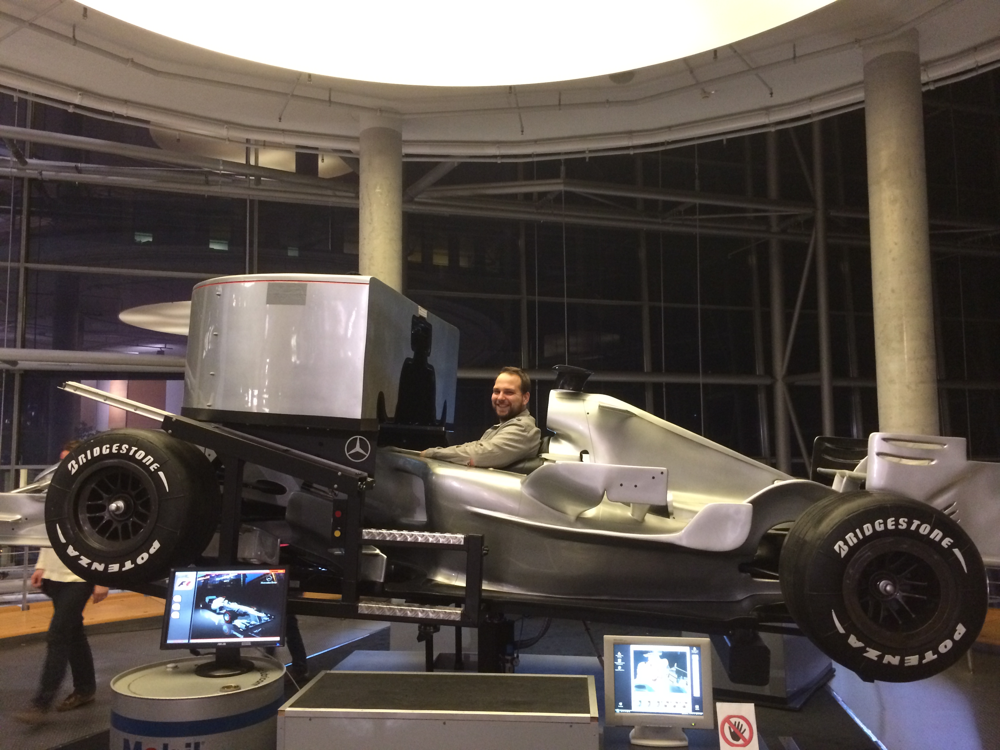
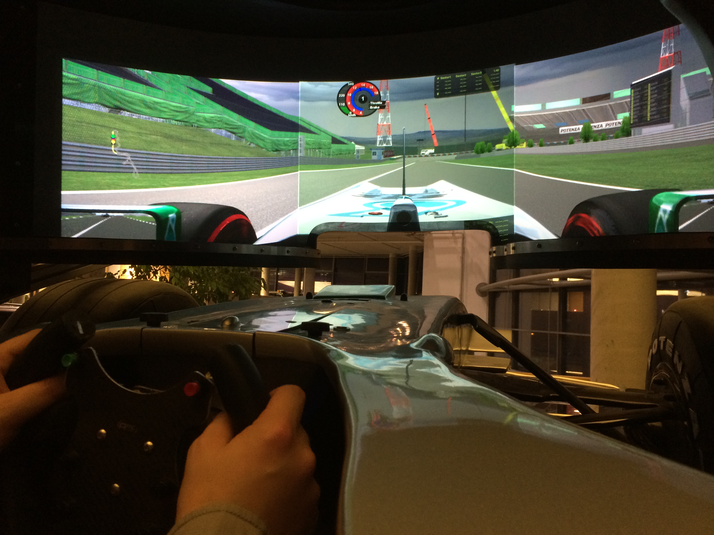
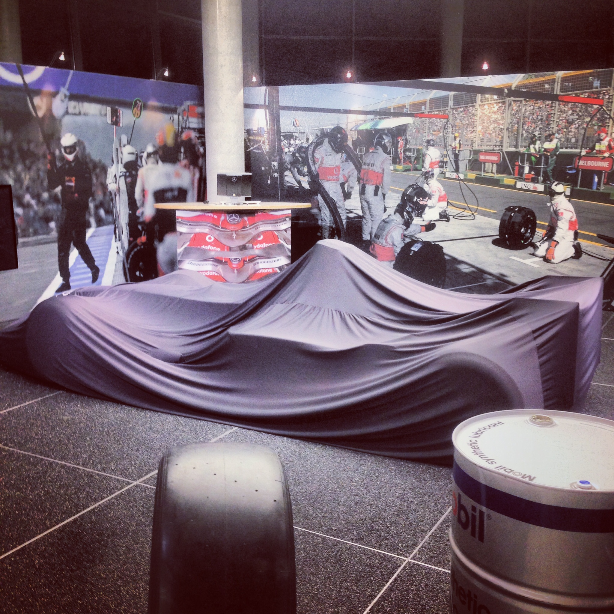

Ich hatte am Samstag das große Vergnügen den Formel1-Simulator von Mercedes auszuprobieren! Die Hauptstadtrepräsentanz von Mercedes am Salzufer in Charlottenburg beherbergt nämlich nicht nur eine Kletterwand über 4 Stockwerke, einen ebenso großen Wasserfall und eine Kinderwelt, sondern auch einen waschechten Formel1-Simulator. Und der hat es ganz schön in sich.

Man sitzt in einem Nachbau eines richtigen Formel1-Wagens. Und das heißt in erster Linie, dass man wenig Platz hat. Ich war mir gar nicht bewusst, dass man seine Füße dort komplett durchstreckt und das Lenkrad quasi auf den Oberschenkeln liegt. Also, ich wusste, dass die da wenig Platz haben – aber, dass es so wenig ist. Heftig. Das Lenkrad auf den Oberschenkeln ist aber kein Problem, da man nicht umgreifen muss.

Der Simulator an sich hat eine Kuppel, die bei Betrieb zurückfährt und das Cockpit fast komplett blickdicht abschließt. Innen ist ein Beamer mit Rundumblick. Das Lenkrad und die Pedale haben ordentliches Force Feedback. Man fühlt sich wirklich sofort wie im richtigen Auto. Das hat ganz schön geflasht. Als Strecke habe ich mir Suzuka ausgesucht, da das ja nach einstimmiger Fahrermeinung anscheinend die spannendste Strecke ist.

Die Grafik ist jetzt nicht auf Playstation-Niveau. Aber das direkte Feedback der Steuerelemente und der Fakt, dass man von seiner Umwelt sonst nicht viel mitbekommt, lässt einen ziemlich in Rennfieber kommen.

Zuerst hatte ich etwas Angst, dass mir schlecht werden könnte (wird es den Gästen dort anscheinend regelmäßig), weil sich so ein klein wenig das Gefühl wie beim Fliegen breitmacht. Also, wenn man nicht mehr genau fühlt, wo oben und unten ist. Das war weniger das Problem, allerdings sind mir nach 10 Minuten im Training erst mal Füße und Beine eingeschlafen. Das war nicht ganz so schlimm wie Übelkeit, aber doch etwas nervig.

Das deshalb auf 5 Runden verkürzte Rennen habe ich zwar nicht gewonnen, wohl aber habe ich viele Erfahrungen gewonnen ;) Als nettes Gimmick gibt es eine Urkunde sowie Schnappschüsse aus dem Inneren des Simulators.

Der Vollständigkeit halber: Der Anbieter ist nicht Mercedes-Benz direkt, sondern die [Simforce Motorsports GmbH](http://www.simforce-motorsports.de/). Gutscheine dafür gibt es bei [mydays\*](http://ad.zanox.com/ppc/?26958594C62000252T&ULP=[[http://www.mydays.de/geschenkidee/formel1-simulator-fahren?utm_source=Zanox&utm_medium=Affiliation_Networks]]) und [Jochen Schweizer\*](http://ad.zanox.com/ppc/?26958916C99836775T&ULP=[[http://www.jochen-schweizer.de/geschenke-maenner/formel-1-simulator,default,pd.html?src=zanox]]), und Konsorten.
