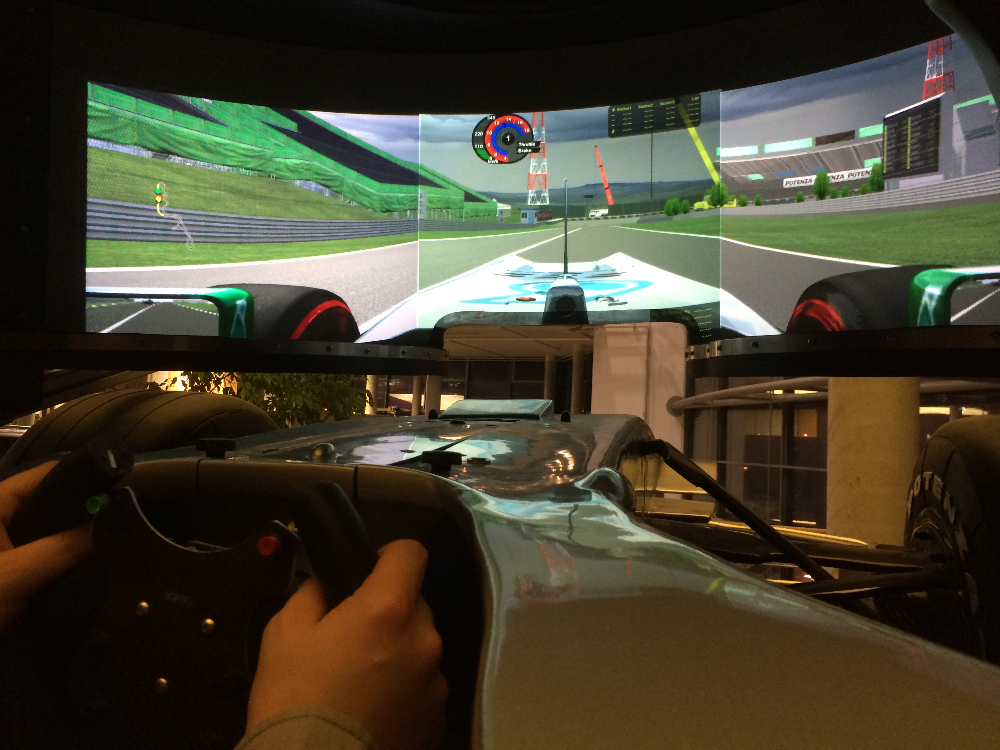
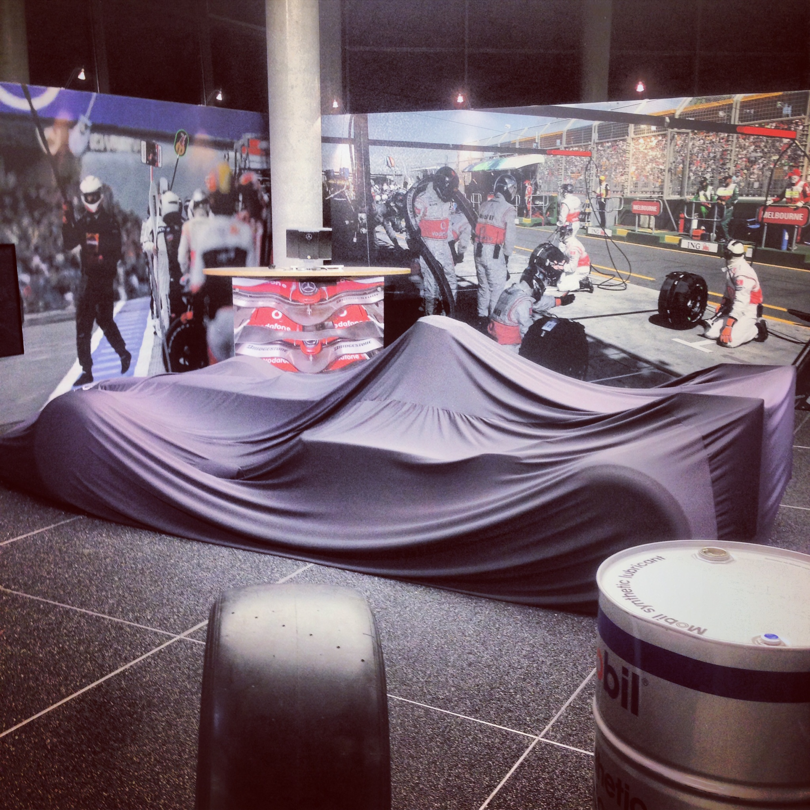

On Saturday, I had the great pleasure of trying out the Formula 1 simulator from Mercedes! The capital representation of Mercedes at Salzufer in Charlottenburg houses not only a climbing wall over 4 floors, an equally large waterfall, and a children's world, but also a genuine Formula 1 simulator. And it really packs a punch.

You sit in a replica of a real Formula 1 car. And that means first and foremost that you have very little space. I wasn't aware that you stretch your feet completely through there and the steering wheel practically lies on your thighs. Well, I knew they have little space there – but that it's so little. Intense. The steering wheel on the thighs isn't a problem though, since you don't need to grip around it.

The simulator itself has a dome that retracts during operation and almost completely seals off the cockpit from view. Inside is a projector with a panoramic view. The steering wheel and pedals have proper force feedback. You really feel like you're in a real car immediately. That was quite a flash. I chose Suzuka as the track, since that's apparently the most exciting track according to unanimous driver opinion.

The graphics aren't at PlayStation level now. But the direct feedback from the controls and the fact that you don't notice much of your surroundings otherwise gets you quite into racing fever.

At first, I was a bit afraid that I might get sick (apparently it happens regularly to guests there), because there's a slight feeling like when flying. That is, when you no longer feel exactly where up and down is. That was less of a problem, but after 10 minutes in training, my feet and legs fell asleep. That wasn't quite as bad as nausea, but still a bit annoying.

The race, which I shortened to 5 laps because of this, I didn't win, but I did gain many experiences ;) As a nice gimmick, there's a certificate as well as snapshots from inside the simulator.

For completeness: The provider is not Mercedes-Benz directly, but [Simforce Motorsports GmbH](http://www.simforce-motorsports.de/). Vouchers for this are available at [mydays\*](http://ad.zanox.com/ppc/?26958594C62000252T&ULP=[[http://www.mydays.de/geschenkidee/formel1-simulator-fahren?utm_source=Zanox&utm_medium=Affiliation_Networks]]) and [Jochen Schweizer\*](http://ad.zanox.com/ppc/?26958916C99836775T&ULP=[[http://www.jochen-schweizer.de/geschenke-maenner/formel-1-simulator,default,pd.html?src=zanox]]), and the like.
