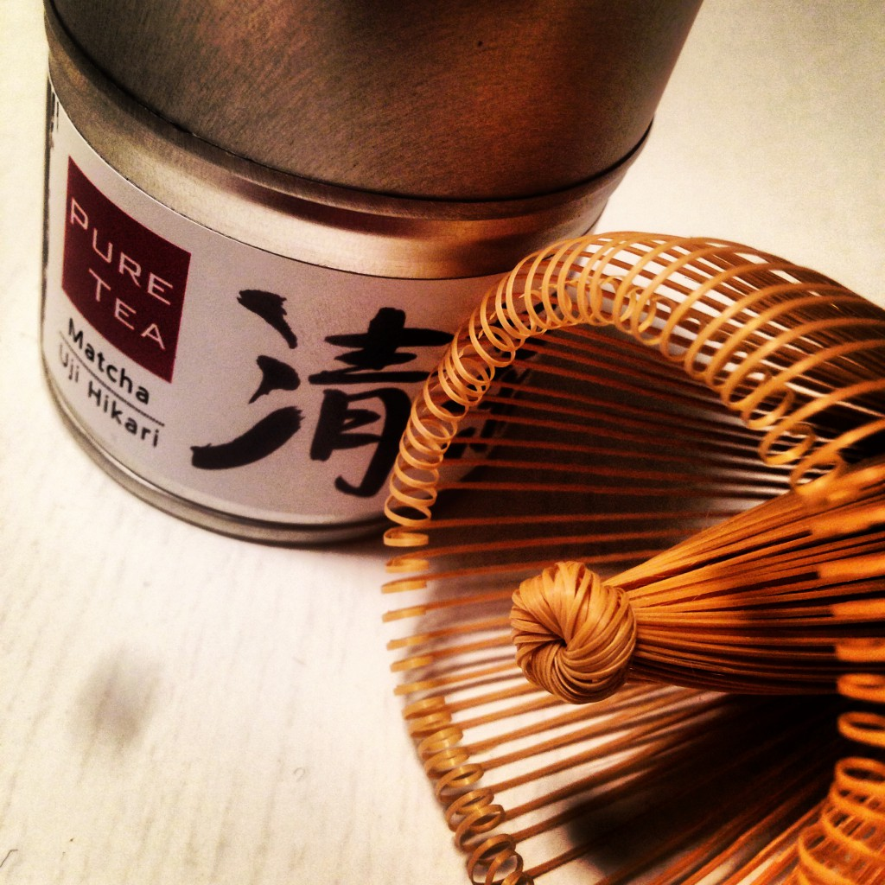

Und ich freue mich darüber sehr. Ich war vor langer Zeit schon mal ein Teemensch, doch dann bin ich vor ziemlich genau vier Jahren nach Berlin gezogen. Dort war das Wasser so unglaublich schlecht! Ich hatte viele verschiedene Grüntees, doch alle haben dann gleich geschmeckt. Ich hab sie dann weggeworfen.
Jetzt, 4 Jahre später, habe ich [mir einen Wasserfilter gekauft\*](http://www.amazon.de/gp/product/B003L20HI4/ref=as_li_ss_tl?ie=UTF8&camp=1638&creative=19454&creativeASIN=B003L20HI4&linkCode=as2&tag=mobizzle-21) und fange wieder an mit Tee. Habe mir sogar endlich mal einen Bambusbesen für Matcha gegönnt – früher als Student undenkbar.

Ich verköstige gerade das [allumfassende Probensortiment von Pure Tea](http://www.puretea.de/tee-shop/pure-tea-probensortimente/probensortiment-pure-tea-komplett.html), um wieder reinzukommen. Meine Erfahrungen findet ihr unter dem Hashtag [#pureteadi
