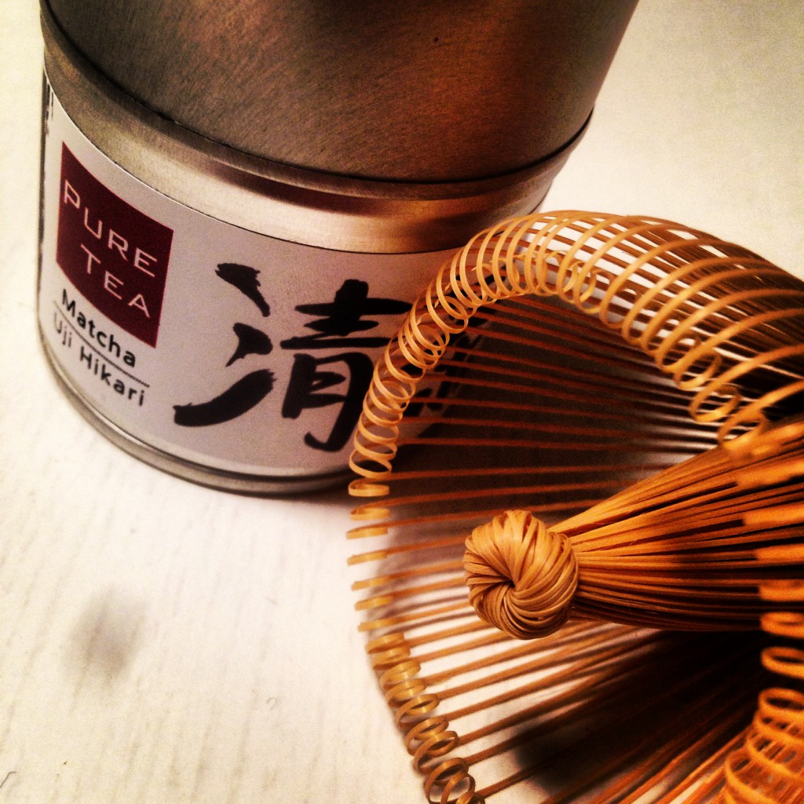

And I'm very happy about it. I was a tea person a long time ago, but then I moved to Berlin almost exactly four years ago. The water there was incredibly bad! I had many different green teas, but they all tasted the same. I ended up throwing them away.

Now, 4 years later, I've [bought myself a water filter\*](http://www.amazon.de/gp/product/B003L20HI4/ref=as_li_ss_tl?ie=UTF8&camp=1638&creative=19454&creativeASIN=B003L20HI4&linkCode=as2&tag=mobizzle-21) and I'm starting with tea again. I even finally treated myself to a bamboo whisk for matcha – unthinkable as a student back then.

I'm currently sampling the [comprehensive sample collection from Pure Tea](http://www.puretea.de/tee-shop/pure-tea-probensortimente/probensortiment-pure-tea-komplett.html) to get back into it. You can find my experiences under the hashtag [#pureteadiary](https://twitter.com/search?q=%23pureteadiary&src=typd).

\* Affiliate link
