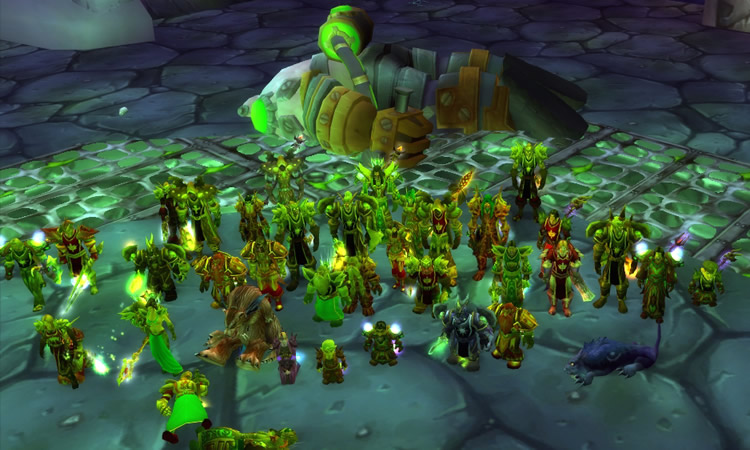

_World of Warcraft Grobbulus Kill_

Ich hatte von 2004 bis 2007 viel Zeit in der Welt von World of Warcraft verbracht. In zwei vollen Lebensjahren hatte ich 150 Tage “ingame” verbracht. Und ich bereue keinen einzigen Tag davon. Zum bald 10jährigen Jubiläum möchte ich mal ein kleines Resumé ziehen und erzählen, was das Spiel aus und mit mir gemacht hat.

## Organisation

In World of Warcraft organisiert man sich in Gilden. Das Ziel von Gilden ist es, Bosse mit Schlachtzügen zu töten, um Waffen und Ausrüstung zu bekommen. Wir waren damals schon eine ziemlich professionelle Gilde, welche beim Töten von Bossen auch einige sogenannte “Server Firsts Kills” verzeichnen konnte. In den Schlachtzügen mussten 40 Menschen verschiedenster Charakter-Klassen und verschiedenster Fähigkeiten koordiniert werden. Weiter mussten Ressourcen gemanaged und Manöver in Abstimmung aufeinander orchestriert werden. Und war auch nur ein einziger Mitspieler währenddessen Abendessen, haben 39 andere gewartet.

Aus dem Raid als wichtigstes Bestandteil meines Lebens wurde inzwischen eine Agentur. (Manch einer sieht da vielleicht gar keinen Unterschied..) Die Anzahl an Menschen allerdings ist die selbe. Und auch meine persönliche Rolle in diesem Konstrukt ist die selbe: Die Agentur habe ich genauso wie die Gilde mit gegründet. Schnell zu begeistern und bis zum Ende loyal, war ich bei beidem von Anfang an dabei, aber nie der alleinige Anführer. In beiden Fällen war es ein Kollektiv von drei bis vier Menschen, die die wichtigen Entscheidungen gemeinsam treffen/trafen. In beiden Fällen sind/waren sogar die unterschiedlichen Ausprägungen der Charakter sehr ähnlich!

## Persönlichkeitsentwicklung

Ich habe im Spiel einen ziemlichen Ehrgeiz entwickelt. Um in der Geschichte voran zu kommen, zwingt einen das Spiel förmlich dazu, immer die Ausrüstung haben zu wollen. Diesen Zwang hatte jeder. Aber irgendwie war ich dann doch immer noch einen Ticken ehrgeiziger als die meisten anderen und hatte auch abseits der Raids keine Kosten und Mühen gescheut, mir immer weiter das beste Equipment zu sichern.

Na gut, ich hatte auch die Zeit dafür. Zum Beginn war ich 18 Jahre alt und kurz vor dem Abi. Der Zivildienst danach verging wie im Flug und am Ende war ich 20 und im ersten Semester. Insgesamt also eine sehr prägende Phase im Leben eines Menschen. Es ist schwer zu sagen, ob ich durch das Spiel einen besonderen Ehrgeiz gewonnen habe oder ob diese Entwicklung ohnehin in dieser Phase passiert war.

Auch die ersten Beziehungen und größten Enttäuschungen hatte ich im Spiel. Die wirklich wichtigen Teenager-Krisen hatte ich alle virtuell durchlebt und als ich das Spiel abschaltete, war ich ein Mann.

## Real Life Migration

Apropos Ausstieg. Viele werden sich jetzt fragen, wie ich eben jenen geschafft habe. Wobei – Ausstieg hört sich ziemlich hart an. Es war eher eine natürlich Entwicklung. Ich würde sogar fast behaupten, hätte mich jemand externes mich zum Aufhören gezwungen, hätte ich vermutlich rebelliert.

Aber es kam von innen: Ich begann mit dem Studium von Software Engineering im Wintersemester 2006. Die Noten des Semesters waren alle so um 3.0. Damit war ich ziemlich unzufrieden, denn in der Schule hatte ich in Mathematik und Informatik immer nur 14 und 15 Punkte. Zusätzlich empfand den Stoff im Studium auch nicht wirklich schwer, also musste ich etwas ändern. Mit dem Start des Sommersemester zum 18.03. 2007 habe ich aufgehört. Das ist zusätzlich leicht gefallen, da zu diesem Zeitpunkt das erste Addon released wurde und auch viele andere aufhörten. (Hardcore Gamer mögen Addons in etwa so sehr wie der Teufel das Weihwasser.)

Im zweiten Semester kam dann die Ernüchterung: Nur durch das Nicht-Spielen hatte ich nicht automatisch gute Noten. Ich bin sogar zum ersten und einzigen Mal durch eine Prüfung gefallen. Ab dem dritten Semester begann ich dann auch wirklich zu lernen und rettete eine 2.6 der Bachelor-Vorprüfung zu einem Abschluss von 1.7.

## Was blieb

World of Warcraft war mehr als nur ein Spiel. Damals natürlich sowieso – es war unser ein und alles. Aber auch so im Nachhinein erzähle ich noch ganz gerne davon, denn ich habe viele Lektionen für das Leben dort gelernt.

Denn auch wenn es “nur ein Spiel” war – es waren echte Menschen. Im Umgang mit diesen entwickelte man, geschützt durch ein alter Ego, auch seinen eigenen Charakter weiter. Man wagte dort Sachen, die man im realen Leben vielleicht nicht wagen würde. Schließlich konnte man ja nichts verlieren – Jedenfalls weniger, als im echten Leben.

Der so erlernte Mut kann prägen. Ein ganzes Leben lang.
