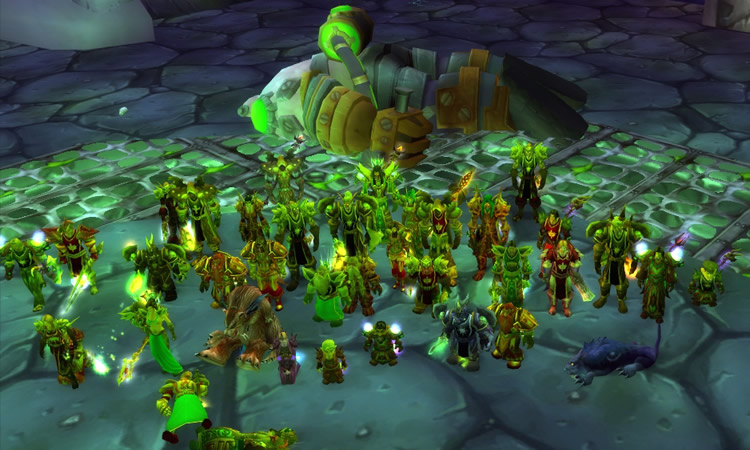

_World of Warcraft Grobbulus Kill_

From 2004 to 2007, I spent a lot of time in the world of World of Warcraft. In two full years of life, I had spent 150 days "ingame." And I don't regret a single day of it. As the 10th anniversary approaches, I'd like to draw a small résumé and tell you what the game has made of and with me.

## Organization

In World of Warcraft, you organize yourself into guilds. The goal of guilds is to kill bosses with raids to get weapons and equipment. We were already quite a professional guild back then, which could also record some so-called "Server First Kills" when killing bosses. In the raids, 40 people of various character classes and various abilities had to be coordinated. Furthermore, resources had to be managed and maneuvers had to be orchestrated in coordination with each other. And if even just one player was having dinner, 39 others had to wait.

From the raid as the most important part of my life, an agency has now emerged. (Some might not see any difference there..) However, the number of people is the same. And my personal role in this construct is also the same: I co-founded the agency just like the guild. Quick to inspire and loyal to the end, I was there from the beginning in both cases, but never the sole leader. In both cases, it was a collective of three to four people who made/make the important decisions together. In both cases, even the different manifestations of the characters are/were very similar!

## Personal Development

I developed quite an ambition in the game. To progress in the story, the game practically forces you to always want to have the best equipment. Everyone had this compulsion. But somehow I was still always a tick more ambitious than most others and had also spared no expense or effort outside of raids to secure the best equipment for myself.

Well, I also had the time for it. At the beginning, I was 18 years old and just before my Abitur. The civilian service afterward passed like in a flash, and at the end, I was 20 and in my first semester. So overall, a very formative phase in a person's life. It's hard to say whether I gained a special ambition through the game or whether this development would have happened anyway in this phase.

I also had my first relationships and biggest disappointments in the game. I had experienced all the really important teenage crises virtually, and when I turned off the game, I was a man.

## Real Life Migration

Speaking of exit. Many will now ask how I managed to do just that. Although – exit sounds quite harsh. It was more of a natural development. I would even almost claim that if someone external had forced me to stop, I probably would have rebelled.

But it came from within: I began studying Software Engineering in the winter semester of 2006. The semester grades were all around 3.0. I was quite dissatisfied with this because in school I had always only gotten 14 and 15 points in mathematics and computer science. Additionally, I didn't really find the material in university difficult, so I had to change something. With the start of the summer semester on March 18, 2007, I stopped. This was also easy because at that time the first addon was released and many others also stopped. (Hardcore gamers like addons about as much as the devil likes holy water.)

In the second semester came the disillusionment: Just by not playing, I didn't automatically get good grades. I even failed an exam for the first and only time. From the third semester onwards, I then really started to learn and saved a 2.6 in the Bachelor preliminary exam to a final grade of 1.7.

## What Remained

World of Warcraft was more than just a game. Of course, back then anyway – it was our be-all and end-all. But even in hindsight, I still quite like to talk about it because I learned many lessons for life there.

Because even though it was "just a game" – they were real people. In dealing with these, you developed your own character further, protected by an alter ego. You dared things there that you might not dare in real life. After all, you couldn't lose anything – at least less than in real life.

The courage learned in this way can shape you. For an entire lifetime.
