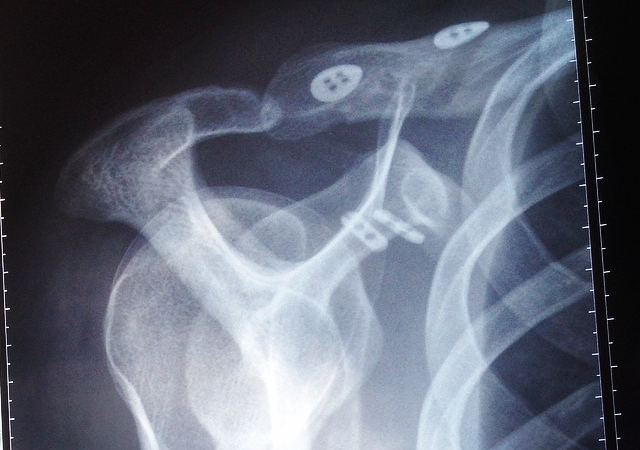

Wenn man, wie ich, einen Verkehrsunfall hatte, bei dem der rechte [Oberarmknochen die Bänder der Schulter sprengt](https://de.wikipedia.org/wiki/Schultereckgelenksverrenkung), dann dauert das nicht nur sehr lange bis man wieder mit zwei Händen einen Computer bedienen kann, sondern es ändert sich noch vieles mehr. Naja. Jedenfalls kann ich jetzt wieder einen Computer bedienen und damit auch welche Veränderungen damit in meinem Leben einher gingen.

- Im digitalen Alltag lernt man das iPad als wichtiges Arbeitsgerät zu schätzen. Direktes Touchen ist so viel einfacher als die Maus mit links zu bedienen. Und dank Autocorrect tippt es sich mit einer Hand auf dem iPad viel schneller als auf der Tastatur.
- Man lernt, die Zähne mit der linken Hand zu putzen. Da führt kein Weg drumrum. Ich habe keinen Hack oder Hilfe dafür gefunden. Das war das härteste.
- Es müssen einem die Brötchen aufgeschnitten werden. Das Bestreichen mit Butter geht gerade so. Frischkäse ist aber besser.
- Man kann keine Schnürsenkel mehr Knoten, sondern verwendet [Lock Laces\*](http://www.amazon.de/gp/product/B00DGFF82G/ref=as_li_tl?ie=UTF8&camp=1638&creative=19454&creativeASIN=B00DGFF82G&linkCode=as2&tag=mobizzle-21&linkId=PANXBLIQW5EUUU6D).
- Man darf keine Rucksäcke mehr tragen.
- Taschen sind auch kompliziert. Weil hat man nur einen Beutel oder Tüte dabei, ist schon keine mehr Hand frei.
- Man trägt vor allem Hosen mit vielen Taschen.
- Vorzüglich sind das kurze und weit geschnittene Hosen. Egal bei welchen Temperaturen.
- Denn Jeans kann man sich mit einer Hand nur unter immensem Aufwand und Schmerzen anziehen. An die rechte Hosentasche kommt man erst recht nicht mehr ran.
- Dafür hat man normalerweise in der Bahn viel Platz durch die [Orthese](http://www.sporlastic.de/de/pdf/07255.pdf), die die Schulter ruhigstellt.
- Außer manchmal, dann nicht. Und dann nervt es richtig.
- Das Konzert der liebsten Death Metal Band schaut man eher von hinten als von vorne.
- Man lernt, dass Späti-Verkäufer in Kreuzberg hilfsbereiter als Kassiererinnen in Mitte sind.
- Trotzdem kauft man lieber Getränke mit Plopp-Verschluss statt mit Kronkorken.
- Man kann keinen Parmesan mehr reiben, sondern kauft ihn in fertiger Pulverform. Und ist jedes mal wieder enttäuscht.

Das schlimmste daran ist aber ja, dass man nichts tun kann, außer nichts zu tun. Und dann muss man auch noch Hilfe annehmen! Und manchmal hat man darauf keine Lust. Aber man bereut es schnell.
