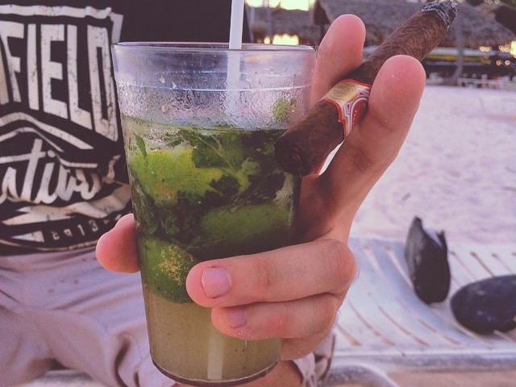

Der Mojito in seiner Heimat, der Karibik, ist zwar großartig, aber in Pauschalurlaub auch pauschal viel zu klein.

Noch dazu verstehen in der Dominikanischen Republik die Barkeeper beim Bestellen nur Spanisch – in jeglicher Hinsicht. Man freute sich ja schon, wenn überhaupt kam, was bestellt wurde.

In meiner Verzweiflung ob der kleinen Drinks begann ich, immer zwei Mojito auf einmal zu bestellen. Durch die kleinen Gläser hatte ich allerdings immer mehr vom Bodensatz als Drink. Irgendwann hatte ich dann die glorreiche Idee, meinen Mojito als “Grande” zu bestellen. Allerdings war dies anscheinend ein Novum und ich musste bei der Wahl des Glases des Öfteren intervenieren. Ich wiederholte dann mehrmals “Grande! Grande!” während ich mit den Händen eine vertikale Spanne von ca. 20-30 cm Länge gestikulierend aufzeigte. Nach 1-2 Tagen hatten die meisten Barkeeper dann verstanden, dass ich einen besonders großen Mojito wollte.

Ein Barkeeper hatte aber anscheinend besonders Spaß an mir. Er erkannte mich schon auf die Entfernung, setzte sein dickstes Grinsen auf und formte mit seinen Händen die von mir eingeführte Geste, während er fleißig “Grande?! Grande!!!” wiederholte und sich dumm und dusselig darüber freute.

Es reichte dann nur noch ein kleines Nicken und ich bekam immer einen mir genehmen Mojito. Ein Traum!

Leider konnte ich ab diesem Zeitpunkt dann auch gar nichts anderes mehr bestellen. Ich hatte Angst, die aufgebaute Beziehung zum Barkeeper und all die freudige Hoffnung in seinen Augen wieder zunichte zu machen. Ich hatte ihn ins Herz geschlossen. Endlich wurde ich verstanden!

In mir machte sich eine Vertrautheit breit, wie sie bei Stamm-Dönerbuden erst nach über einem Jahr entsteht.

Sein Name war Oscar. Gefühlt hatte er an 7 Tagen der Woche, rund um die Uhr, Schicht. Zum Ende hin wuchs die Spanne seiner Geste auf 50-60 cm an und er gab sich redlich Mühe, immer noch größere und seltsamere Gläser für mich zu finden. Wäre ich noch einen Tag länger geblieben, hätte er mir meinen Mojito bestimmt in einem mallorcawürdigen Putzeimer kredenzt. Und ich hätte mich nicht beschwert.
