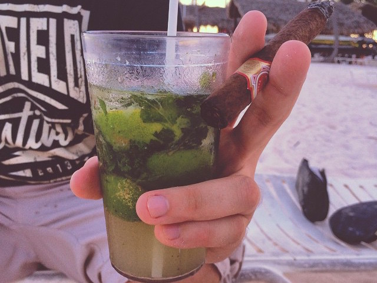

The Mojito in its homeland, the Caribbean, is indeed magnificent, but in package holidays it's also generally much too small.

On top of that, in the Dominican Republic, the bartenders only understand Spanish when ordering - in every respect. You were already happy if what you ordered actually arrived.

In my desperation over the small drinks, I started ordering two Mojitos at once. However, due to the small glasses, I always had more sediment than actual drink. At some point, I had the brilliant idea of ordering my Mojito as "Grande". However, this was apparently a novelty and I had to intervene several times in the choice of glass. I then repeated "Grande! Grande!" several times while gesturing with my hands to show a vertical span of about 20-30 cm in length. After 1-2 days, most bartenders had understood that I wanted an especially large Mojito.

But one bartender apparently had particular fun with me. He recognized me from a distance, put on his biggest grin, and formed the gesture I had introduced with his hands, while eagerly repeating "Grande?! Grande!!!" and laughing himself silly about it.

From then on, just a small nod was enough and I always got a Mojito to my liking. A dream!

Unfortunately, from that point on, I couldn't order anything else anymore. I was afraid of destroying the relationship I had built with the bartender and all the joyful hope in his eyes. I had taken him to heart. Finally, I was understood!

A familiarity spread within me, like the kind that only develops at regular kebab places after over a year.

His name was Oscar. It felt like he had shifts 7 days a week, around the clock. Towards the end, the span of his gesture grew to 50-60 cm and he honestly tried to find ever larger and stranger glasses for me. If I had stayed one more day, he would definitely have served me my Mojito in a Mallorca-worthy cleaning bucket. And I wouldn't have complained.
