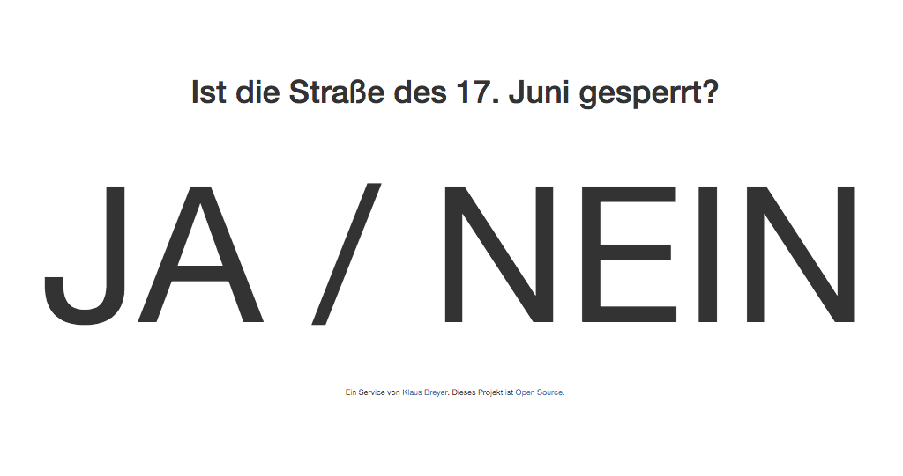

Update: The project is currently offline. More on this: below.

I have [this great side project, which shows in real time if the street of June 17th is closed](https://istdiestrassedes17tenjunigesperrt.de/).

## 2015: VIZ & PHP Symfony

So far, I have been able to generate the statement by automatically checking whether "June 17th" is mentioned on the [VIZ's construction and closures page](https://viz.berlin.de/verkehr-in-berlin/baustellen-und-sperrungen/). Something at VIZ changed in the last few months, though.
I can't say if this project was the trigger, but scraping the data was made more difficult. (And that despite the [Open Data Initiative of Berlin](https://daten.berlin.de)!)

## April 2020: Google Maps Distance Matrix API & Rewrite in Node

I have adapted my project and no longer get the data from this public entity. I now make a request to the [Google Maps Distance Matrix API](https://developers.google.com/maps/documentation/distance-matrix/intro?hl=de) and in real time check if the shortest route between Brandenburg Gate and Ernst Reuter Square is less than 5km and can be travelled in less than 15 minutes.

The statements are therefore even more accurate. In the future, I plan to extend this with a "history" API that captures the historical data for this.
Furthermore, I have moved the open-source project to a serverless infrastructure, it now scales arbitrarily - even at the largest major event. There probably won't be one this year, but I am prepared for the next World-Olympia-New Year's Championship.
Spoiler Alert: it is (due to corona) of course not closed right now.

## April 2021: Rewrite in Go

I rewrote the API in Go. Anyone interested in the details can retrieve the raw data I generated via [the API](https://europe-west3-istdiestrassedes17tenjunigespe.cloudfunctions.net/availability) directly and live. The query to the Google Distance Matrix API remains the same as last year. However, I have made a small optimization: I now use geocoordinates to determine the route even more precisely.

In the frontend, I have removed all tracking and 3rd party bloat from Google Analytics, Twitter, and Facebook.

[There is now also an API documentation at Postman.](https://documenter.getpostman.com/view/6113937/TzJu8cPL)

There are still no signs of upcoming events - but I am excited.

[You are warmly welcome to learn from this open source project and make it even better.](https://github.com/apiapi-rest/istdiestrassedes17tenjunigesperrt)

## April 2022: Temporary End

I have taken the project offline for now. Google Maps has been getting better and I need more time to focus on other projects. Therefore, I will not invest any more time in operation for the time being. But: Stay tuned!

## Media Mentions <!-- wp:audio {"id":2283} --> Interview with me at the Sunday drivers on radioeins <!-- /wp:audio -->

- [In January, June 17th is only open for six days](http://www.bz-berlin.de/berlin/mitte/in-january-june-17th-is-only-open-for-six-days)
- [Website shows whether the Street of June 17th is closed – Berlin.de](https://www.berlin.de/tourismus/infos/5045705-1721039-website-street-of-june-17th-closed.html)
- [This page tells you if the Street of June 17th is closed](https://mitvergnuegen.com/2017/this-page-tells-you-if-the-street-of-june-17th-is-closed/)
