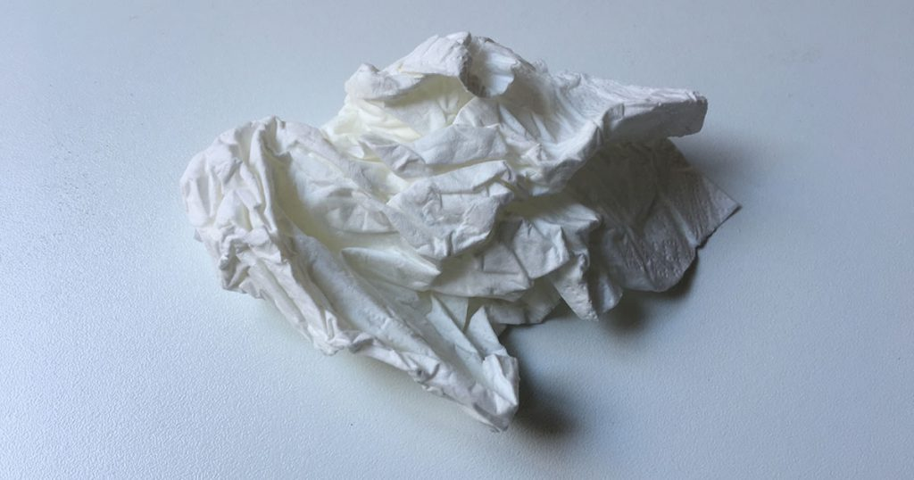

Heute möchte ich mal über eine Erkältung reflektieren, die ich unlängst überwunden habe. Freitag Morgen begann ein Martyrium von 3 Tagen Halsschmerzen, gefolgt von 3 Tagen leichtem Schnupfen. Soweit, so gut. Die Symptome hat man ja schnell im Griff mit Tantum Verde, Gelomyrtol etc.

## Die Psyche

Mein eigentliches Problem: Ich kann mich während einer Erkältung überhaupt nicht leiden. Es ist wirklich ein Drama:
Alles lenkt einen so schnell ab. Ich konnte keinen Podcast in der Bahn hören, weil die Nebengeräusche so stark abgelenkt haben.
Man kann sich keine 5 Minuten konzentrieren. Programmieren ist gar unmöglich.
Was gerade noch geht, ist Termine wahrnehmen. Mit Menschen sprechen. Da funktioniert man einfach. Aber Spaß macht es keins.

## Meine These

Da man in unserer modernen Welt ständig unter Druck steht und abliefern muss, bietet die Erkältung eine willkommene Ausrede einmal ganz runterzufahren. Im Alltag muss man sonst jede Deadline erreichen und an jedem Meeting teilnehmen – nun hat man endlich eine Ausrede, sich zurückzuziehen und endlich mal etwas zu verschieben.

Schaltet der Körper bewusst in einen Notmodus, weil das Immunsystem geschwächt ist? Oder setzt diese eigentlich ja nur kleine körperliche Schwächung erst einen Impuls für die Psyche, einmal komplett runterzufahren?

## Männerschnupfen

Ich glaube in dieser These liegt auch der Grund für den sogenannten Männerschnupfen: Endlich hat der Mann auch mal einen Grund, verletzlich zu sein. Er muss mal nicht den Müll raus bringen und darf so lange schlafen, wie er will.

Aber um ehrlich zu sein: Ich persönlich will nicht mal Mitleid. Ich will einfach nur meine Ruhe.

Übrigens: Wer sich bei einer Erkältung richtig einigeln will und gar nicht mehr aus dem Haus raus möchte: Bei Prime Now kann man auch PS4 Spiele bestellen. In meinem Fall ist die Erkältung passenderweise auf den Release von [No Man's Sky](http://amzn.to/2bPpD6c) gefallen. ;)
