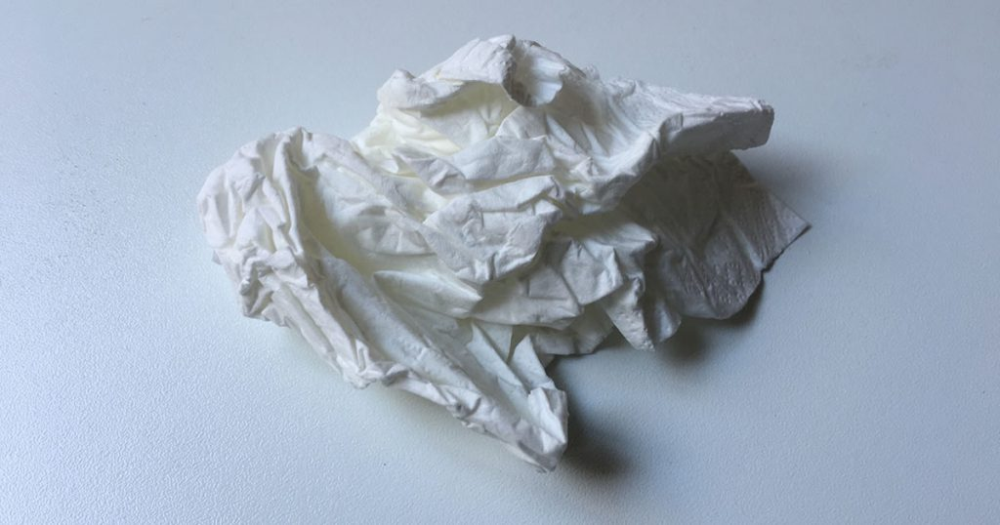

Today I want to reflect on a cold that I recently overcame. Friday morning began a 3-day ordeal of sore throat, followed by 3 days of mild runny nose. So far, so good. You can quickly get the symptoms under control with Tantum Verde, Gelomyrtol, etc.

## The Psychology

My real problem: I absolutely cannot stand myself during a cold. It's really a drama:
Everything distracts you so quickly. I couldn't listen to a podcast on the train because the background noise was so distracting.
You can't concentrate for even 5 minutes. Programming is completely impossible.
What still works is keeping appointments. Talking to people. You just function there. But none of it is fun.

## My Theory

Since we're constantly under pressure in our modern world and have to deliver, the cold offers a welcome excuse to completely shut down. In everyday life, you otherwise have to meet every deadline and attend every meeting – now you finally have an excuse to withdraw and finally postpone something.

Does the body consciously switch to emergency mode because the immune system is weakened? Or does this actually only minor physical weakness first set an impulse for the psyche to completely shut down?

## Man Flu

I believe this theory also lies at the heart of the so-called man flu: Finally, the man also has a reason to be vulnerable. He doesn't have to take out the trash and can sleep as long as he wants.

But to be honest: I personally don't even want pity. I just want my peace and quiet.

By the way: If you want to really hibernate during a cold and not leave the house at all: You can also order PS4 games from Prime Now. In my case, the cold conveniently coincided with the release of [No Man's Sky](http://amzn.to/2bPpD6c). ;)
