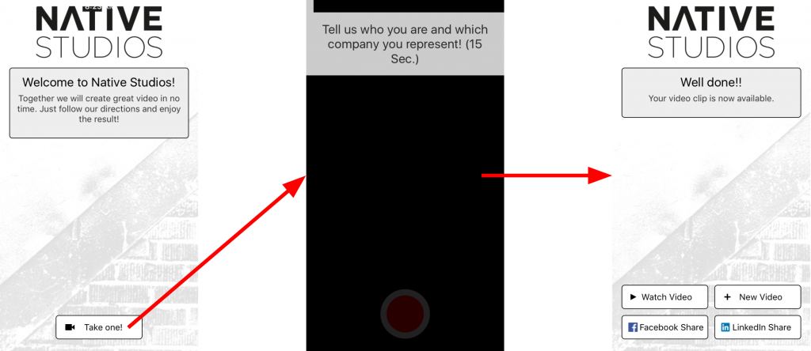
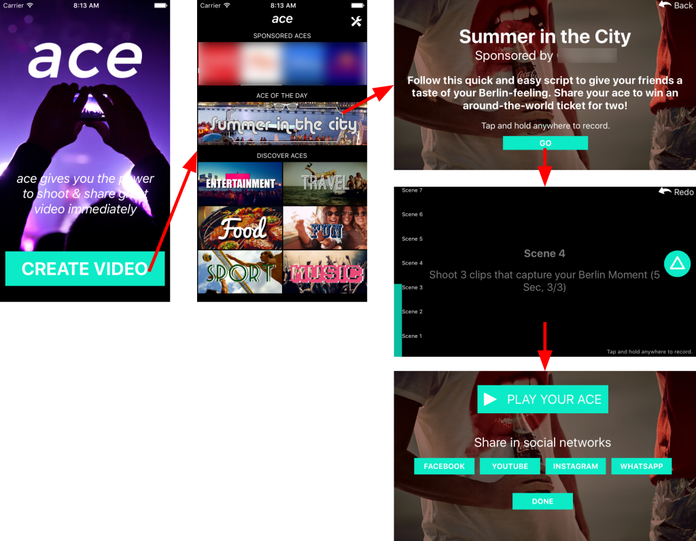

Letztes Jahr kamen die Jungs des frisch gegründeten Startups [Native Studios](http://www.native-studios.com/) mit einer App-Idee auf mich zu, die sich inzwischen [creAce](http://creace.io/) nennt und in einem mustergültigen Prototyping Prozess implementiert wurde. Diesen Prozess möchte ich heute einmal vorstellen.

## Idee

Die grundsätzliche Idee dahinter ist, dass Nutzer Unterstützung bekommen hochqualitativen Video-Content zu produzieren, indem sie beim Aufnehmen Regie-Anweisungen sehen und die eigenen anschließend mit professionell produziertem Übergängen und Content einer Produktionsfirma zusammengefügt werden.

Inzwischen ist die App Live in sowohl einer [Android](https://play.google.com/store/apps/details?id=com.nativestudios&hl=de)- als auch einer [iOS](https://itunes.apple.com/de/app/creace-video-app/id1134621325?mt=8)-Version live.

Die Ergebnisse werden euch überraschen - probiert es mal aus! Aktuell gibt es auch eine Promo zum neuen [NERVE Film](http://nerve-film.de/creace_challenges/), wo Nutzer Filme mit Hilfe der creAce App Videos produzieren und veröffentlichen.

Einen guten Überblick [über das Produkt gibt es auf dem Blog von Schröder Schömbs](http://www.schroederschoembs.com/newsroom/creace/). Bei mir geht es heute hauptsächlich um den Prozess.

## Prozess Erst mal 1 Prototyp.

Gestartet wurde mit einem ganz kleinen Prototypen, welcher lediglich 3 Manntage benötigte. Dieser Prototyp konnte ein einziges Templates mit Regieanweisungen “aufnehmen” und die aufgenommenen Videos zusammen mit professionellem Content hintereinander abspielen. Es gab noch keine Menüführung, sondern es wurde lediglich der Kern der Wertschöpfung abgebildet.

Challenges: Erste Entscheidungen zum grundsätzlichen Aufbau wurden ganz pragmatisch getroffen. Unter anderem hat sich das Touch to Record bewährt und wurde bis zum Release beibehalten.
Am meisten hat der Prototyp dazu beigetragen, dass auch im Gründerteam über Dinge gesprochen wurde, die man so vorher noch nicht auf dem Radar hatte. Offensichtlichster Punkt war die Frage nach den großen Upload- und Download-Volumen, die so eine Video-App mit sich bringt - sowohl technisch, als auch des Userinterfaces wegen.

### Prototyp bekommt Menüführung und mehrere Templates

Im nächsten Prototyp gab es eine Basic Menüführung und zwei funktionierende Templates.

An diesem Schritt haben wir uns sehr viel darüber unterhalten, welche Herausforderungen es beim generativen Erstellen von Videos gibt. Das Schneiden von professionellem Video-Content lässt sich eben schlecht in eine Schablone pressen, da der Cutter doch sehr viele Entscheidungen intuitiv und nach Gefühl trifft. Das macht der Cutter vor allem bei Übergängen (beispielsweise geht die Hintergrundmusik bei Schnitten leicht versetzt hoch und runter). Zusätzlich kann bei User Generated Content nicht immer davon ausgegangen werden, dass die Inhalte immer die selbe Länge haben.
Ergebnis war eine eigene Template-Notation und ein fest definiertes Featureset für die Film-Kreativen, welche ein Rendering-Service programmatisch verarbeiten kann.

Challenges: Eine Balance an Abstraktion zu finden, welche zwar noch ein großartiges Ergebnis zulässt aber trotzdem auch automatisiert von einem Renderingservice erstellt werden kann.
Wir bewegen uns im Bereich der Teil-Automatisierung von Video-Rendering. Wir haben hier keine Invididual-Leistung wie in einem professionellem Avid like Schnittprogramm, wo ein Cutter jedes mal ein Unikat macht und alles händisch anpassen kann und will. Wir bewegen uns aber auch nicht im Bereich der Voll-Automatisierung, wo wir am Ende ein App nur für ein einziges Template mit wechselndem User-Content programmieren. Es muss konfigurierbar und wiederverwendbar sein.

### Prototyp mit releasenaher User Experience

Mit dem ganzen Team und UX-Experten haben wir gebrainstormed, was die finale App an Featureset benötigt. Anschließend wurden die Features in releasekritisch und eine spätere Roadmap unterteilt.

Mit dem releasekritischen Featureset und den bisherigen Learnings der Nutzung wurde der Prototyp um ein möglichst releasenahes Interfaces erweitert und ca. 200 externen Testern ausgeliefert. Wertvolles Feedback!

Challenges: Eine normale App möchte man im Portrait Modus nutzen, doch was ist mit aufgenommenen Videos? Die möchte man vermutlich ja im Querformat haben. Wie halten wir den Nutzer bei der Stange, während das Video im Hintergrund hochgeladen und verarbeitet wird? Müssen wir etwas für Nutzer vorsehen, die gerade kein W-Lan haben?

Die Antworten dazu könnt ihr in der Release-Version selbst herausfinden. ;)

### Livegang

Inzwischen hatte das Startup den ersten Kunden gesigned und damit einher endlich auch ein Launchtermin. In 10 Wochen wurde dann die App aus ihrem Prototyping-Stadium heraus bis zum Release für Android und iOS inkl. API und kompletter Rendering-Pipeline von einem 5-köpfigen Entwicklerteam verteilt in Berlin und Frankfurt gestemmt.

Zusätzlich wurde im Hintergrund auf der kreativen Seite auch schon massiv an der Erstellung von Templates und professionellem Content gearbeitet.

## Technologie

Schon der erste Prototyp wurde in React Native (damals v0.13) implementiert.
Die API setzt auf PHP/MySQL und die Frameworks [Laravel](https://www.laravel.com/) und [Dingo](https://github.com/dingo/api).
Das Rendering zu beschreiben wäre nochmal ein komplett eigenes Thema, aber im Grunde setzt es auf dem [Amazon Simple Workflow Service](https://aws.amazon.com/de/swf/) und das [MLT Framework](https://www.mltframework.org/) auf - gescripted durch Node.JS.

Ich begleitete das Startup zu Anfangs durch Erstellung der Prototypen und während der Entwicklungsphase als Berater, Dev-Ops/Infrastruktur und Code-Reviews.
