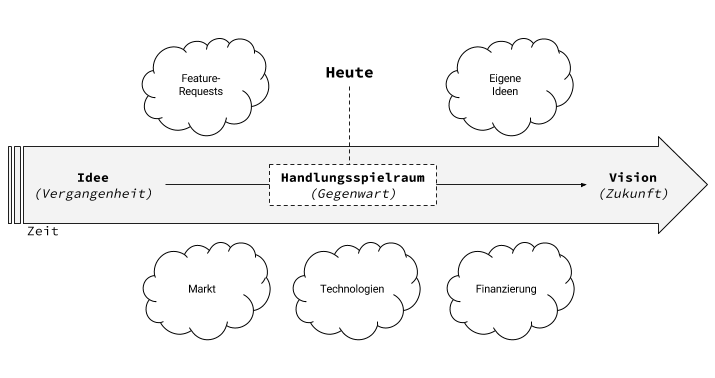

Viele Menschen haben Geschäftsideen. Oft sind es schlechte. Viel zu oft allerdings sind es utopische. [Es soll das nächste Uber für X werden. Oder noch besser: das nächste Instagram.](https://klaus-breyer.de/blog/entrepreneurship/das-neue-x-fuer-y-ueber-startups-die-plattformen-sein-wollen/1810)

Dazu erst mal: Es ist super unrealistisch, ein solches Plattform-Geschäftsmodell wie Instagram mit dem Luxus mehrerer Millionen Venture Kapital für Reichweite aufzubauen, bevor Geld verdient werden muss. In Deutschland erst recht.
Die Idee kondensieren
Grundsätzlich gilt: Es existiert ein Problem, für dessen Lösung ein Kunde zu Bezahlen bereit ist.

Ziel ist möglichst wenig Zeit in die Produktentwicklung zu stecken, bis erstes Geld verdient wird. Oder bis zumindest theoretisch Geld verdient werden kann. Wenn nämlich der erste Wurf kein Geld einbringt, stehen die Prioritäten ganz schnell anders.

Ganz wichtig ist hierbei, auch die Verbreitung der Idee gleich mit zu denken. Das Produkt kann noch so gut sein, die Menschen müssen auch davon wissen.

Mögliche Fragen:

- Was ist der Kern der Idee?
- Wie generiert eine solche Idee Wert für jemanden, der dafür Geld zu bezahlen bereit ist?
- Was ist das kleinstmögliche Produkt, um diesen Wert zu generieren?
- Wie erreichen wir die Menschen, die dafür zu Zahlen bereit sind?

Die Vision aufbauen

Wenn das Unternehmen erst einmal läuft und das erste Geld verdient ist, fallen einem selbst und den Kunden plötzlich 100te tolle Features ein. Jetzt ist Ruhe gefragt.

(Darüber, dass Feature-Requests von Kunden am besten erst mal komplett ignoriert werden, sondern es sich viel eher darauf fokussiert werden sollte das zugrunde liegende Problem zu verstehen, könnte ich nochmal einen ganz eigenen Blogeintrag verfassen. Mache ich euch bestimmt bald)

Wirklich wichtig ist allerdings, dass ein Gefühl dafür entwickelt werden muss, wo der Markt und das eigene Unternehmen in 5 Jahren sein wird. Dann (und erst dann!) können Features richtig priorisiert werden.

Mögliche Fragen:

- Welche potentiellen Partner gibt es in Zukunft?
- Zu welchen heute etablierten Playern wird das Unternehmen eine Alternative sein?
- Welche heute utopischen Technologien werden bis dahin realistisch einsetzbar sein?
- Entstehen neue Standards? Können selbst neue Standards gesetzt werden?
- Wie entwickelt sich der Markt? Verteilen sich sich Budget-Töpfe um?
- Welche potentiellen Partner gibt es, die in großem Maßstab von unserem System profitieren können?
- Nach welchen Mitarbeitern müssen wir Ausschau halten?

Den eigenen Handlungsspielraum als [Sliding Window](https://de.wikipedia.org/wiki/Sliding_Window) verstehen
Wenn das eigene Unternehmen als Zeitstrahl verstanden wird, dessen Ursprung die Idee und dessen Ziel die Vision ist, so existiert immer eine gewisser Handlungsspielraum, in dem agieren werden kann.

Der Handlungsspielraum ist so zu verstehen: Es muss nicht immer alles heute implementiert werden, aber nächstes Jahr könnte es schon zu spät sein.

Inheränt: Manche Dinge sind in Zukunft einfacher zu lösen sind als sie es heute sind. Frameworks für künstliche Intelligenz / Machine Learning entwickeln sich beispielsweise aktuell so rasant, dass hier durchaus stark abgewägt werden muss, zu welchem Zeitpunkt man diese implementiert. Es ist durchaus eine Option erst in 2-3 Jahren damit zu arbeiten, dann allerdings mit einem Bruchteil der dafür notwendigen personellen Kapazitäten.

Es sollen und müssen allerdings die Produktentscheidungen schon darauf auslegen sein, indem z.B. erst einmal mit semi-automatischen Mechanismen gearbeitet wird, die später dann in in eine 100% Automatisierung überführt werden können.

Parallel entwickelt sich der Markt ja auch weiter. Budgets steigen, Anforderungen ändern sich. Auch hier sind fundierte Prognosen wichtig.

Andererseits muss auch verstanden werden, dass manche Züge einfach abgefahren sind. Weil beispielsweise andere Player schneller waren.

Mögliche Fragen:

- Zahlt dieses Feature auf unsere Vision ein?
- Können wir das nächstes Jahr günstiger implementieren?
- Welche Bedingung des Marktes muss erfüllt sein, damit wir dieses Feature implementieren?
- Haben wir heute schon das Kapital um das Feature zu entwickeln?
- Welche Mitarbeiter stelle ich heute ein? Was decke ich lieber erst mal über Freelance ab?
- Lohnt sich dieses und jenes überhaupt noch?

Im Einklang
Ziel ist es das eigene Handeln im Einklang mit allen externen Faktoren zu verstehen. Es muss einem bewusst sein, dass sich ständig neue Möglichkeiten ergeben und es muss einem bewusst sein, dass man nicht vergangenen Chancen nachjagen sollte.

Mir hilft eine solche Einordnung in ein großes Ganzes immer sehr gut, um Prioritäten festzulegen.
