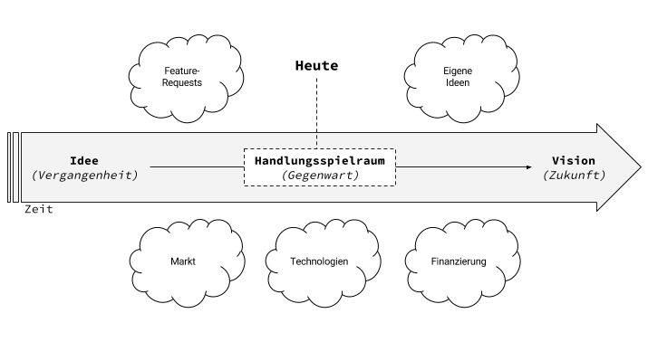

Many people have business ideas. Often they are bad. Far too often, however, they are utopian. [It is supposed to become the next Uber for X. Or even better: the next Instagram.](https://klaus-breyer.de/blog/entrepreneurship/das-neue-x-fuer-y-ueber-startups-die-plattformen-sein-wollen/1810)

First of all, it's incredibly unrealistic to build a platform business model like Instagram with the luxury of several million venture capital for reach before having to make money. Even more so in Germany.
Condensing the Idea
In principle: There is a problem for whose solution a customer is willing to pay.

The aim is to invest as little time as possible in product development until the first money is made. Or at least until theoretically money can be made. Because if the first shot doesn't bring in money, the priorities change very quickly.

It is very important to consider the spread of the idea along with the product. The product can be as good as it gets, but people need to know about it.

Possible questions:

- What is the core of the idea?
- How does such an idea generate value for someone who is willing to pay for it?
- What is the smallest possible product to generate this value?
- How do we reach the people who are willing to pay for it?

## Building the Vision

Once the company is up and running and the first money is made, you and your customers suddenly think of hundreds of great features. Now is the time for calm.

(That customer feature requests should best be completely ignored at first, and instead focus should be on understanding the underlying problem, I could write a whole separate blog entry about. I'll do that for you soon)

What's really important, though, is to develop a sense for where the market and your own company will be in 5 years. Then (and only then!) can features be properly prioritized.

Possible questions:

- Who are potential partners in the future?
- To which established players will the company be an alternative?
- Which utopian technologies today will be realistically usable by then?
- Are new standards emerging? Can we even set new standards ourselves?
- How is the market developing? Are budget pots being redistributed?
- Who are potential partners who can benefit from our system on a large scale?
- What kind of employees should we be looking for?

Understanding Your Own Scope of Action as a [Sliding Window](https://de.wikipedia.org/wiki/Sliding_Window)
If your own company is understood as a timeline, whose origin is the idea and whose goal is the vision, there is always a certain scope of action in which you can operate.

The scope of action is to be understood as follows: Not everything has to be implemented today, but next year it could already be too late.

Inherent: Some things will be easier to solve in the future than they are today. Frameworks for artificial intelligence / machine learning are currently developing so rapidly that you should definitely consider when to implement them. It is quite an option to only start working with it in 2-3 years, but then with only a fraction of the personnel resources required.

However, product decisions should already be geared towards this, by working with semi-automatic mechanisms at first, for example, which can later be converted into 100% automation.

At the same time, the market continues to evolve. Budgets increase, requirements change. Here, too, well-founded forecasts are important.

On the other hand, it also needs to be understood that some trains have simply left the station. Because other players were faster, for example.

Possible questions:

- Does this feature contribute to our vision?
- Can we implement this cheaper next year?
- What condition of the market must be met for us to implement this feature?
- Do we already have the capital to develop the feature today?
- What employees do I hire today? What do I rather cover via freelance for now?
- Is this or that even worth it anymore?

## In Harmony

The aim is to understand your own actions in harmony with all external factors. You have to be aware that new opportunities are constantly arising and you have to be aware that you shouldn't chase after past opportunities.

Such a classification into a big picture always helps me a lot to set priorities.
