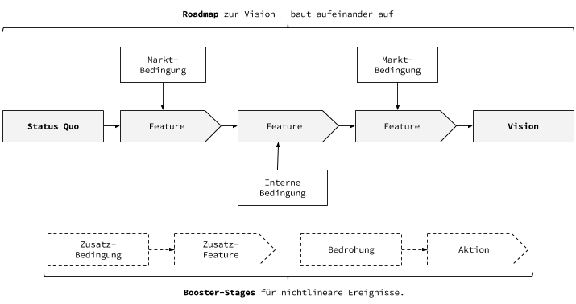

Anyone presenting me today with a perfectly thought-out plan for a successful company would make me laugh. There is no foolproof plan for success in our complex world, as external circumstances are constantly changing. The success of a company results from being adaptable as well as bringing a grand vision.
Roadmap
The actual roadmap should lead from today's standpoint [to the grand vision](https://klaus-breyer.de/blog/entrepreneurship/von-der-idee-zur-vision-der-eigene-handlungsspielraum-als-sliding-window/1808). Without detours. The individual core features should build on each other.

Before certain features can be rolled out, certain conditions sometimes have to occur. These can be both external (e.g., certain market maturity) and internal factors (right personnel, data base, etc.). The indicators on which this is based should be noted as a condition. Otherwise, your own roadmap merely appears to be pulled out of thin air.

For the sake of clarity, I represent external and internal conditions above and below the roadmap.
Booster-Stages
In addition to the productive roadmap to the big vision, there are always factors in a complex market that crossfire. But an entrepreneur has probably already dealt with these and can define corresponding booster stages, which can be ignited separately from the actual roadmap in case of emergency.

These can be both concrete and emerging threats in market dynamics, which one has already prepared for, or also planned alternative business or billing models, which do not change anything on the actual roadmap vision.

The booster stages can be just at the back of your mind, as well as concrete plans in the drawer, waiting for implementation.
Living Document
Everything doesn't always have to run serially and fully planned. As already written, there is not always the perfect plan. Every roadmap must be adjusted regularly.

Such a framework is, by the way, a good basis for talks with investors. It presents the depth of the vision along with a realistic plan. At the same time, individual boosters still offer enough room to show flexibility towards potential threats and additional opportunities.
