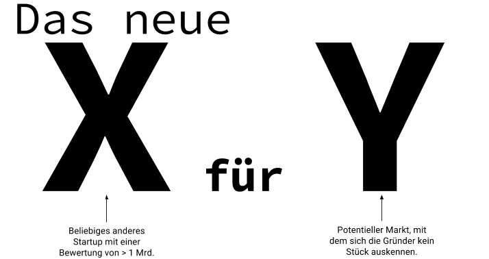

On average, I'm pitched a business idea once a week. Either to have me on the team, to book me as a consultant, or just because - "one should really" to get feedback.

One pattern that runs through all bad ideas: We will be the new X for Y.

X usually stands for a platform and Y for a market that the person has not really dealt with yet.

Fictitious example: "We will be the new Uber for delivery services!"

[Apart from the fact that not even Uber is profitable](http://mobilbranche.de/2016/12/uber-wachstumskurs-mio), this all sounds harmlessly ambitious at first. But let's take a closer look.

Platform Mechanics

For me, a platform is defined by different parties coming together, each pursuing different interests. Usually, there is a demand-side and a seller-side. The demand-side has a need for which they want to spend money, and the seller-side can meet this need directly or indirectly.

Example 1: Airbnb

At Airbnb, people who want to rent out their apartment (seller-side) are brought together with people who want to rent an apartment (demand-side) and directly linked.

The company must grow on both sides simultaneously and has a massive initial effort to build the platform, because always two views on the system are necessary.

Example 2: Instagram

Instagram offers businesses that want to place their advertising (demand-side) an inventory of app users, who gain added value through use in the form of pretty pictures and thus pay indirectly.

The company first builds an inventory that is not directly monetizable. It provides users with a tool that solves a problem for them. Then a big bet is made on the future, as it is still unclear how and if the inventory can be marketed.

Platform Product Development and Activation

The typical chicken-and-egg problem: In order for potential customers to be able to spend money, a certain inventory must always be available that can be bought. So the company must operate and think on two tracks.

It not only needs experts for both parties during product development, but also for activation. The two parties usually differ drastically. With Instagram, these are photographers as users and media people as paying customers. A hip mobile platform on one side and a technically functional interface to book advertising times on the other.

With AirBnB, the buyer-side is mainly SEO driven, as their need to rent something usually comes spontaneously. On the other hand, providers who want to generate permanent income must first be informed about the existence of the product.

I don't even want to go into the further network effects needed to build a functioning platform (today).

Tip for First-time Founders

These are all solvable problems. The main problem is primarily the increased capital requirement already in an early phase of the company. Nevertheless, prioritization and trade-offs must be constantly made between both sides. Rarely does a solution feel 100% right. Well, but when does it ever?

My tip for first-time founders: Solve a single problem for a single target group and let them pay you directly for it. This is a much simpler business model than platforms, pays off much shorter term, and is easier on the nerves.
