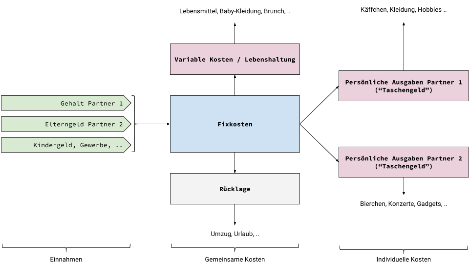

Before our child was born, my wife and I earned roughly the same amount and we split expenses roughly. When parental leave and child benefits created a financial gap, my wife didn't want to feel like she was being "supported."

Since I always think in simple and scalable processes (even in private life), I took on the challenge and developed for us not only an organized but also a non-discriminatory financial organization system.

Our setup: 1 wife, 1 husband, 1 child (<1y)

## System

### Income

All income, regardless of source, is deposited into a joint account (for fixed costs). This is actually relatively easy to change with any employer.

- Partner 1 salary
- Partner 2 salary
- Business income
- Royalties
- Child benefit
- Parental allowance

### Fixed Costs

This fixed costs account is a joint checking account that covers recurring items. These are characterized by the fact that they usually have long terms and that you can't get rid of them so quickly.

Examples:

- Rent
- Utilities
- Electricity
- All insurance
- Crossfit
- Daycare

From this account, a fixed amount is also distributed monthly to our 3 "operational" accounts.

At the end of each month, what's left over is finally transferred to the reserve account.

Here there are also many other options to actively manage finances, such as a regular savings plan for the child or your own investment strategies.

### Variable Costs / Living Expenses

This is our "operational" account from which we pay for shared, irregular, and spontaneous expenses. Both partners have their own checking and debit cards for this.

Examples:

- Groceries
- Household items
- Everything for the baby (diapers, clothing, toys, etc.)
- Shared activities (brunch, dinner, etc.)

Since there are no contractual obligations on this account, leisure fun simply stops when the money is gone.

### Personal Expenses / "Pocket Money"

Now each partner also gets "pocket money" which is at their free disposal.

Examples:

- Hobbies
- Concerts
- Gadgets
- Apps
- Beer
- Coffee
- Clothing

Under no circumstances do subscriptions or other regular obligations run here. Practically, this means that each person simply uses their "old" account for this.

### Reserve

For our reserves, we use a joint savings account that is used for one-time larger (hopefully planned) expenses.

Examples:

- Vacation
- Furniture
- Moving
- Larger gifts

Through the stable difference between total income and fixed costs, it can also be calculated how the reserves will develop over the course of the next year, for example to set a budget for a vacation.

## Advantages

We've been using this setup for almost exactly a year now and are both quite happy with it.

- Fixed costs are always covered – nothing lets you sleep better.
- The smaller operational budgets provide overview in everyday life.
- Simple calculation of how reserves grow.

In addition to the totally practical advantages of this system, we solve quite pragmatically (at least for us privately) the issue of different salary levels and the resulting power imbalance in financial decisions.

## Addendum: "Time Accounts" for Parental Leave / Part-time

Just as we split our income, we also split childcare. If I work a 60-hour week, for example, and my wife takes care of the child during that time, it counts for us just as if she had also worked a 60-hour week. So to speak, "work on the child."
We then split the remaining shared time 50/50, meaning I don't have special protection at home when I'm at the office for a long time. My wife also had a long day with the child.

Finally, "work on the child" is just as important and exhausting as gainful employment. It's definitely more responsible, since it's about a person and their development.
