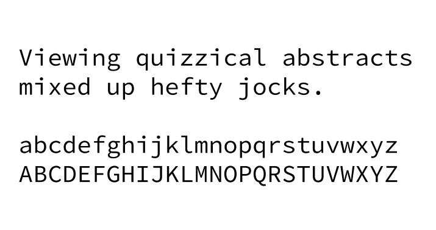

Ich persönlich bin ja großer Fan der [Source Code Pro](https://github.com/adobe-fonts/source-code-pro) und nutze sie sogar hier auf meinem Blog und in meinem Briefpapier für Akzente. Der größte Vorteil für mich ist die Verfügbarkeit bei [Google Fonts](https://fonts.google.com/specimen/Source+Code+Pro).

Ansonsten natürlich vor allem in meinem Editor [Sublime Text](https://www.sublimetext.com/) und in meinem [iTerm](https://www.iterm2.com/) Terminal.

## Schriftart in Sublime Text ändern

Cmd + , und anschließend folgendes Setting hinzufügen:

"font_face": "Source Code Pro",
"font_size": 14,
"highlight_line": true,

## Schriftart in iTerm ändern

Cmd + , -> Profiles -> Text

## Alternativen

Weitere gute Alternativen für Entwickler werden regelmäßig [auf Slant diskutiert](https://www.slant.co/topics/67/~best-programming-fonts).
