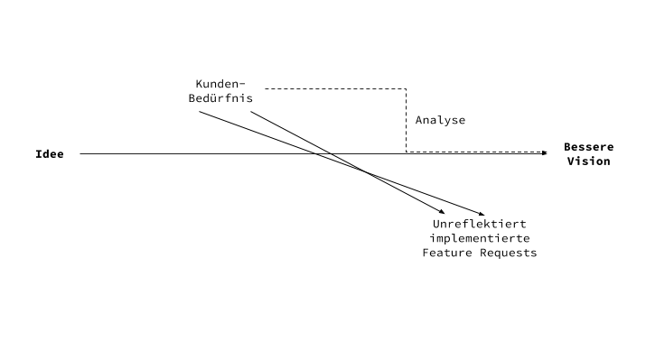

[Das](https://twitter.com/nicoleyershon/status/816585699826761728) [halbe](https://www.goodthingsguy.com/business/elon-musk-receives-product-suggestion-twitter-implements-6-days-later/) [Internet](https://medium.com/@MeierMarketing/getting-that-c-level-buy-in-for-twitter-elon-musk-receives-product-suggestion-on-twitter-tesla-e63dcec271b7#.uenmuphpo) [hat](https://news.ycombinator.com/item?id=13258882) [Elon](https://www.facebook.com/loic/posts/358222374547033) [Musk](https://twitter.com/faris/status/812383727091412997) [dafür](https://www.linkedin.com/pulse/getting-c-level-buy-in-twitter-elon-musk-receives-product-meier) [gefeiert](https://twitter.com/SeedMasterTrent/status/818093043098079232), dass er in nur 6 Tagen einen Feature-Wunsch von Twitter implementiert hat. Ich halte das für Bullshit.

Zunächst einmal bezweifle ich, dass selbst Tesla so kurze Deployment-Zyklen hat. Beweise dafür habe ich keine, allerdings benötigt[selbst Facebook für deren Web Tier im Schnitt 9 Tage](https://www.youtube.com/watch?v=LR7mifkS4PQ). Ich denke einfach, dass dieses Feature schon lange auf der Roadmap stand und nun lediglich im Zuge des normalen Produktmarketings über Social Networks promoted wurde.

Darüber hinaus halte ich es sogar für schlechtes Produkt Management, jeden Feature Request implementieren zu wollen.

Wenn es um Kunden-Feedback geht, sind Feature Requests schädlicher als Bug-Reports. Bug-Reports bringen eine Software weiter und machen sie zuverlässiger. Feature Requests allerdings bringen immer die Gefahr mit sich, sich zu verzetteln und [von der Vision abzuweichen](https://klaus-breyer.de/blog/entrepreneurship/von-der-idee-zur-vision-der-eigene-handlungsspielraum-als-sliding-window/1808).

Feature Requests sollten allerdings durchaus zum Anlass genommen werden, die dahinter liegenden Bedürfnisse zu analysieren. Egal ob sie von extern oder intern kommen. Denn vermutlich liegt hier ein wirklicher Need zugrunde. Leider liegt hier das wirkliche Frustrationspotential für die hinter dem Produkt stehenden Denker. :)

Deshalb also dieser kleine Appell hier beim nächsten Feature Request (egal ob von extern oder intern) nicht einfach nur den Backlog anschwellen zu lassen, sondern sich als Team nochmal kritisch mit dem dahinter liegenden Problemen auseinanderzusetzen.

Und das ist einfach mal schwer. Punkt. Aber es muss nun mal gemacht werden.
