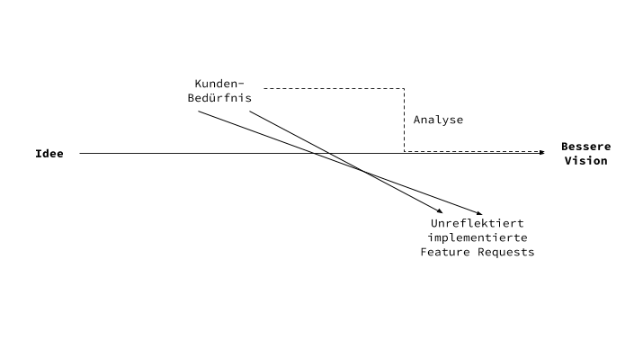

[The](https://twitter.com/nicoleyershon/status/816585699826761728) [half](https://www.goodthingsguy.com/business/elon-musk-receives-product-suggestion-twitter-implements-6-days-later/) [internet](https://medium.com/@MeierMarketing/getting-that-c-level-buy-in-for-twitter-elon-musk-receives-product-suggestion-on-twitter-tesla-e63dcec271b7#.uenmuphpo) [has](https://news.ycombinator.com/item?id=13258882) [celebrated](https://www.facebook.com/loic/posts/358222374547033) [Elon](https://twitter.com/faris/status/812383727091412997) [Musk](https://www.linkedin.com/pulse/getting-c-level-buy-in-twitter-elon-musk-receives-product-meier) [for](https://twitter.com/SeedMasterTrent/status/818093043098079232) implementing a feature request from Twitter in just 6 days. I think this is bullshit.

First of all, I doubt that even Tesla has such short deployment cycles. I have no evidence for this, but [even Facebook takes an average of 9 days for their web tier](https://www.youtube.com/watch?v=LR7mifkS4PQ). I simply think that this feature has long been on the roadmap and has now simply been promoted as part of normal product marketing via social networks.

Furthermore, I even consider it bad product management to want to implement every feature request.

When it comes to customer feedback, feature requests are more harmful than bug reports. Bug reports advance software and make it more reliable. However, feature requests always carry the risk of getting bogged down and [deviating from the vision](https://klaus-breyer.de/blog/entrepreneurship/von-der-idee-zur-vision-der-eigene-handlungsspielraum-als-sliding-window/1808).

However, feature requests should certainly be taken as an opportunity to analyze the underlying needs. Whether they come from outside or inside. Because probably there is a real need here. Unfortunately, this is where the real potential for frustration lies for the thinkers behind the product. :)

So this is a small appeal to not just let the backlog swell the next time a feature request comes in (whether from outside or inside), but to critically deal with the underlying problems as a team.

And that's just hard. Period. But it just has to be done.
