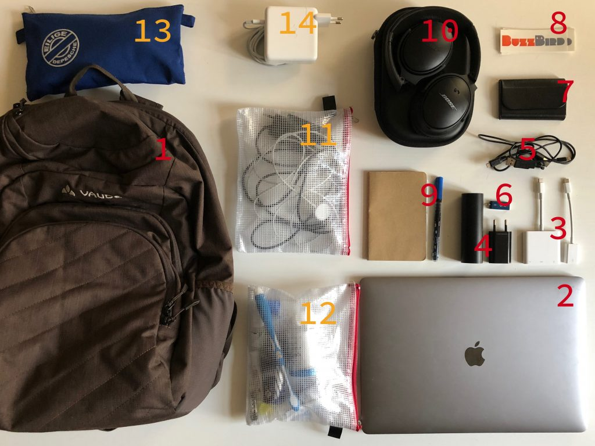

**1. Bag:** My bag is more of a backpack, it comes [from Vaude and is called PETros](http://amzn.to/2D3BbPX). I like Vaude out of hometown loyalty. But they also do a lot for environmental protection and such, so it seems morally justifiable. This backpack is made from recycled PET, for example. This is their best laptop backpack that also has enough space. It works just as well for me when I'm on a business trip for 1-2 days or when I take my sports gear to work once a week.

**2. Laptop** is a [15″ MacBook Pro with Touchbar](https://www.apple.com/de/macbook-pro/), because the 13″ doesn't come with quad-core. I don't really need the Touchbar, but it doesn't bother me much either. I basically always have this laptop within reach and it travels with me every day to work and back home.

**3. Adapter:** You never know when something needs to be presented somewhere. For that, I always have an [original HDMI adapter from Apple](http://amzn.to/2DtFQaW) with me. I don't trust third-party providers here, because when I need it, I often don't get a second chance. Additionally, I also have a [USB C to USB adapter](http://amzn.to/2EHgk1B) with me.

**4. Power supply:** Especially important for travel are battery and power adapter. The battery is an [Anker PowerCore 5000mAh](http://amzn.to/2myTQZc) and contains roughly 2 complete charges for the iPhone X. The [power adapter](http://amzn.to/2AZFt5b) is from a third-party provider and delivers 1 ampere – charges faster and can also power an iPad in a pinch.

**5. Cables:** I have a [Lightning cable](http://amzn.to/2EGD1Tw) from Amazon Basics and additionally a [Micro USB cable](http://amzn.to/2DtVKC7), to either charge the battery or to charge other devices (or other people's devices). I've had the best experiences with Amazon Basics. Even better than with Anker.

**6. USB stick:** Here I have a very small promotional gift that I left formatted as FAT32. Actually never used, but doesn't weigh much either. But when the need arises, it's definitely compatible with a Windows computer from the last millennium.

**7. Business cards** in a small case.

**8. BuzzBird stickers:** Always with me – you never know when someone needs one stuck somewhere.

**9. Notebook:** I always have a small notebook with me, because you never know when you need to look smart in a meeting. The notebook is a [blank pocket format from Moleskine](http://amzn.to/2D7mCLk). For pens, I trust exclusively in [Inkys](http://amzn.to/2AYv4Xq). My grandfather already used those.

**10. Headphones!** The [BOSE QC35](http://amzn.to/2DrWQyh) are the world's best headphones. Indispensable, whether Deutsche Bahn with their trains becomes a coworking space again or in the Berlin office. The QC35 not only have fat sound, but they actually take away every disturbing noise. I'll write a separate post about the right music for creative work.

## Modularly expandable through travel kits

The power adapter and my three travel kits I don't have with me every day, but only when I'm away overnight. (Whether business trip or to family.) These kits have the advantage that you don't have to constantly set up and tear down things at home for a one-day trip. (Especially annoying with cables!) Additionally, this brings the advantage that you don't have to think about whether everything is there anymore.

I've been doing this with these travel kits for several years now and I'm very satisfied with both the system and the bags (from [Foldersys](http://amzn.to/2D1NoUJ)).

**11. Cable kit:** Here is an [intelligent Anker dual power adapter](http://amzn.to/2DuoKd2) and a [charging cable for the Apple Watch](http://amzn.to/2EFDvcw) as well as a [very long (1.80m) Lightning cable](http://amzn.to/2AY3t8Z). The price for the Watch cable is a bit high, but constantly fiddling with this cable at the bedside table is just annoying. And the length of the cables simply brings the advantage that you're more independent when they've saved on power outlets in a hotel room again.

**12. Hygiene kit:** Here I have toothbrush, small toothpaste, deodorant, nasal drops, ear drops, etc. So all liquids, so I can simply put them on the security belt during a flight.

**13. Tablet kit:** I fortunately rarely need it, but with vitamin B, ibuprofen, and Gelomyrtol, I'm basically prepared for everything that can happen to you on a short trip. Just having everything with me already calms me down a lot.

**14. Power adapter:** It hurts at the prices, but for travel I have a second [laptop power adapter](http://amzn.to/2Dv6gJA) (and a second [USB-C charging cable](http://amzn.to/2Dv6m3U)...)

Disclaimer: These are affiliate links. Meaning: If you purchase the products through the links in this post, I earn something from it.
