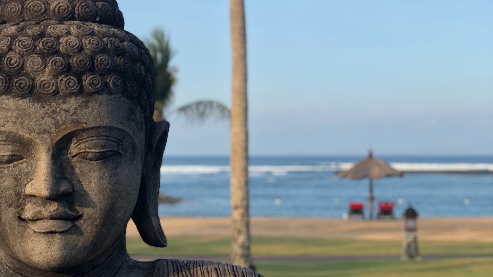

**I spent the last few weeks traveling around Bali and Java and wanted to share my pictures and thoughts here. To see the images in full size, simply click on them. To discuss the thoughts, please write to me or leave a comment. :)**

**Key Details:**
09.07.2018 – 13.07.2018 Bali / Ubud
13.07.2018 – 15.07.2018 Java / Yogyakarta
15.07.2018 – 21.07.2018 Bali / Nusa Dua

## Monkey Forest

[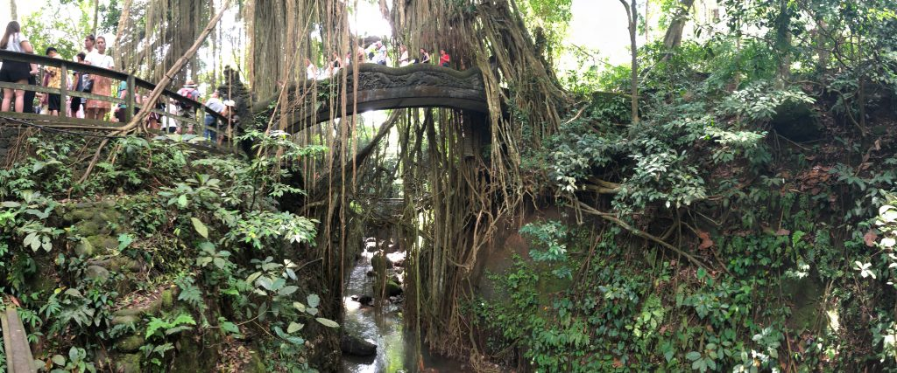](IMG_7735-1024x427.jpg)
The so-called Monkey Forest. Here you'll find temples and trees alongside plenty of monkeys – both animal and human ones.

## Transportation

[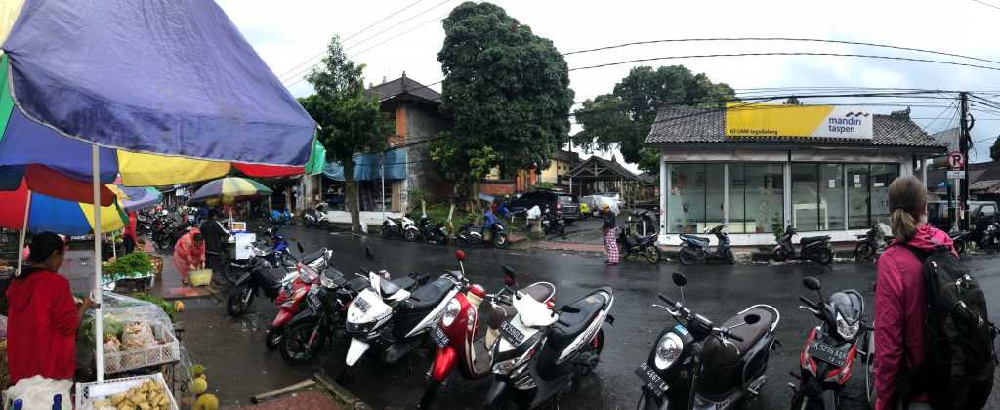](IMG_7817-1024x420.jpg)
On Bali, everyone rides scooters. Adults and minors. With and without helmets, babies strapped on and toddlers standing in front of the handlebars. We, of course, are exemplary and ride with helmets. And backpacks.
Left-hand traffic is quite a funny challenge, and even after a day of scooter riding, I'm still not clear on how "right before left" is interpreted here. Somehow it's more like "First come, first served," but with an impressive sense of community: Everyone takes the right of way when they need it, but also gives way to others when they're in a hopeless situation. I didn't see a single accident during all that time. Reckless behavior, however, was constant...

## Tegalalang

[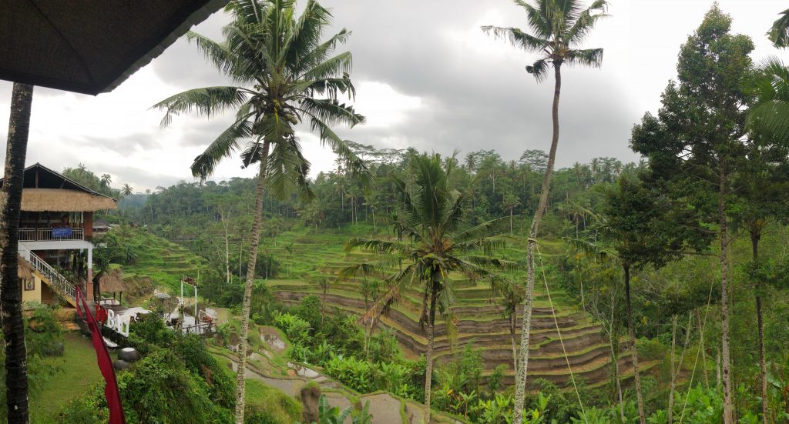](IMG_7820-1024x551.jpg)
These are the rice terraces of Tegalalang. They're so impressive, surely this is a World Heritage site. Unfortunately, on this picture they're harvested and in the rain. But for the rice, this is perfect weather.

## Kanto Lampo

[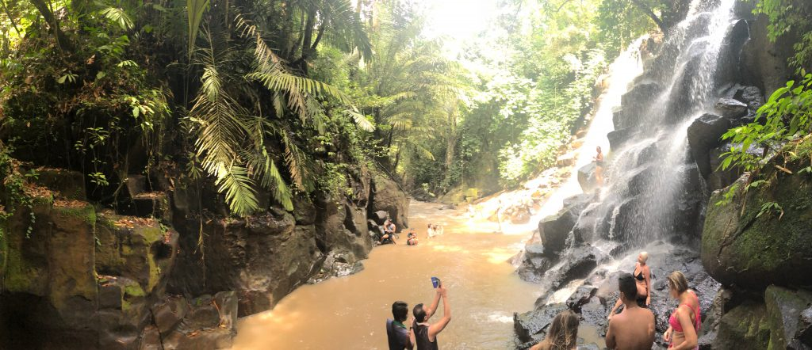](IMG_7875-1024x442.jpg)
This is Kanto Lampo, a great place for a waterfall. And for a selfie.

## Pura Tirtal Empul

[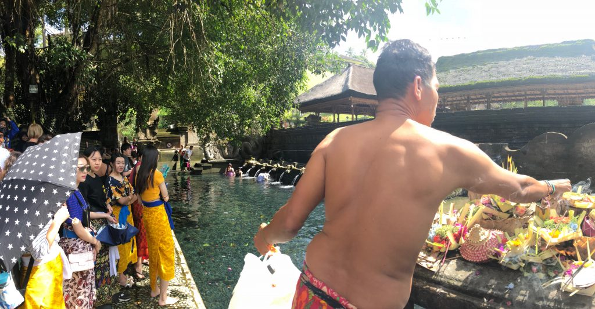](IMG_7861-1024x533.jpg)
Pura Tirtal Empul is also called the Water Temple. Locals can purify their soul and body here. The Balinese religion is very complex and, alongside Hinduism, is shaped by countless animistic rituals. Tourists manage to disrespect all of them and cross cultural boundaries just as countless times.

## Campuhan Ridge Walk

[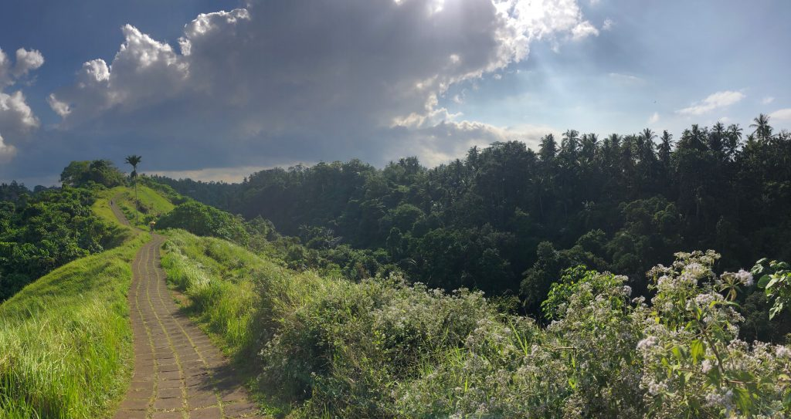](IMG_7944-1024x543.jpg)
Every path leads somewhere. Getting up at 8 AM and walking the Campuhan Ridge Walk leads to such magical images. Only at this time can this path be walked without seeing the same functional clothing as in Prenzlauer Berg.

## Borobudur (Buddhism)

[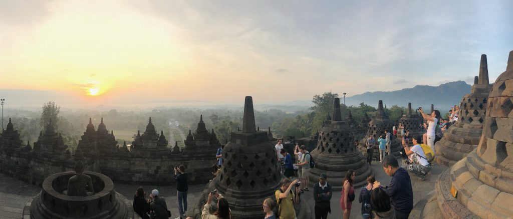](IMG_8238-1024x439.jpg)
This image is from Borobudur, the largest Buddhist temple in Southeast Asia with a view of Mount Merapi. The sunrise tour here starts at 4:30 AM and involves quietly sitting and waiting for sunrise for about 1 hour. Easier said than done. If only it had been that quiet. I can't say whether it was due to the other tourists or inner restlessness, but in the end, it was a very exhausting experience for me, constantly living with the fear of missing the perfect shot. In the end, my wife took an even more beautiful one.

## Yogyakarta (Islam)

[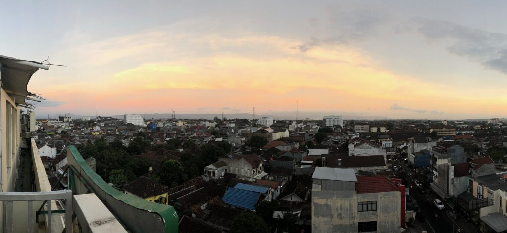](IMG_8290-1024x473.jpg)
On Bali, the rooster crows, and on Java, the muezzin calls. A truly impressive soundscape when the calls from the individual quarters of the entire city accumulate from high above!
Aside from this impressive experience, what else should I say about Java? Java didn't particularly appeal to me during my Software Engineering studies either ;). Joking aside. Maybe it was just the culture shock with the big city of Yogyakarta, but compared to fluffy Bali, this is clearly a tougher place. I can't say exactly where this impression comes from. Somehow everything is cheaper in the sense of inexpensive, but also in the sense of dirtier, unmotivated, unengaged, and generally just loveless.

## Prambanan (Hinduism)

[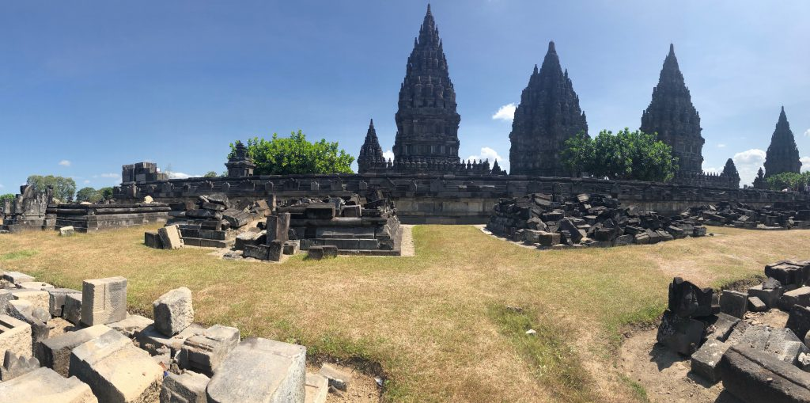](IMG_8322-1024x509.jpg)
The Hindus are the perfectionist artists among the faithful. For every purpose, there is a god, and in the Hindu temple complex of Prambanan, there's also a dedicated temple for each one. So the complex consists of over 200 temples, many of them destroyed. We were lucky – until recently, even the main temple (dedicated to Shiva, the Destroyer) was destroyed by an earthquake.

## Nusa Dua

[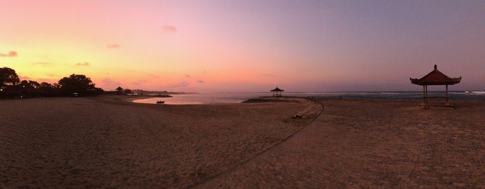](IMG_8873-1024x401.jpg)
This is the beach of the hotel where we spent the second half of our trip. A vacation from the vacation, so to speak. Plenty of time for reading and processing.

Time, then, for a summary. But what else can you say about a country whose national dish is a kind of suckling pig?!

A lot: Even though Indonesia isn't a country that's really doing badly, this trip leaves me with a lot of humility and makes me realize once again how privileged we Western Europeans are. The people who here every day carry suitcases with bone-breaking effort, peddle goods, serve tourists to feed their families, and still smile, actually deserve to take vacations here much more.

What somewhat reconciles me, however, is that the people are quite relaxed with each other, and there isn't just capitalist exploitation here, but a lot goes through the community with collective and cooperation models.

In Ubud, for example, parts of the land belong to the religious community/"community," and members get it loaned/leased/for use. They can build buildings on it and run businesses, but they can't sell the land. The people who then work in these businesses (e.g., guesthouses) are also part of the family/community. This way, they succeed in strengthening the local community while preserving values. I find this a super exciting approach, also for local projects.
