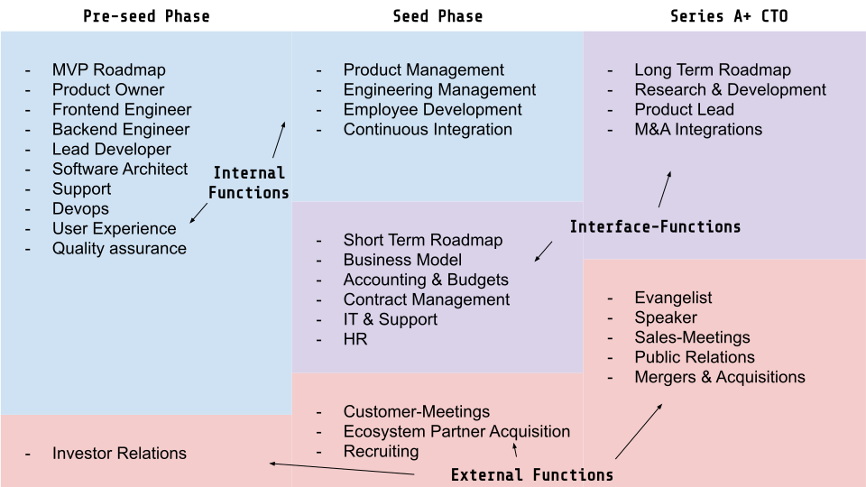

Vorneweg: Ein CTO ist weder der beste Programmierer noch der beste Manager. Warum nicht der beste Programmierer?
Weil es nicht seine einzige Aufgabe ist und ihm dafür meistens die Zeit fehlt. Anstelle selbst Technologie zu implementieren, ist es wichtiger Technologie kommunizieren zu können. Dies bedeutet: Auf Augenhöhe sowohl mit dem eigenen (implementierenden) Team zu sein, als auch sich auf technisch weniger versierte Stakeholder (wie z.B. Investoren oder Sales-Mitarbeitern) einstellen zu können.

Er muss aber auch gar nicht der beste Programmierer sein, denn irgendwann kommen ohnehin Engineers, Tech Leads, Architekten ins Unternehmen, die ihre ganze Zeit dafür verwenden können.
Warum nicht der beste Manager?
Ihm liegt zu viel am Ergebnis. Es geht ihm als Visionär und Gründer vor allem um die [Total Cost of Ownership](https://hackernoon.com/software-development-sprint-vs-marathon-mindsets-3bbb7505a7ab). Es ist ihm wichtig, die richtigen Dinge richtig zu machen, um nicht mit Technical Debt später dafür zu bezahlen, allerdings auch darum Overengineering zu vermeiden.

Dies ist aber ebenfalls kein Problem. Für schnelles Shipping gibt es irgendwann einmal einen Engineering Manager oder VP Engineering. Diese Manager-Rollen sind sehr Prozess- und Ergebnis-orientiert.
CTO ist eine strategische Rolle
Ein CTO repräsentiert sowohl die Technologie-Seite als auch die Business-Seite. Beides muss vereint werden. Dabei geht es aber nicht darum, den eigenen Tech-Stack jedem Mitarbeiter zu diktieren oder die Entwickler zu micromanagen.

Es geht um Business Entscheidungen.

Und vor allem geht es darum, diese zu implementieren. Es müssen Hebel gefunden werden, wie Technologie für das Geschäftsmodell eingesetzt werden kann. Herausforderungen müssen in ihre technischen Bestandteile zerlegt, Risiken abgeschätzt und anschließend wieder neu zusammengepuzzelt werden.
Im Wandel des Unternehmens
Wie jeder andere Startup-Gründer übernimmt auch ein CTO mehrere Rollen, bis diese nach und nach durch neue Mitarbeiter und später ganze Teams ersetzt werden. Im Schaubild (oben) habe ich mal versucht aufzuführen, welche Rollen dies über die Stadien eines Unternehmens hinweg alles sein könnten. Your mileage may vary
Pre-Seed Phase:
Er ist alleine, baut das Produkt alleine, macht sich Gedanken zur UX, geht im Code viele Kompromisse ein um schnell zu shippen, beantwortet alle Support-Anfragen und steht für Qualität und Bugs ein.

Er trägt Kopfhörer und wird glücklicherweise selten gestört.
Seed Phase:
Nun baut er ein Team auf, hat 1-3 Entwickler, gegebenenfalls Freelancer und Designer im Team, denkt mehr konzeptionell, muss eine Roadmap zumindest im Kopf haben, kauft IT-Equipment und richtet es ein, beschäftigt sich mehr mit Entwicklung der Angestellten als seiner eigenen und fokussiert sich darauf den Overhead zu eliminieren, welcher durch Neueinstellungen entsteht.

Er trägt immer noch Kopfhörer so oft es geht, aber dies wird nicht mehr immer respektiert.

Neben der Arbeit an Produkt und Geschäftsmodell müssen zusätzlich noch Schnittstellen ins restliche Unternehmen aufgebaut werden. Das ganze Team muss bei der Produktentwicklung mitgenommen werden, Budgets müssen geplant und verwaltet werden.
Series A und darüber hinaus:
Er repräsentiert immer öfter das Unternehmen gegenüber Externen, überlegt welche Zukäufe das Unternehmen noch schneller wachsen lassen und muss auch schon einmal mal repräsentativ in wichtigen Sales Meetings teilnehmen.

Er trägt die meiste Zeit keine Kopfhörer, weil er nur in Meetings ist, aber wenn, dann wird es wieder respektiert.

Ab diesem Punkt hat ein CTO kein C und kein O im Titel verdient, wenn seine Abteilung nur implementiert, was sich andere ausgedacht hatten. In seiner Führungsrolle muss er die Produktentwicklung anführen.
Der ultimative Problemlöser
Einfach gesagt ist ein CTO der ultimative Problemlöser in einer Firma. Niemand anderes ist so sehr sowohl in der Problem- als auch in der Lösungsdomäne involviert. Es ist die Person, an die sich jeder wendet, wenn sie ein Problem gelöst oder etwas geändert brauchen. Genauso muss ein CTO sich ständig fragen, was die Firma denn benötigt - und das möglich machen, ständig evaluieren, wo die größten technischen Möglichkeiten (aber auch Risiken) liegen und diese tacklen.
