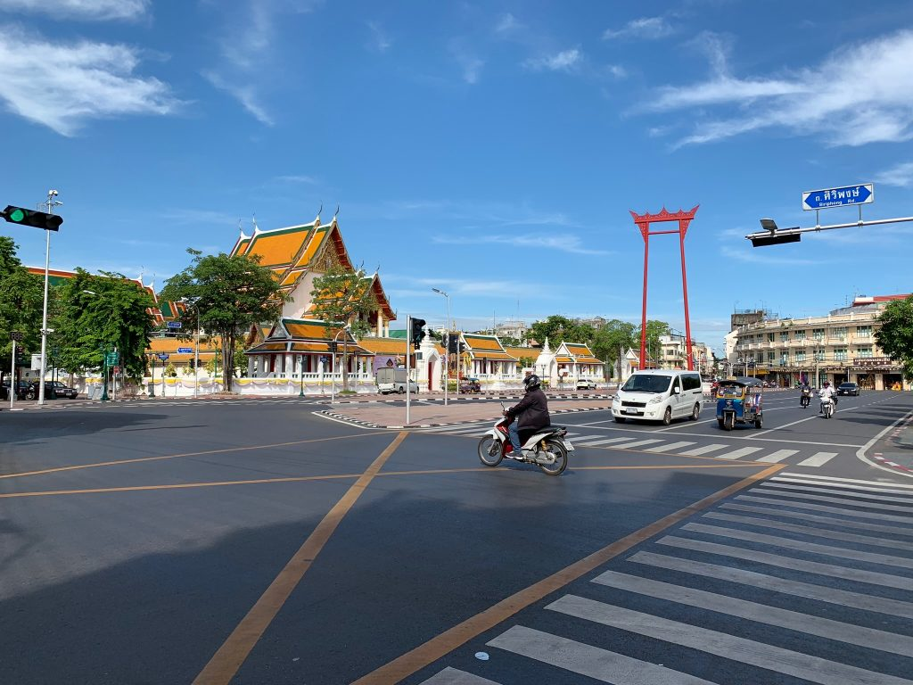
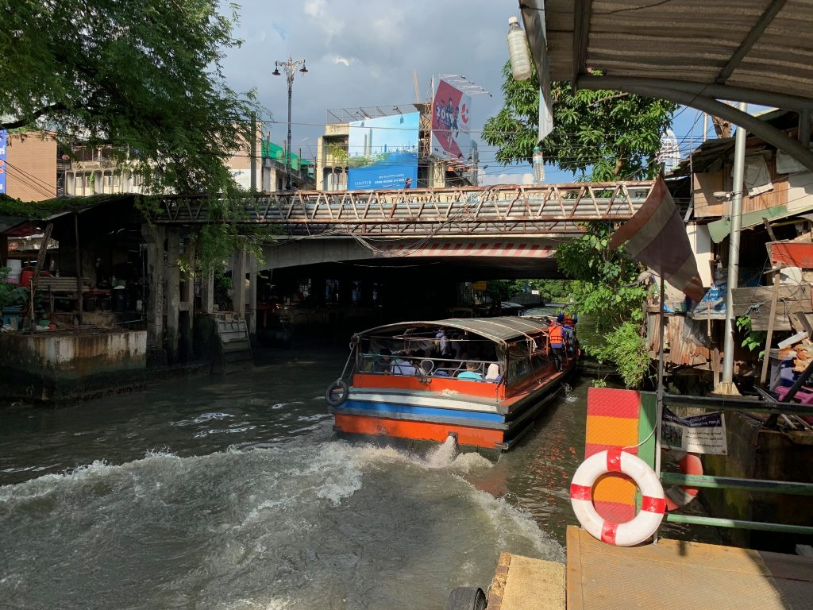
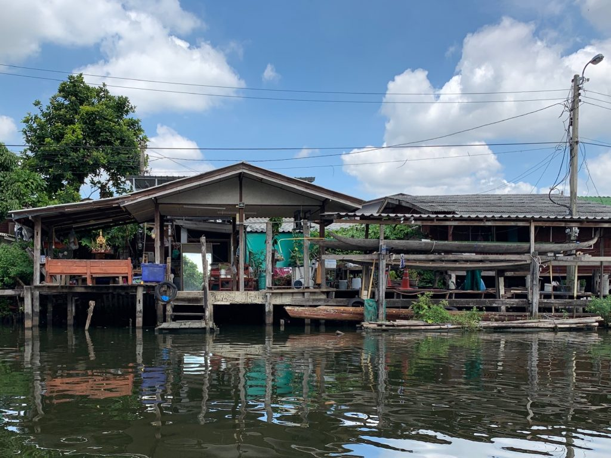
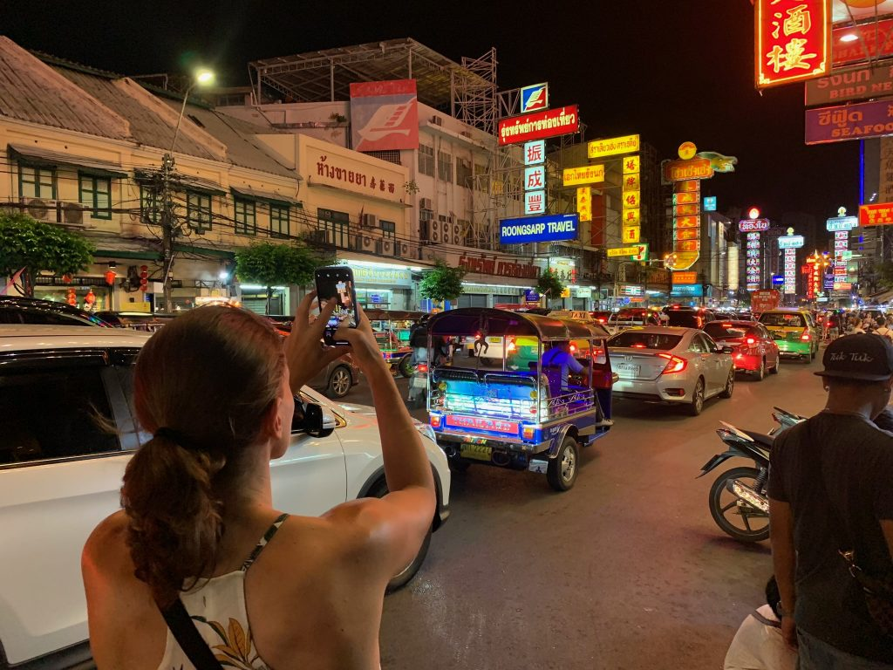
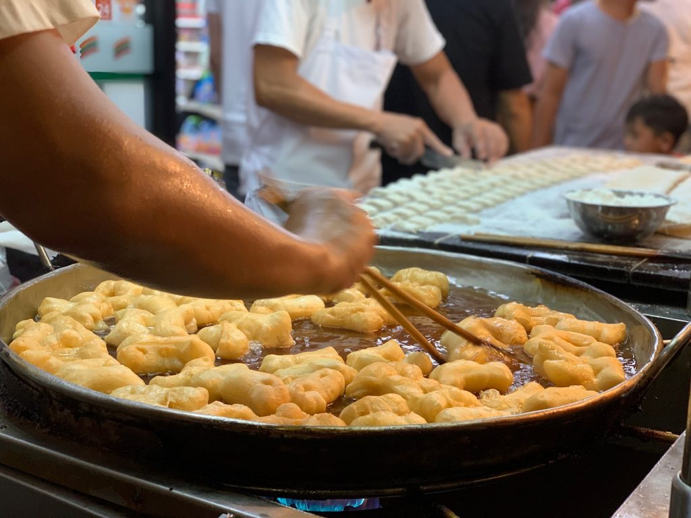
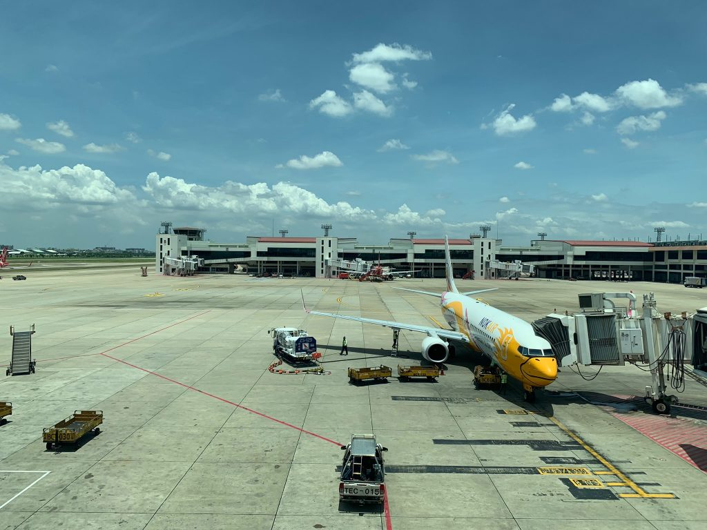
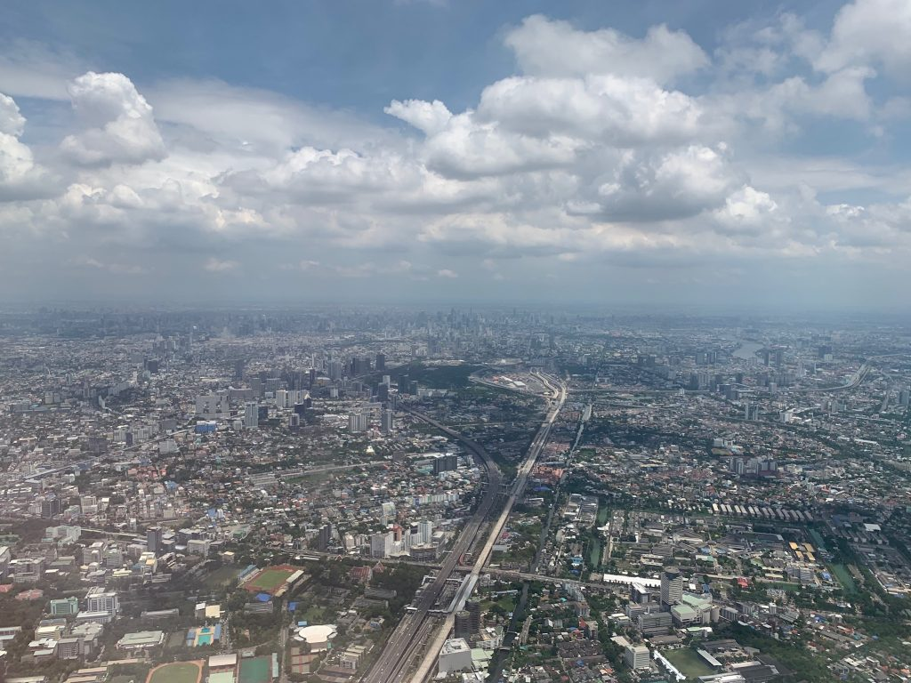
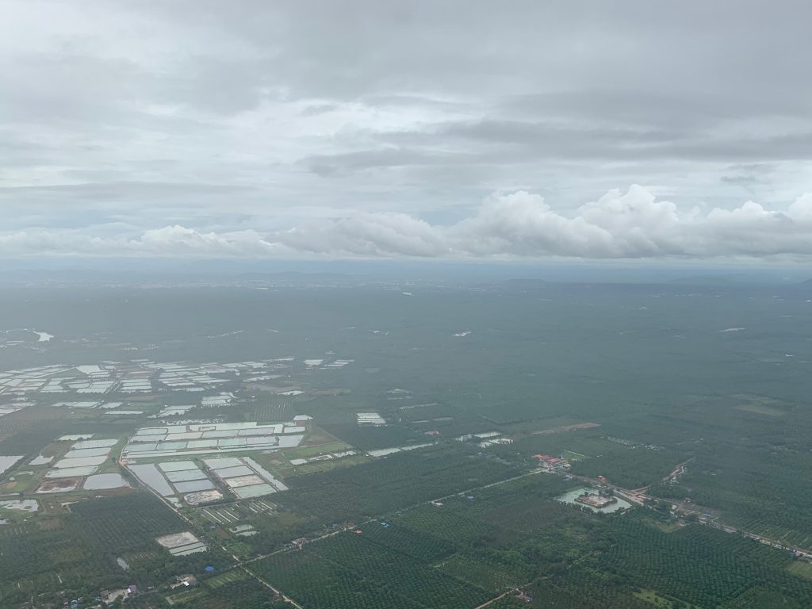

Ich war die letzten 3 Wochen in Thailand unterwegs – und habe dabei gemeinsam mit meiner Frau eine Menge Bilder und super deepe philosophische Eindrücke gesammelt und mitgebracht.

**Eckdaten:**

- 16.07.2019 – 19.07.2019 Bangkok
- 19.07.2019 – 25.07.2019 Ko Pha-ngan
- 25.07.2019 – 31.07.2019 Phuket

## Bangkok

Bangkok wirkt nicht wie eine Großstadt, wenn man mitten drin ist. Eher wie ein gigantisches Dorf. Es ist meistens nicht sehr hoch, sondern eher flach gebaut und jeder scheint an jeder Ecke seine eigene Suppe zu kochen.

### Wirtschaft

Ich war mir gar nicht bewusst, dass Thailand bis vor kurzem hauptsächlich vom Obst- und Reis-Export lebte, bis durch Flut und Dürre sämtliche Äcker nachhaltig zerstört wurden. Jetzt ist Vietnam Export-Meister der Region und Thailand hat die Weichen gestellt, um Tourismus wirtschaftlich noch stärker zu fördern, sodass es nun die Haupteinnahmequelle ist.

### Verkehr

Wie überall in Asien gibt es sehr viele Roller, die sich halsbrecherisch in den fließenden Verkehr einsortieren (um es mal positiv zu formulieren).
Wir haben unserer lokalen Guide vom Verkehr in Deutschland erzählt. Sie verstand überhaupt nicht, wie man vorankommen soll, wenn man ständig in seiner Spur bleiben muss.

Zuletzt bin ich in Asien auf Bali Roller gefahren. Und ich muss sagen, dass hier mehr Verkehrsregeln durchgesetzt werden als in Indonesien. Hier werden Rollerfahrer ohne Helm auch mal zur Kasse gebeten. Und wir waren live dabei, als unserem Grab-Fahrer das Auto von der Polizei stillgelegt wurde, da er keine Lizenz zur Personenbeförderung hatte.

Grab – das kann man sich vorstellen wie Uber. Menschen, die sich etwas dazuverdienen wollen, fahren Gäste in einem privaten PKW umher. Vermittelt wird das durch eine App. Aus Fahrersicht ist es bestimmt wie in GTA: Dein Telefon klingelt, jemand steigt ein, dir wird angezeigt, wo du hinmusst – und am Ende taucht wie von Zauberhand das Geld auf deinem Konto auf.

Wir nutzen das ganz gerne, um hier durch die Stadt zu kommen. Man kann sich sicher sein, dass man nicht beschissen wird, und für umgerechnet 2-3€ kommt man in einem klimatisierten Auto fast überall hin.

### Klongs

Klongs sind die Kanäle, die Bangkok durchziehen. Auf ihnen fahren Longtail-Boats, die mit Motoren japanischer Trucks bestückt sind.

Klong – Das hört sich nicht nur so an, wie wenn ein Schraubenschlüssel auf den Boden fällt; das Fahrgefühl auf einem solchen Longtail-Boat ist auch nicht weit weg davon. Man kann es sich in etwa so vorstellen, wie wenn man einen Traktor mit einem Schlauchboot kreuzt – und dann in einem Abwasserkanal Amok fährt. Mein persönliches Highlight des Tages.

Die Häuser an den Klongs werden auf traditionelle Bauweise gefertigt – aus Holz und Wellblech, auf Pfählen. Wenn einer verrottet, wird er nebenan durch einen neuen ersetzt. So wird die strukturelle Integrität auf organische Art und Weise sichergestellt.

### Glauben

Einmal im Leben geht ein junger Erwachsener hier in den Tempel für einen beliebig langen Zeitraum. Eine Woche oder ein ganzes Jahr.
Ansonsten scheint es üblich zu sein, wenn man vor einer schwierigeren privaten Problemstellung steht, auch einfach mal nur ein paar wenige Tage in den Tempel zu gehen, bis man es gelöst hat.
Sehr sympathischer Ansatz. Eine kleine Auszeit wünschen wir uns im Westen ja auch hin und wieder – in Thailand scheint mir das gesellschaftlich akzeptierter.
Dafür nimmt hier niemand psychologische Hilfe in Anspruch, da sie mit einem noch höheren Makel belegt ist, als bei uns.

### Buddhismus

Ich denke auch über das Glaubenssystem der Thailänder nach.
Es ist vordergründig zwar der Buddhismus, aber nicht wie er uns im Westen (isoliert) begegnet. Es gibt hier auch starke Einflüsse der alten Naturreligionen (Glauben an gute und böse Geister) sowie Aberglauben, in Form von Glücksbringern und Amuletten.

Mich irritiert das, da der Buddhismus als Weltanschauung in meinem (westlichen) Verständnis einem solchem Aberglauben diametral entgegengesetzt ist.
Andererseits sieht man auch schön, wie hier eine Gesellschaft im Wandel ist – nur eben später als wir im Westen. Das Christentum brauchte ja auch über tausend Jahre, bis es vorherrschend war – und kurz darauf wurde es direkt wieder reformiert.

Vielleicht ist aber ja auch genau das eben das Ideal der Freiheit: Lebensanschauung und Ziele zu wählen, ohne ewige Gültigkeit für sie in Anspruch zu nehmen. Prinzipien sind ja nicht deshalb weniger heilig, weil ihre Dauerhaftigkeit nicht garantiert werden kann. (Inspiriert von Isaiah Berlin)

### Streetfood

Essen hat in Thailand wohl generell einen sehr hohen Stellenwert. Zuhause wird nur im Familienverbund gekocht, ansonsten scheint sich hier jeder etwas beim nächsten Streetfood-Stand zu holen, anstatt selbst zu kochen.

### Jay Fai

Jay Fai ist eine 70-jährige Street Food Chef, die alleine, in Gummistiefeln, Wollmütze und Skibrille, über Holzkohle kocht. Dafür wurde sie als erstes Street Food überhaupt mit einem Michelin Stern ausgezeichnet und hat jüngst eine Netflix Doku bekommen.
Und ich muss sagen: zurecht. Und zwar nicht nur in kleinen Portiönchen, wie man es von einem Stern erwartet, sondern richtig volle Teller und dann einfach nur mampfen bis zum Food Coma – auf unglaublich hohem Niveau.

## Ko Pha-ngan

Nächste Station auf der Reise, die Metropole Bangkok eingetauscht gegen eine Mini-Insel.
Das ganze Insel-Leben pulsiert hier. Bei der Wasserversorgung pulsiert der Wasserstrahl, die Lichter pulsieren durch Elektrizitätsschwankungen... Manchmal fällt es auch ganz aus, der Strom – aber auch das Leben. Doch meist ist es schnell zurück.
Touristen werden gebracht, jedem wird ein individuell einmaliges Erlebnis generiert, anschließend wieder von der Insel weggebracht.

Man kommt als Tourist selbst schnell klar, wenn man sich dem Puls hingibt und mit dem Strom schwimmt. Alles ist sehr gut erschlossen hier. Man kommt an alles schnell ran, eignet sich für jemanden Ü30 also gut zum Chillen, mehr aber nicht.
Der eigentliche USP der Insel ist ja die berühmt-berüchtigte Fullmoon Techno Party. Dann gerät der Puls etwas aus dem Lot.
Dann sind nämlich zu viele Menschen hier. Und dann fällt auch großflächig der Strom aus, um Licht und Sound zu betreiben.
Aber die meisten Partygäste knipsen sich (durch überhöhten Alkoholkonsum) selbst das Licht aus. Passt also alles wieder.

### Songthaew

Auffällig ist, dass hier auf der Insel alles gleich kostet. Wäscherei, Massage, Roller, Taxi – immer ein Einheitspreis.
Die Qualität ist zwar auch immer vergleichbar, dadurch immerhin weniger Chance zum Betrug als in Bangkok. Man merkt, dass sie auf Touristen angewiesen sind.
Bei den Sammeltaxis (Songthaew) gibt es sogar noch eine Art Zuhälter. Dieser verteilt die Tour
