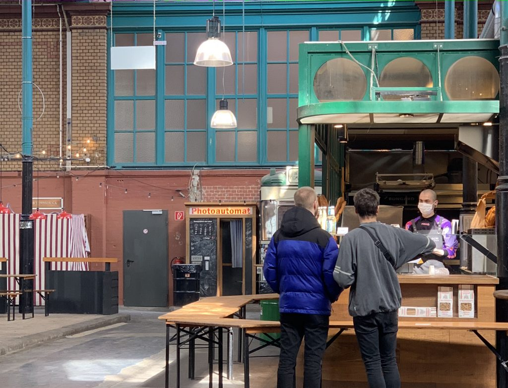

Nochmal laufen gehen, solange man kann. Egal was für eine unsportliche Figur einer dabei macht. Das schien heute das Motto.

Die Markthalle in Kreuzberg – gespenstisch. Schon mittags die absolute starke Vermutung, dass das wohl das letzte Mal so wie immer war. Angst um den “Hipster-Lifestyle”. Aber vor allem Trauer um und mit kulinarischen Kleinst-Unternehmern.

_Bäckerei Sironi, wo sonst eine Schlange ist._

Im Prenzlauer Berg waren aber alle nochmal draußen. Der erbärmlichste Park wird zum größten Happening. Vor allem die Jugend muss sich nochmal treffen und billigen Alkohol trinken. Die Eltern haben am Wochenende mit ihren Kindern schon die ersten Frühlingssonnenstrahlen genossen. Aber heute sind alle ein letztes Mal gemeinsam draußen. Um 18 Uhr kündigt die Kanzlerin die ersten Einschränkungen des öffentlichen Lebens an.

Bis zuletzt noch damit gehadert, wie einfach und toll es andere, vor allem Alleinstehende, haben, die keine Verantwortung für Kinder tragen. Wie produktiv diese die Zeit nutzen können! Startups gründen, Open Source Contributions, Gaming, ...

Allerdings nun auch die Einsicht, dass eben jene Alleinstehende – nun ja – allein sind. Denn mit Weiterem ist (mit Blick auf die Nachbarländer) zu rechnen. Auch wenn "goldener Käfig" (und zwar einer mit Dachterrasse) eine treffende Metapher für unsere Wohnsituation ist – die Aussicht, bei weiteren Verschärfungen über Wochen mit einem 3-Jährigen und einem 4-monatigen in Quarantäne zu sitzen – quälend. Noch dazu ist der Neugeborene gerade in so einer Phase, naja. Pink Floyd hilft aber.
