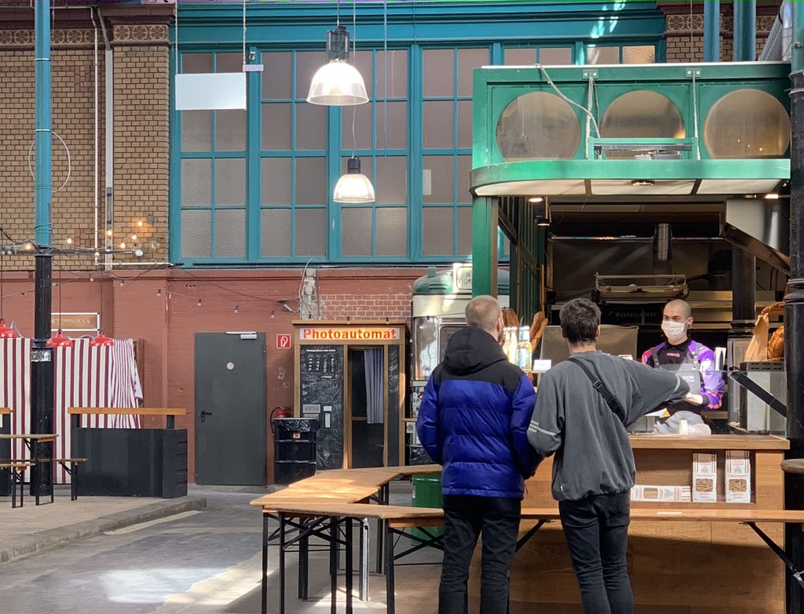

Go for a run one more time, while you still can. No matter how unsporty you look doing it. That seemed to be today's motto.

The market hall in Kreuzberg – eerie. Already at noon, there was the absolute strong suspicion that this was probably the last time things would be as they always were. Fear for the "hipster lifestyle." But above all, grief for and with culinary small business owners.

_Bäckerei Sironi, where there's usually a line._

But in Prenzlauer Berg, everyone was outside one more time. The most miserable park becomes the biggest happening. Above all, the youth needs to meet one more time and drink cheap alcohol. The parents had already enjoyed the first spring sunbeams with their children on the weekend. But today everyone is outside together one last time. At 6 PM, the Chancellor announces the first restrictions on public life.

Until the very end, I struggled with how easy and great others have it, especially singles, who don't bear responsibility for children. How productively they can use this time! Start startups, make open source contributions, gaming, ...

However, I now also have the insight that those singles are – well – alone. Because more is to be expected (looking at neighboring countries). Even if "golden cage" (and one with a rooftop terrace at that) is an apt metaphor for our living situation – the prospect of sitting in quarantine for weeks with a 3-year-old and a 4-month-old in case of further restrictions – agonizing. On top of that, the newborn is just in such a phase, well. But Pink Floyd helps.
