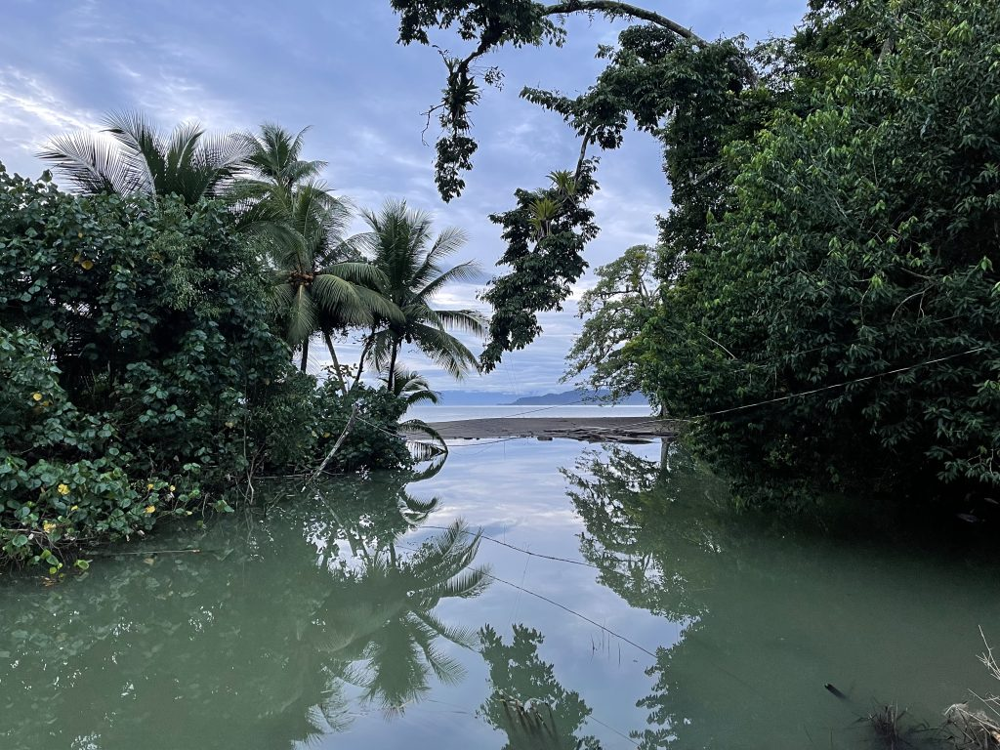
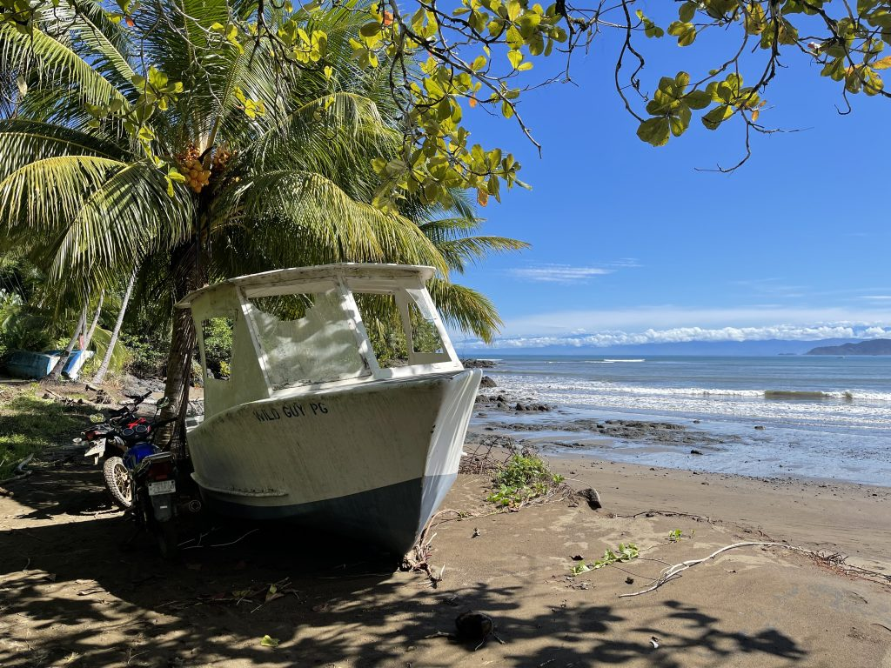
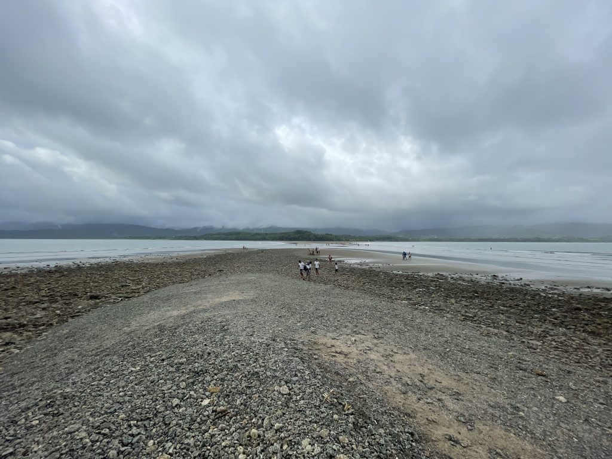
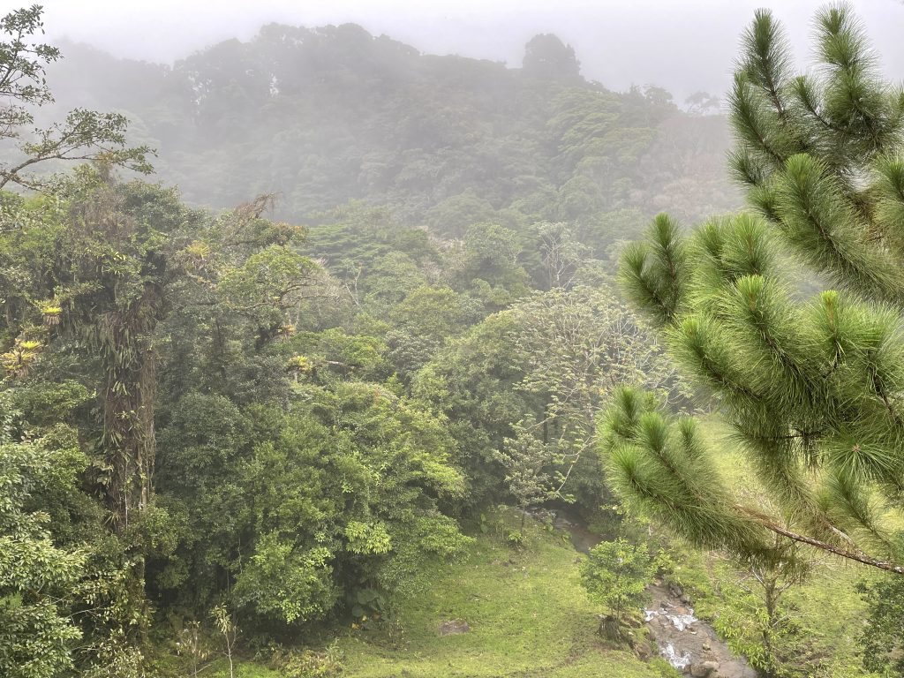
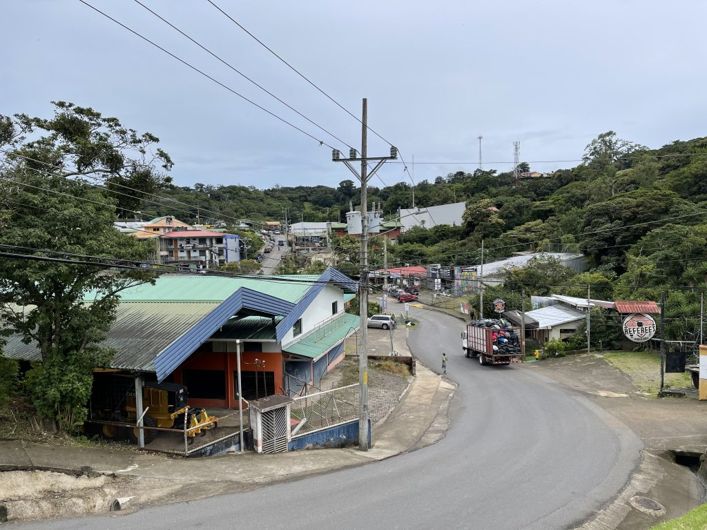
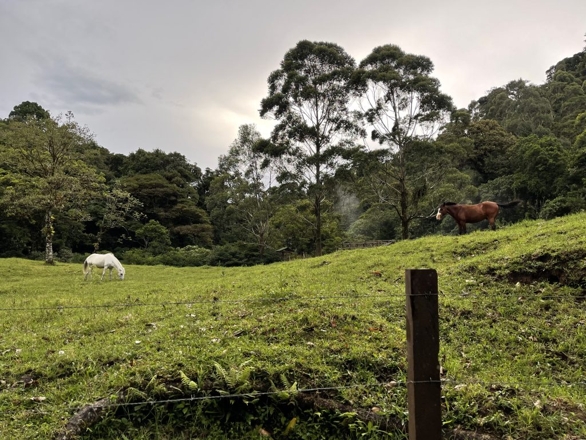
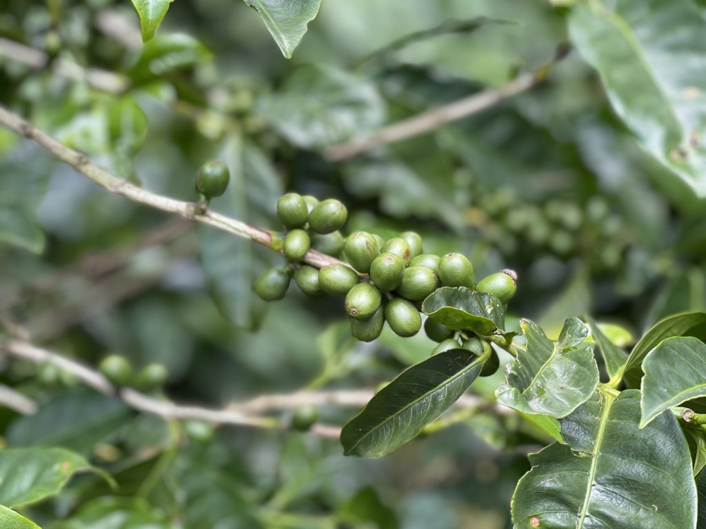
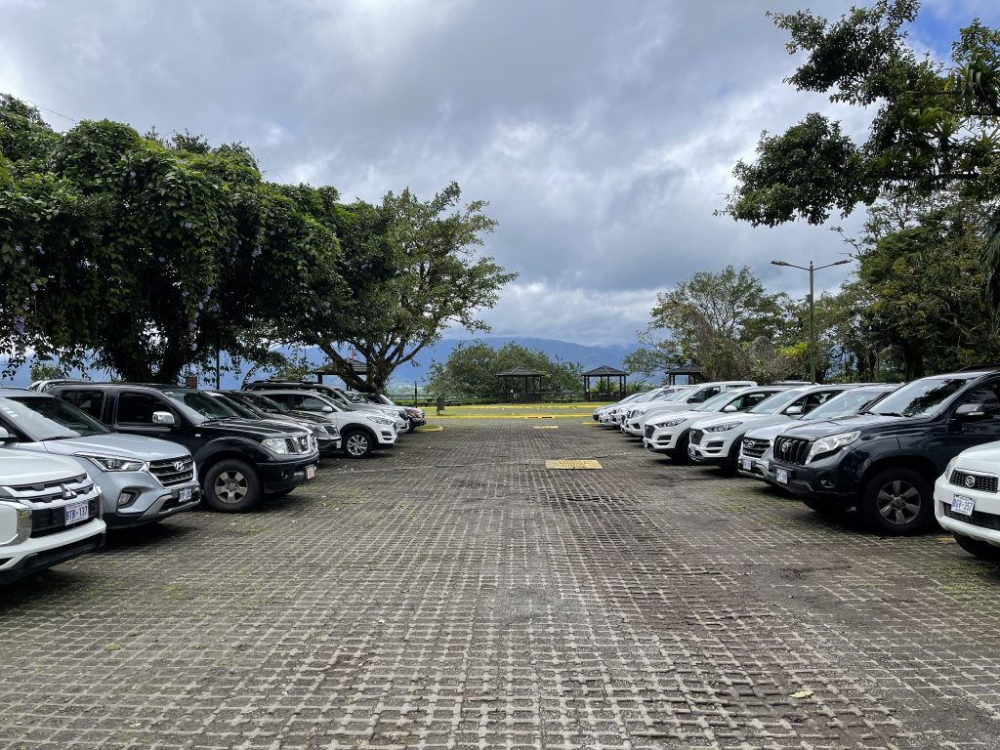
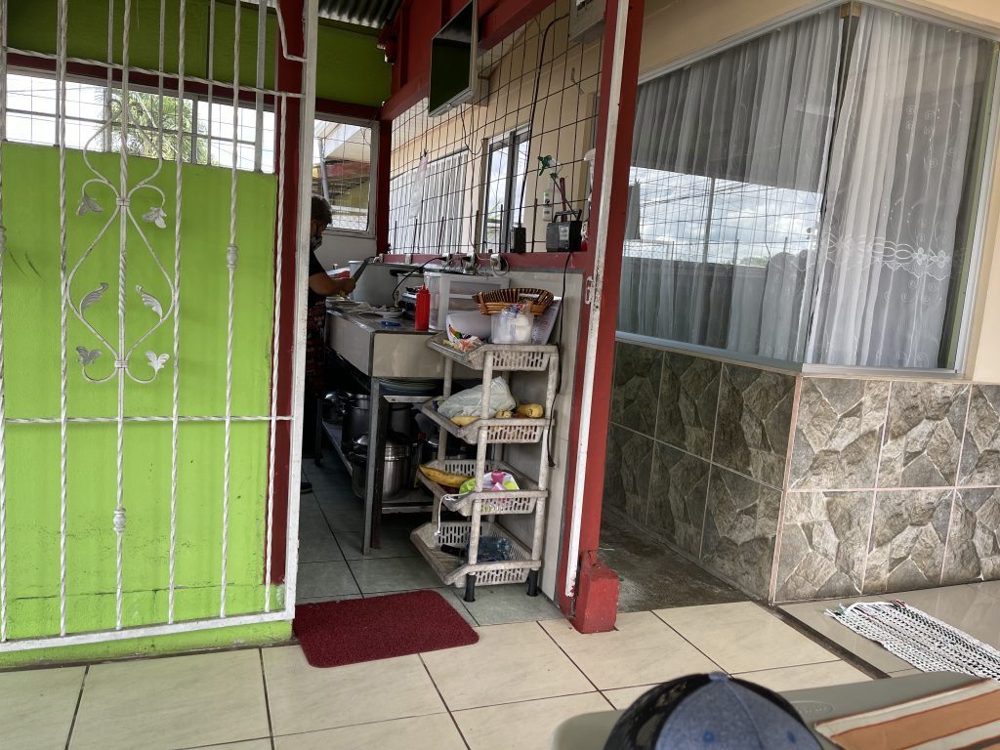

Wir waren die letzten Wochen in Costa Rica unterwegs. Immer wenn mir etwas auf- oder eingefallen ist, habe ich es aufgeschrieben. Diese Gedankenfetzen (und ein paar Bilder) möchte ich gerne mit euch teilen:

**Man sieht hier ja überhaupt keine Sterne.**
(Weil es immer wolkig ist.)

**Alles ist klamm, wegen der Feuchtigkeit. Unglaublich.**
Bücher wellen sich nur vom Lesen, Chips sind schon nach 1 Stunde nicht mehr knusprig und Klamotten brauchen 2 Tage zum Trocknen. Aber man gewöhnt sich daran, auch mal in feuchte Sachen zu steigen.

**Alles blüht.**
Unglaublich grün und fruchtbar. Wenn man nur irgendwo hinspucken würde, würde etwas wachsen. Ständig dieser warme „grüne“ Geruch. Wie Fäule. Aber angenehm. Besonders im Nebelwald. Das ist eine Art von Regenwald mit sehr viel Nebel. Dort sind die Pflanzen nochmal ein absurdes Level mehr grüner, da sie nicht so viel Licht bekommen und deshalb mehr Chlorophyll produzieren.

**Hier fahren beeindruckend große amerikanische Trucks rum.**
Wie in Filmen aus den 90ern.

**Zum Tanken bleibt man hier einfach sitzen.**
Gezahlt wird kontaktlos beim Tankwart durch das Autofenster.

**Das Essen ist gar nicht so sehr gewürzt.**
Die Gerichte sind zwar von der Art und der Optik sehr mexikanisch/spanisch, aber schmecken doch deutlich milder, als man erwarten würde. Dass sie überall Bohnenpaste dran machen, macht es nicht besser.

**Man zahlt nur Mehrwertsteuer, wenn es sich digital (mit Karte) nachvollziehen lässt.**
Je weiter weg man von der Hauptstadt ist, desto kreativer werden die Buchführungen. Da macht auch die werbliche Ansprache keinen Hehl daraus.

**Sie haben schon viele Regeln – aber sie nutzen sie meistens mit Augenmaß.**
Maskenpflicht: grundsätzlich ja. Aber nur bis man aus den Menschenmassen draußen ist. Und sie lieben Bürokratie. So mancher Parkeintritt war langwieriger als die Passkontrolle des Flughafens.

**Cola schmeckt hier anders.**
Weil es die amerikanische Cola ist. Lecker!

**Sie wollen niemanden enttäuschen und bleiben deshalb bewusst vage.**
Z.B. wird etwas für Samstag versprochen, ohne zu sagen, welcher Samstag genau gemeint ist. So ist genügend Spielraum, um die Erwartungen zu decken. Komme ich heute nicht, komme ich morgen – aber ohne mit der Leistung zu enttäuschen.

**Tranquillo**
Dann noch ein Wort zum vielleicht wichtigsten Aspekt. Der Mentalität. Ich kämpfe seit meiner Ankunft mit einem mentalen Disconnect: überall liest man, dass Costa Rica ja so entwickelt ist: Kein Militär, hohes Bildungssystem-Niveau, Tourismus ökologisch und nachhaltig, etc. Trotzdem liest man aber auch von Drogen-Trafficking, Gang-Kriminalität, Politiker-Korruption, etc. Das bekam ich nicht zusammen. Ist Costa Rica nun entwickelt oder nicht?

So langsam setzt sich aber in mir eine Erkenntnis durch: Nur weil ein Land als (relativ) „entwickelt“ gilt (im Verhältnis zu den Nachbarländern), darf man nicht erwarten, dass alles exakt so wie bei uns ist, also in Bezug auf Infrastruktur, etc. Denn andere Länder haben andere Voraussetzungen: Temperatur, Mentalität, etc. Aber auch andere Needs: Nicht jedes Land braucht überall feste Straßen und Häuser mit massiven Wänden (wie wir).

Die „Entwicklung“ Costa Ricas kann man aber nicht beschreiben, ohne die „Tranquillo“-Mentalität zu erklären: Hier geht alles etwas langsamer und entspannter. Aber das darf man jetzt nicht in einem Sinne von „schlecht“ oder minderer Qualität verstehen. Keinem hier sind Dinge egal. Ich hatte hier schon einige zuvorkommende Erlebnisse, da hätte in anderen Ländern, die ich bereist habe, noch nicht mal jemand mit der Wimper gezuckt. Oder sofort die Hand aufgehalten.

Sie machen alles hier mit Bedacht, lassen sich von ihren Werten leiten und versuchen dabei das Richtige zu machen – mit den ihnen zur Verfügung stehenden Mitteln. Immer auf Sicht fahrend, ganz pragmatisch. Und damit ist „Tranquillo“ eigentlich ganz schön agil, in unserem westlichen Sinne. Und wenn man dann das Land auch in Relation auf die Ausgangslage in dieser Gegend der Welt bewertet (Kolonialismus, etc.), kann man auf jeden Fall zum Schluss kommen: Ja, das Land ist entwickelt. Und sie können stolz darauf sein, was sie schon erreicht haben.

**Anekdoten diesbezüglich:**

- Wir haben einen Ausflug machen können, ohne vorher geklärt zu haben, wie wir ihn denn bezahlen. Zitat: „Ihr könnt hier eh nicht weg“ (von der Halbinsel).
- Ein Boot wollte einmal umdrehen, als zwei Gäste keine Masken mit dabei hatten (Julia konnte zumindest einen davon versorgen).
- Der Taxikoordinator am Flughafen hat uns unser Shuttle zur Autovermietung organisiert – ohne dass es sein Job gewesen wäre.

## Bilder

Geschossen mit einem iPhone 12 Pro Max.

## Eckdaten

24.07.2021 – 25.07.2021: San José
25.07.2021 – 29.07.2021: Drake Bay
29.07.2021 – 02.08.2021: Uvita
02.08.2021 – 04.08.2021: Monteverde
05.08.2021 – 07.08.2021: La Fortuna
