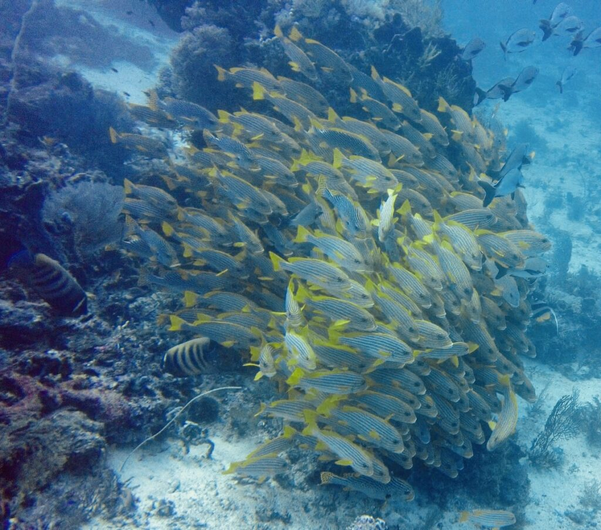

Raja Ampat ist der wohl der am weitesten entfernte Ort, an dem ich je war. Nicht nur geografisch, sondern von.. allem.

Für alle, die es noch nicht kennen: Raja Ampat ist ein Archipel in West Papua, ganz im Osten Indonesiens, mittlere australische Zeitzone.

Um dorthin zu reisen braucht man von Deutschland aus 48 Stunden in 3-5 Flugzeugen und 1-2 Booten.

Warum man da hin will? Das habe ich mal versucht, festzuhalten. Mit Worten. Und mit Bildern. Es gibt allerdings eine leichte Text-Bild-Schere. Manche Eindrücke (in Wort) haben sich erst nach der Rückkehr komplett manifestiert.

Dank und Props an meine Frau Julia, von der einige der Aufnahmen stammen – und sämtliche Aufnahmen unter Wasser.

## Landschaft

Zeit zum Lesen findet man hier während einer Reise ganz gut, denn über Wasser gibt es nicht ganz so viel zu tun: Recht ereignisloser Dschungel auf Karstinseln.

Allerdings super hübsch! Die Wasserfarbe ist fast überall türkis, weil es so lange flach bleibt. Und Korallen... unendlich viele, so viele dass sie sogar bei Ebbe aus dem Wasser ragen.

Viele Vögel, gibt es hier auch, jaja. Darüber hinaus kann man es zusammenfassen mit: viele Insekten, wenig Empfang.

## Marine Artenvielfalt

In aller erster Linie möchte man hier hin, da es eine unglaubliche marine Artenvielfalt gibt. Etwas einfacher ausgedrückt: Es gibt hier sehr viele Fische. Und noch besser: sehr wenige Menschen.

Wir hatten bis vor unseren Bungalow riesige Korallenriffe mit Rochen, Haien und ganzen Schwärmen von Fischen! Eine perfekte Location zum Tauchen. Durchaus etwas anspruchsvoll, wegen der Strömung.

Aber in der Strömung ist die Nahrung der Fische, habe ich gelernt. Deshalb sind dort viele kleine Fische, und deshalb sind dort viele große Fische.

## Nahrung

Das Essen war eine komplette Umgewöhnung für mich: Viel Fisch, wenig Fleisch. Denn Fleisch müsste ja hier transportiert werden und Fisch gibt es wirklich genug. Mir hat das ganz neue Einblicke in eine gesündere Ernährung gegeben (wenn die gewohnten Alternativen fehlen).

Ebenfalls Früchte, denn die schmecken ja ohnehin immer am besten in den Ländern, in denen sie angebaut werden. Riesengroße Pomelo („royal“!) und Drachenfrüchte gibt es hier, zum Bruchteil des europäischen Preises.

Ach, und auch die Schlangenfrüchte dürfen nicht unerwähnt bleiben. Darin habe ich eine ganz neue Liebe entdeckt. Herrlich!

## Feuchtigkeit

Ebenfalls wie die Luft, besteht auch die komplette geografische Umgebung hier hauptsächlich aus Wasser.

Alles hier ist feucht. Oder wird irgendwann feucht. Denn alles passt sich der Luftfeuchtigkeit an.

Alle Taschenbuch-Deckel wölben sich und selbst die dicken Flugtickets fühlten sich an wie nach einem Vollbad..

## Sterne

In zwei Wochen vor Ort hatten wir mal zwei Nächte ohne Wolken. Und – OMG – hatte es uns dann die Sprache verschlagen: Alle Sterne waren da. Jeder einzelne. Sogar die Milchstraße!

Die habe ich seit 20 Jahren nicht mehr gesehen. (Ich hatte schon einen Trip in die Atacama Wüste geplant, um das mal wieder zu erleben..)

Aber hier ging das fast genauso gut.

## Architektur

Man lebt hier nicht in Beton oder Gemäuer. Wenn die Luft hier nicht zirkulieren kann, würde alles nur schimmeln.

Die Häuser sind aus Palmen Strohmatten gebaut und dadurch super atmungsaktiv, dabei aber auch noch überraschend widerstandsfähig gegenüber jeder Witterung.

Und davon hatten wir viel: Starkregen, Sturm, Sonne – zum Teil alles am selben Tag.

Die Bauten haben kein deutsches Qualitätsniveau: Alle Türen fallen ständig auf oder -zu und Wasserhähne sind an den lustigsten Stellen angebracht. Aber trotzdem beeindruckend in ihrer eigenen Ästhetik.

Eigentlich eine traditionelle Bauweise aus Papua. Aber man muss es sich leisten können. Die meisten dort noch wohnenden einheimischen Stämme können sich derzeit leider lediglich Wellblech leisten.

## Jakarta

Weil wir auf Kulturschocks stehen (aber vor allem aus Gründen unseres Rückfluges) waren wir danach noch zwei Nächte in Jakarta.

Die Stadt hat mich meine Erwartungen nicht enttäuscht.

Eine unglaublich lebendige, vibrante, ja durchaus hektische Stadt in der eigentlich immer etwas los ist und immer jemand mit irgendwas Geld verdienen möchte und auch kann (und in manchen Fällen leider auch verzweifelt .. muss, da
