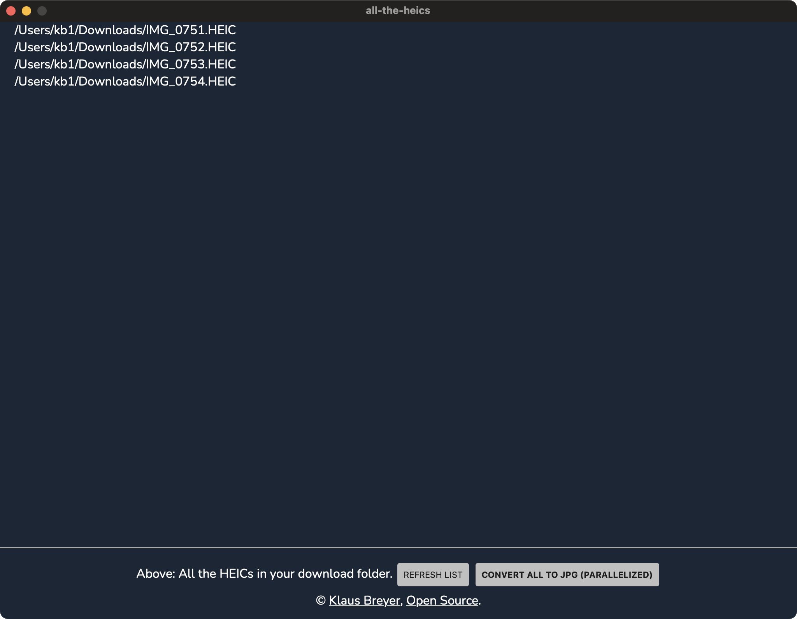

 

Managing HEIC files from Apple devices can be challenging due to compatibility issues. To address this, I’ve developed [all-the-heics](https://github.com/klausbreyer/all-the-heics), a tool that converts all HEIC files in a specified directory to JPG format, preserving both EXIF data and original timestamps. This ensures seamless integration with various platforms and applications.

[all-the-heics](https://github.com/klausbreyer/all-the-heics) is built using the Wails framework, combining Go for backend processing and standard web technologies (JavaScript, HTML, CSS) for the frontend, offering a responsive and efficient user experience.

For more details and access to the source code, visit the [GitHub repository](https://github.com/klausbreyer/all-the-heics).
