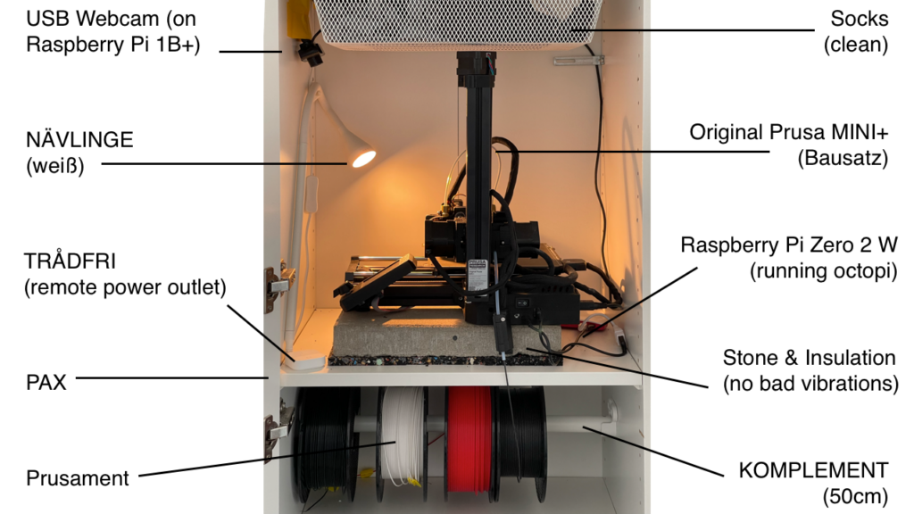

Der 3D Drucker (Prusa) in meinem Kleiderschrank (Pax) hat jetzt einen Livestream auf Twitch. [https://www.twitch.tv/prusapax](https://www.twitch.tv/prusapax)
Das komplette Setup

## Wie es dazu kam - Background Story

Die Faszination für einen 3D Drucker zuhause war groß. Vor allem am Anfang, für die Kinder. Doch gerade für längere Projekte war die Geräuschkulisse in unserer offenen Wohnung dann doch etwas störend.

Deshalb habe ich den Drucker in meinen Kleiderschrank gepackt und ein paar Bretter umorganisiert.

Dort wurde er allerdings erst einmal noch lauter, da die Bretter im Kleiderschrank stark vibrierten. Aber das bekam ich mit einem Stein + Universaldämmmatten sehr gut in den Griff.

Um auch von Unterwegs den Fortschritt zu sehen, wollte ich dann einen Livestream einrichten. Glücklicherweise hatte ich noch eine Webcam und einen Raspberry Pi (erster Generation) übrig. Also habe ich das alles verdrahtet und mit Twitch verbunden.

So - und daran könnt ihr nun alle auf Twitch auch teilhaben - also lasst gerne nen Abo da, etc. kennt ihr ja.

Meistens drucke ich am Wochenende. In den Clips könnt habe ich ein paar Aufnahmen der vergangenen Tage gespeichert.

## Das Projekt Software

- Die Software für den Twitch Raspi läuft als systemd Daemon. Das heißt: sie startet automatisch und verbindet sich mit Twitch, wenn der Raspi Strom bekommt. Dafür habe ich ein [Open Source Projekt geforked und etwas optimiert](https://github.com/klausbreyer/twitch_streaming_pi). Das funktioniert erstaunlich smooth. Der [Raspberry Pi erster Generation](https://www.berrybase.de/raspberry-pi/raspberry-pi-computer/boards/raspberry-pi-1-modell-b-43?c=319) ist mit dem Videostream nur etwa zu 30% ausgelastet (Hardware Encoding!).
- Zur Stromversorgung an den Drucker angeschlossen ist ein [Raspberry Pi 2W](https://www.berrybase.de/raspberry-pi/raspberry-pi-computer/boards/raspberry-pi-zero-2-w) mit [OctoPi](https://octoprint.org/), der wiederrum den Drucker (über den anderen Port) steuert.
- Um Dateien schnell aus der iCloud mit Octopi zu synchronisieren, habe ich mir [ein eigenes Mac OS Command](https://github.com/klausbreyer/octoprint-sync) gebaut und ins Dock gezogen.
- Wenn ich von Unterwegs eingreifen muss, kann ich mich per VPN in mein Heimnetzwerk verbinden und via OctoPi den Druck abbrechen (oder starten).

Auslastung des Raspberry Pi 1 Modell B mit einem 1280x720 Twich Stream

### Hardware

- Der Drucker ist ein [Original Prusa MINI+](https://www.prusa3d.com/de/produkt/original-prusa-mini-bausatz-2/) - ich habe ihn als Bausatz bestellt und selbst zusammengebaut.
- Der Kleiderschrank ist ein [PAX](https://www.ikea.com/de/de/cat/pax-system-19086/), wie ihr euch vermutlich schon gedacht habt.
- Das Filament (PLA + PETG [Prusament](https://www.prusa3d.com/de/kategorie/prusament/)) hängt auf einer [KOMPLEMENT](https://www.ikea.com/de/de/p/komplement-kleiderstange-weiss-90256893/) Kleiderstange, die ich etwas anders montiert habe, um sie leicht rein- und rauszunehmen.
- Die Lampe ist eine [NÄVLINGE](https://www.ikea.com/de/de/p/naevlinge-wand-klemmspot-led-schwarz-10408273/) von IKEA.
- Das komplette Setup (Drucker mit Octopi + Lampe + Twitch Raspberry Pi) hängt an einer [TRÅDFRI Steckdose, funkgesteuert](https://www.ikea.com/de/de/p/tradfri-steckdose-funkgesteuert-00377314/) mit [TRÅDFRI Kabelloser Dimmer](https://www.ikea.com/de/de/p/tradfri-kabelloser-dimmer-weiss-70408595/). Beides hängt an einem [TRÅDFRI Gateway](https://www.ikea.com/de/de/p/tradfri-gateway-weiss-40337806/). So kann ich über die entsprechende iOS App alles auch vom Computer aus einschalten, wenn ich z.b. neue Dateien auf den Octopi syncen will.

Und so ist das ganze von außen: "Und wie sie sehen, sehen sie nichts."
