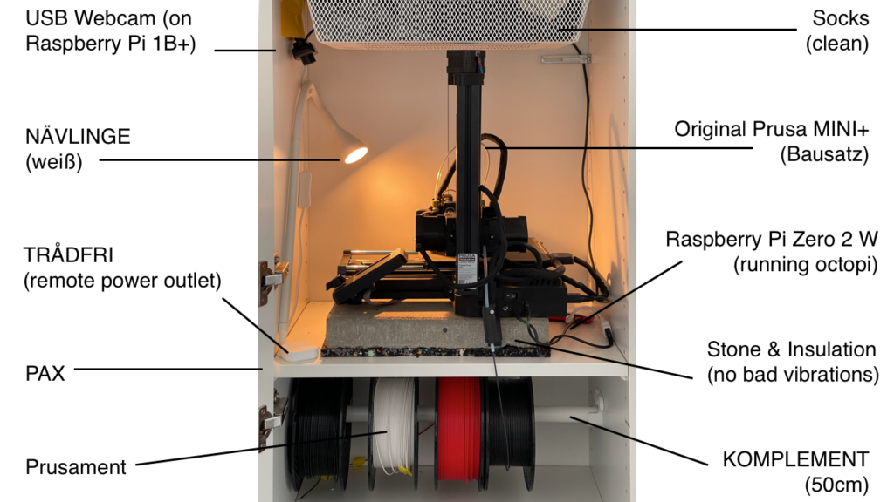
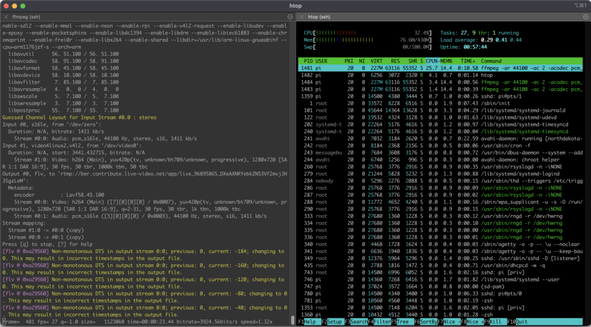
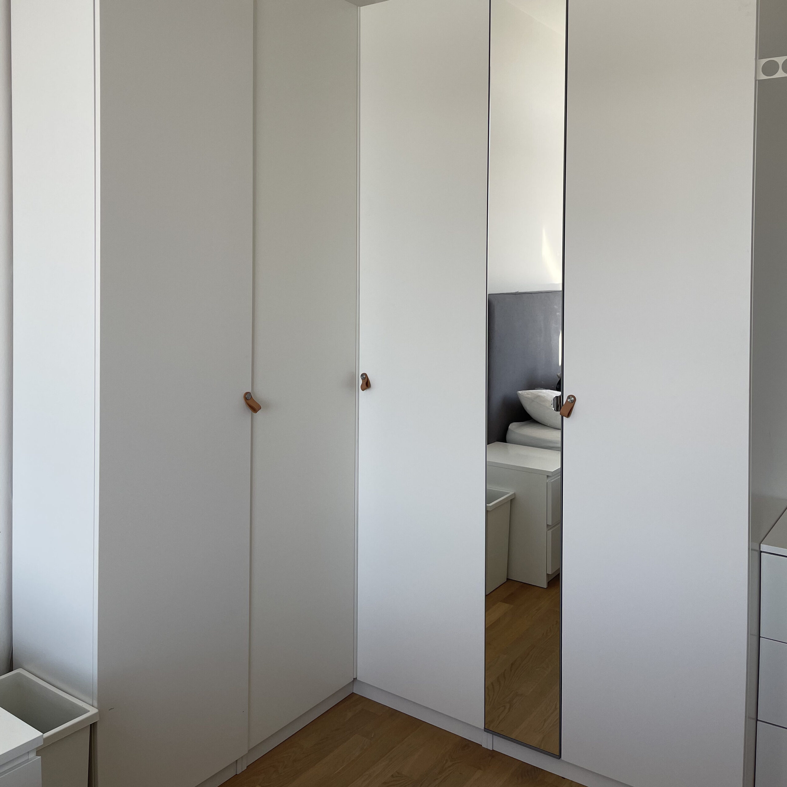

The 3D printer (Prusa) in my closet (Pax) now has a live stream on Twitch. [https://www.twitch.tv/prusapax](https://www.twitch.tv/prusapax)

The complete setup

## How it came about - Background Story

The fascination for a 3D printer at home was great, especially at the beginning for the kids. However, especially for longer projects, the noise level in our open apartment was a bit disturbing.

So, I put the printer in my wardrobe and rearranged a few shelves.

However, it initially got even louder there, as the shelves in the closet vibrated heavily. But I got this under control very well with a stone and universal insulation mats.

To see the progress from on the go, I wanted to set up a live stream. Fortunately, I still had a webcam and a Raspberry Pi (first generation) left over. So, I wired all this and connected it to Twitch.

So - and now all of you can participate in this on Twitch - so feel free to leave a subscription, etc. you know the drill.

I usually print on the weekends. In the clips, I have saved some recordings from the past few days.

## The Project Software

- The software for the Twitch Raspi runs as a systemd daemon. This means: it starts automatically and connects to Twitch when the Raspi gets power. For this, I have [forked and slightly optimized an Open Source project](https://github.com/klausbreyer/twitch_streaming_pi). It works surprisingly smoothly. The [Raspberry Pi first generation](https://www.berrybase.de/raspberry-pi/raspberry-pi-computer/boards/raspberry-pi-1-modell-b-43?c=319) is only about 30% utilized with the video stream (Hardware Encoding!).
- Connected to the printer for power supply is a [Raspberry Pi 2W](https://www.berrybase.de/raspberry-pi/raspberry-pi-computer/boards/raspberry-pi-zero-2-w) with [OctoPi](https://octoprint.org/), which in turn controls the printer (via the other port).
- To quickly synchronize files from iCloud with Octopi, I built [my own Mac OS command](https://github.com/klausbreyer/octoprint-sync) and dragged it into the dock.
- If I need to intervene from on the go, I can connect to my home network via VPN and abort (or start) the print via OctoPi.

Load of the Raspberry Pi 1 Model B with a 1280x720 Twitch stream

### Hardware

- The printer is an [Original Prusa MINI+](https://www.prusa3d.com/de/produkt/original-prusa-mini-bausatz-2/). I ordered it as a kit and assembled it myself.
- The wardrobe is a [PAX](https://www.ikea.com/de/de/cat/pax-system-19086/), as you probably already guessed.
- The filament (PLA + PETG [Prusament](https://www.prusa3d.com/de/kategorie/prusament/)) hangs on a [KOMPLEMENT](https://www.ikea.com/de/de/p/komplement-kleiderstange-weiss-90256893/) clothes rail, which I mounted a little differently to take it in and out easily.
- The lamp is a [NÄVLINGE](https://www.ikea.com/de/de/p/naevlinge-wand-klemmspot-led-schwarz-10408273/) from IKEA.
- The complete setup (printer with Octopi + lamp + Twitch Raspberry Pi) is connected to a [TRÅDFRI socket, radio-controlled](https://www.ikea.com/de/de/p/tradfri-steckdose-funkgesteuert-00377314/) with [TRÅDFRI Wireless Dimmer](https://www.ikea.com/de/de/p/tradfri-kabelloser-dimmer-weiss-70408595/). Both are connected to a [TRÅDFRI Gateway](https://www.ikea.com/de/de/p/tradfri-gateway-weiss-40337806/). This way, I can turn everything on from the computer via the corresponding iOS app when I want to sync new files to the Octopi, for example.

And this is what the whole thing looks like from the outside: "And as you see, you see nothing."
