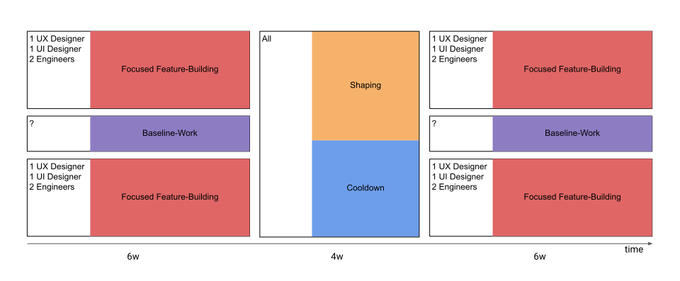

## Shape Up staffing and process patterns

One thing that should be discussed more in detail in Shape up is how to implement it for smaller teams, like migrating an unhappy Scrum team. Many of the cases addressed publicly are for the entire company. But with the correct Pattern, even smaller teams can benefit from the principles of [appetite][1] and [small, autonomous teams][2].

_Update: This is an updated version of this article. So, besides the theoretical patterns, there is also a reality check - besides some other clarifications. I also made the graphics easier to understand. Find the changes highlighted_.

## Why are small teams special?

A single (Scrum) team is a smaller unit than an entire company; however, for many companies migrating to Shape Up, it could be an excellent first step to experiment with an isolated team and create advocates. ([This article is a follow-up to the first steps I did with a particular team 6 months ago.][3])

_Often even small teams are already introducing a lot of bureaucratic overhead (that we hope to remove by implementing Shape Up.)_

Compared to larger, company-wide setups, small teams have those key differences:

- Each developer knows the entire codebase well.
- In most cases, the overall codebase is small enough for everybody to work on everything.
- So everyone can help with technical shaping and try things out.

Nevertheless, continuous integration/deployment and feature flags are necessary, even for small teams to work with Shape Up so that everyone can work on different features in parallel.

## Setting

But let's get specific. In this particular case, we have this team setup:

- 4 (Fullstack) Engineers
- 2 UX Designer
- 2 UI Designer
- 1 Product Person (previously called Product Owner)

It is important to note that the Product Owner, in this specific case, is more of a management role with other responsibilities than a hands-on conceptional Product Manager. So much of the strategic/conceptual work falls to UX.

Furthermore, there is one more aspect that makes the roles of UX in the real world (as compared to 37signals) even more special:

- At 37signals, no specialized person or separate trade is responsible for the user experience. On the one side, there is a lot of UX knowledge during shaping from their CEO, [Jason][4], and their Strategist, [Ryan][5] (back then). But according to their podcasts, the (Product) Designers also have much UX knowledge when implementing designs during the cycle.
- Outside of 37Signals, there is often a specialist UX trade, working on the one hand very high level on a product level but also closely hands-on with UI in the real world.

That makes it difficult to draw a sharp line here. But one thing is sure: **UX is relevant for shaping and building.**

But also, other roles have other/shared responsibilities at specific points during the timeline.

## The Patterns

In the following, I would like to share with you a few theoretical patterns that would have been helpful for me when I was new to implementing Shape up within this team.

Color coding:

- Orange: Conceptual/strategic "uphill" work. Lead by experts with product/strategy and UX skills — complemented by engineers who know the codebase and designers with the foresight to actively participate in shaping and prototyping.
- Red represents the "downhill" work to build new features. The designers design, the engineers write the code, and UX / Product gives sparring alongside.
- Purple is for baseline work. For developers, this is customer onboarding, evolving architecture, fixing bugs, and refactoring code. For designers, this is: making sure the visual big-picture of the application is coherent, building the design system, and polishing.
- Blue: Cooldown time between Sprints, [as defined in Shape Up][6]. Here the teams are reshuffled, dependent on what the next cycle needs.

What all possible patterns have in common: The implementing (small) team does their work autonomously - as long as possible in a timebox.

## Company Wide Shape Up

Shape Up is/will be rolled out company-wide in this situation. With many development teams and enough slack in the system, enough resources are left to take care of the baseline work.

For the shaping part, this model is based roughly [on what Chris Spiek and Justin Dickow shared][7] when they took Product (minded) Engineers out of their development team and put them into the Product department.

[If the shapers can bring a pitch to the builders at the right altitude][8], then they are freed up to be already working on framing and shaping the following things during a build cycle.

With a track for baseline work, the rest of the developers are free to focus on actual features without being disturbed.

## Migration Pattern A: Flip-flopped Shaping

In this alternative approach, a team works divided into two parts most of the time.

- One-half of the team can fully concentrate on building.
- Depending on the maturity and point in time during the cycle, UX + Product can already start with other obligations, like [framing the following features][9].
- The other half of the team takes care of the baseline work and keeps the builders free while spending time on (technical) shaping.
- Product and UX have 6 weeks to focus on shaping. Enough time to test prototypes with real customers and conduct interviews.

You can run this model with fixed teams or rotate them regularly. To ensure a healthy mix, 2 people from a 4-person team can always change (on average) depending on how the feature needs it.

## Migration Pattern B: Interleaved Shaping

The first thing to notice is that there is no fixed responsibility for the baseline work. The developers inside the cycle need to take care, for example, with designated days for it ("[Bugfix Mondays][10]") or on-call rotations.

- Everyone is constantly building or shaping during this entirely different Pattern for small teams.
- Considering this exception, all developers and UI designers can concentrate on building.
- The cooldown phase is extended and used (partly) for shaping. Also, it is possible to remix the teams at this stage.
- Shaping is the absolute focus of the UX and product people during the Cooldown phase. During the cycles, they are sparring partners for the current topic while already framing a couple of upcoming topics.

## Real-life Pattern: alternated shaping and building

_This article has only talked about theoretical patterns in a perfect world where everyone is full-time on the project and has few other commitments._

_Since the first version, intending to implement one of those patterns, the following things have happened:_

- _We have a large amount of baseline work to do: Creation of marketing materials and because we wanted to set the quality bar higher._
- _Especially the designers, unfortunately, don't have as many resources as we would like._

_We have therefore decided on another model. Now there is less parallelization: Shaping and feature-building phases are alternating. It gives the whole system more slack and thus stability._

- _The division into roughly two teams remains._
- _One permanently assigned engineer accompanies the shaping while still involved a little in the baseline work._
- _Almost nothing is expected from the UI designer during shaping except to stay "in the loop" and provide sparring/spiking when necessary._
- _We reserve the right to start shaping when the resources are ready and available during the running cycle._
- _Shaping takes at long as it needs. We have a complex product and do not want to risk starting with half-thought ideas ([like I reported in my Shape Up Practitioners Remote Meetup session][11])_
- _If the pitch is at a point where it makes sense, there is an announcement (which can be 0.5 - 2 weeks in the future) when the next cycle starts._
- _We can shorten the cooldown because there is, otherwise, enough time and slack in the system. After all, we cover the baseline work with enough resources._

[1]: https://basecamp.com/shapeup/1.2-chapter-03#setting-the-appetite
[2]: https://basecamp.com/shapeup/0.3-chapter-01#making-teams-responsible
[3]: https://v01.io/2022/09/23/shape-up-track-for-scrum-or-how-to-experiment-with-the-process/
[4]: https://world.hey.com/jason
[5]: https://feltpresence.com/
[6]: https://basecamp.com/shapeup/2.2-chapter-08#cool-down
[7]: https://www.youtube.com/watch?v=cZF_zV2iby4
[8]: https://basecamp.com/shapeup/1.5-chapter-06
[9]: https://world.hey.com/rjs/20-framing-2f64ddca
[10]: https://www.youtube.com/watch?v=CtcSwlvIIuo
[11]: https://www.youtube.com/watch?v=XEnrFbR2qso
