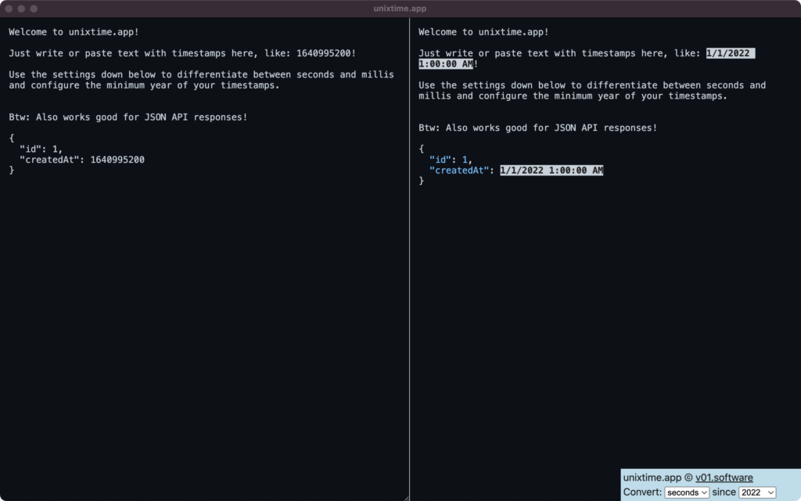

This is an unix epoch timestamp conversion tool to convert and highlight complete texts, whole API responses, and lists with timestampsEverything that looks like a timestamp since a certain year will just be replaced - simple and easy.

Configuration Options are available: Chose between milliseconds and seconds and define the year since when timestamps should be converted.

Works for a list of timestamps, but also full api responses and whatever text you provide.

Feedback is welcome. For Support: [unixtime.app@v01.io](mailto:unixtime.app@v01.io).

