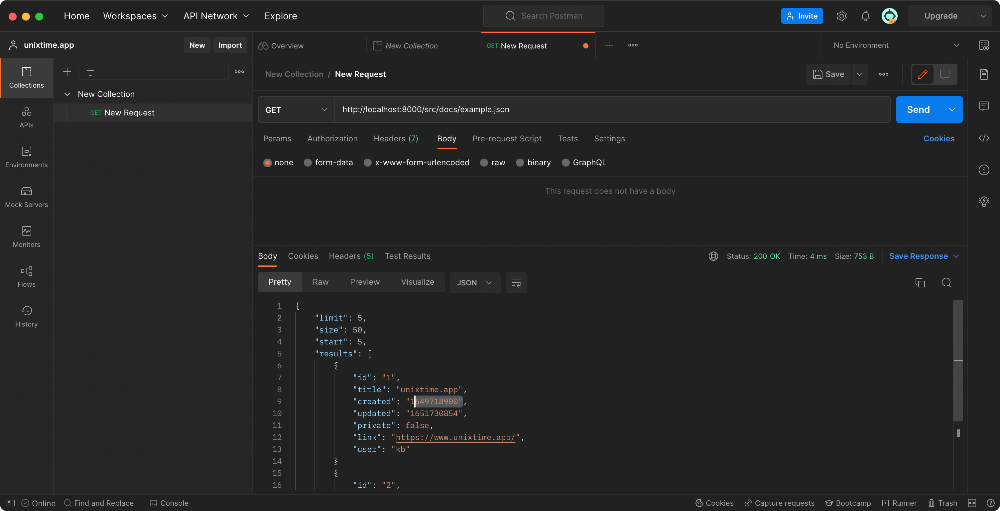
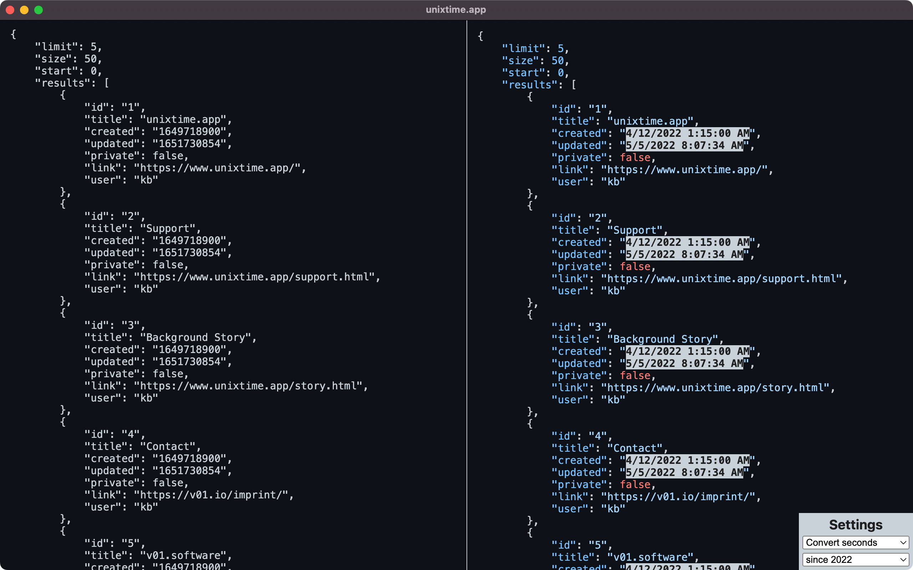
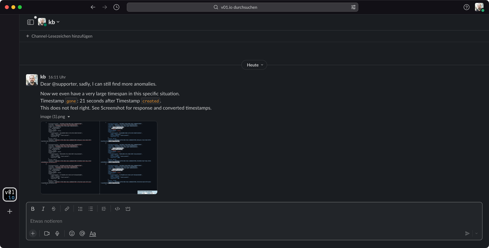

Hi, Iam Klaus Breyer. And I am the author of unixtime.app: An API developers tool for bulk timestamp conversion.

Here I want to tell the story of how I scratched my own itch and how this turned into a product.

## Context: IIotT (Industrial Internet of Things)

The idea's genesis happened during my current stint as Tech Lead for a front-end-heavy product in an IIoT microservice context. Data in the IIoT environment has a lot of timestamps. In the ecosystem I currently work for, the dates were unfortunately not encoded as ISO but as Unix timestamps in milliseconds.

At one point, a completely new microservice was written - we were supposed to be the first customers and could help with requirements.

So far, so good - but then, at some point, the time came when my team and I needed to test and implement the new service. And then the fun began: I looked at API responses for hours and days, wondering whether the API was doing something wrong or our own code. So, nothing unusual. A typical step during development in systems with high real-time requirements.

## Personal Workflow - before

I am a heavy user of Postman. I usually create or import all the API endpoints a product consumes. To verify that the new service is working, I triggered the requests and looked at the responses to check them. Sometimes, I copied browser requests as curl and pasted them into Postman to debug them there.

- In both cases, I had to painstakingly select the timestamp with the mouse cursor each time, ensuring I remembered a digit.
- Next up: I googled "Unix Timestamp Conversion" (or something similar). There are a lot of pages from the seemingly early 2000s that serve this request. They either needed to be more clear or terrible to use.
- And when I got the result, I had to re-contextualize the API call I was debugging.

I repeated those steps- a lot for each API response. This is incredibly annoying when you only have to check for sortings and compare whether one timestamp comes before or after another!

I often ended up with multiple pages to convert multiple timestamps in parallel.

This is a super error-prone workflow. Trying to mark timestamps precisely with a mouse cursor is more than tiring; errors are inevitable when comparing multiple values.

I also looked in the Mac App Store for solutions to have a pretty and easy-to-use tool installed as an application. But, the Apps in the Mac App Store were obviously not developed by developers who optimize their workflow for API development.

In my despair, for very complicated cases where I had to process whole arrays of objects with timestamps, I wrote a small individual script that iterated over them and made comparisons where necessary.

## Personal Workflow - after

Now, I do not select an individual attribute value in Postman anymore. Instead, I copy & paste the complete API request into my handy unixtime.app. Here I can see the converted timestamp in the corresponding context of the API call.

So I know precisely which timestamp belongs to which ID as they are highlighted, and I can continue debugging without losing context.

## A new collaborative workflow

As a side-effect, I can use screenshots of the conversions for collaboration. Because in most cases, however, it wasn't my code that was the problem (of course!!). So I now take screenshots from the unixtime.app and then share them in Slack #support channels or JIRA tickets.

For creating support cases now, I do not need to copy, paste, format, and shorten the API responses. I also saved myself the burden of copying and pasting precisely which timestamp was wrong in what context because this is obvious through the image.

## Prototyping Progress

As a fellow developer, you probably guessed that what this tool does is no rocket science.

- The first version I built in 1h of my free time as a quick proof of concept was just a single HTML file - shareable with my team.
- Next, I moved it to a domain that is easy to remember.
- At some point, I decided to add syntax highlighting for JSON because I guessed this is what most of the payload would be.
- After everything was proven to work, I decided to release the product as a proper application for Mac and Windows.
- After downloads were not picking up and the price was too low for advertising, I decided to make it Open Source.
