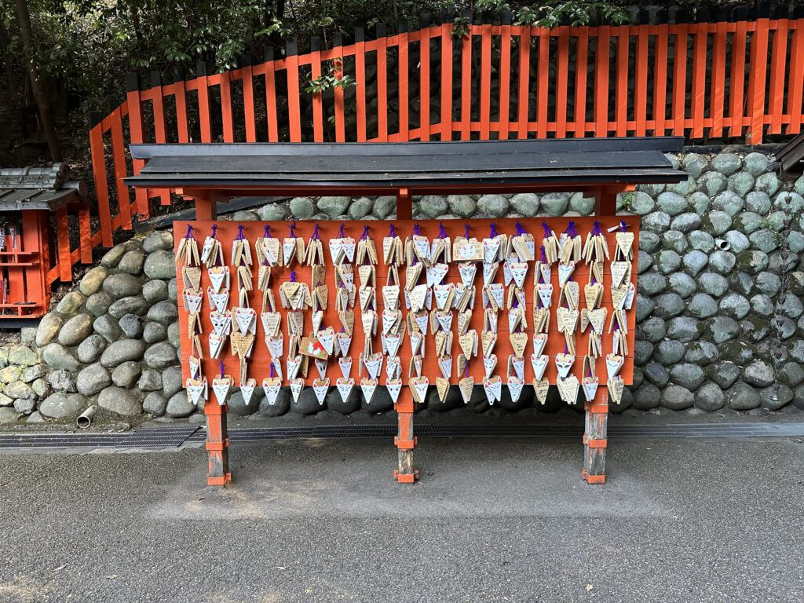
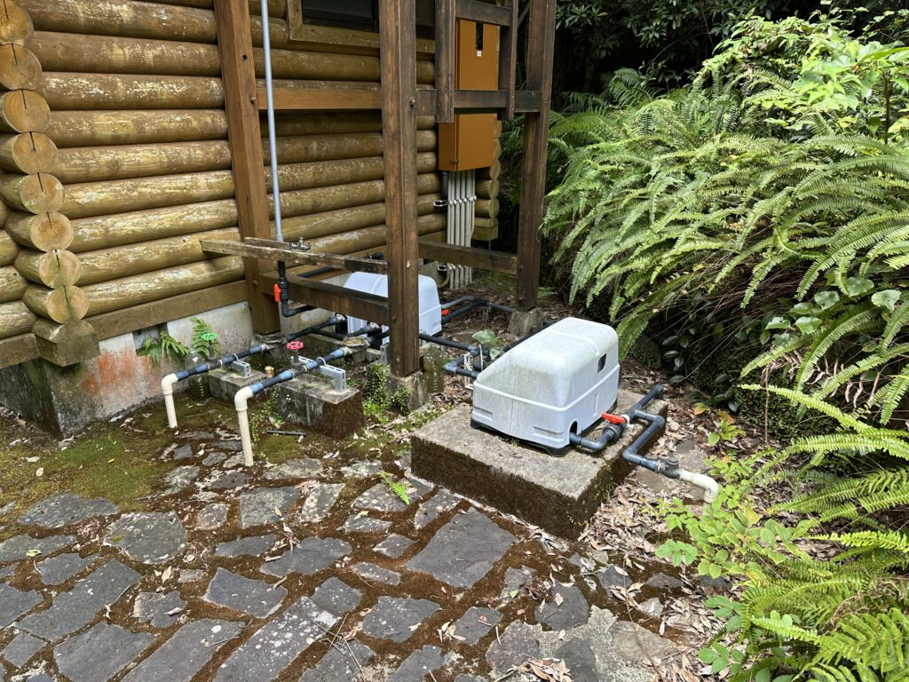
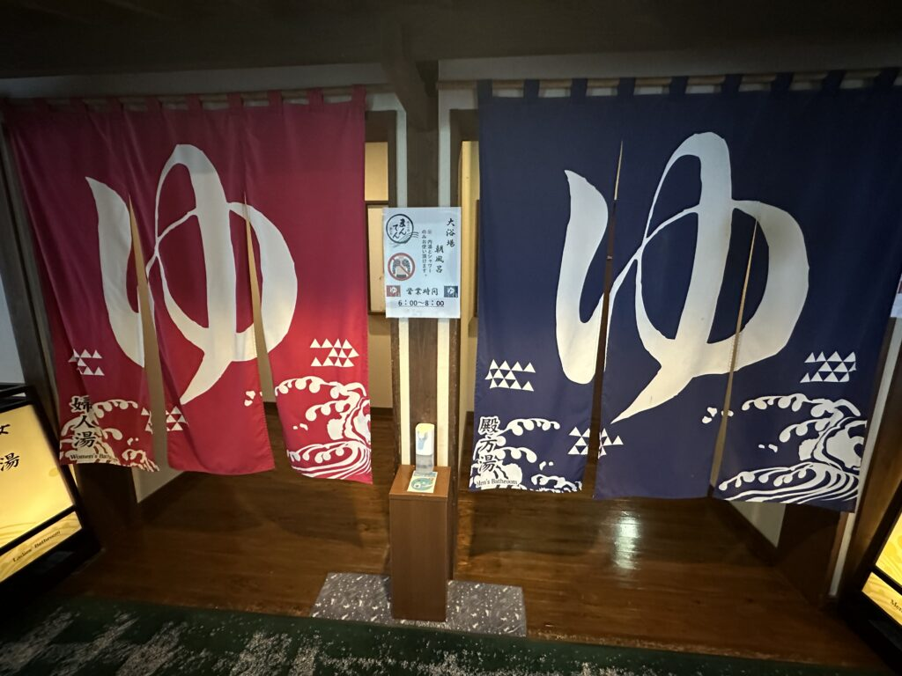
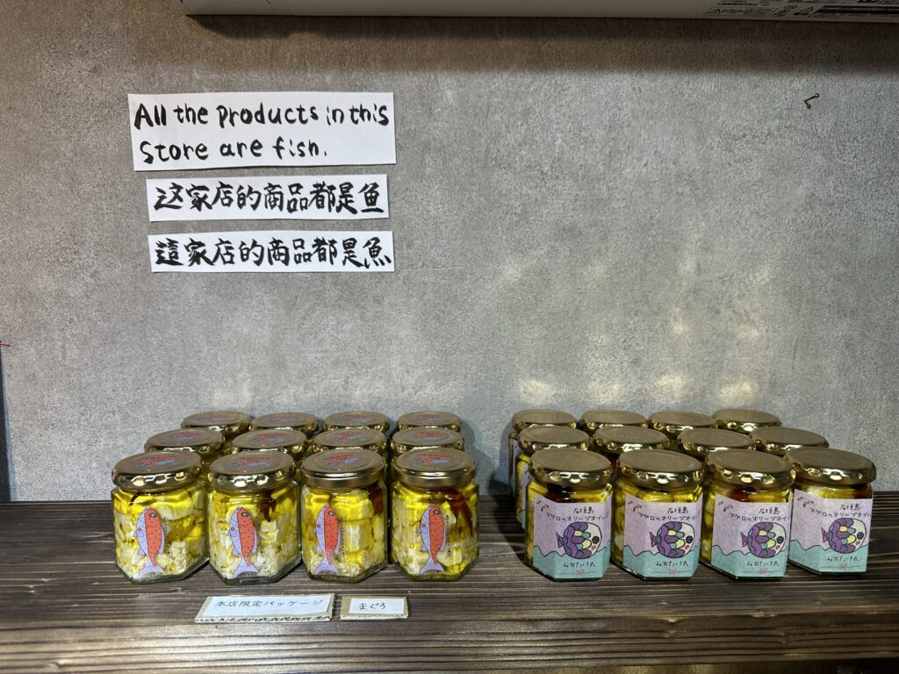
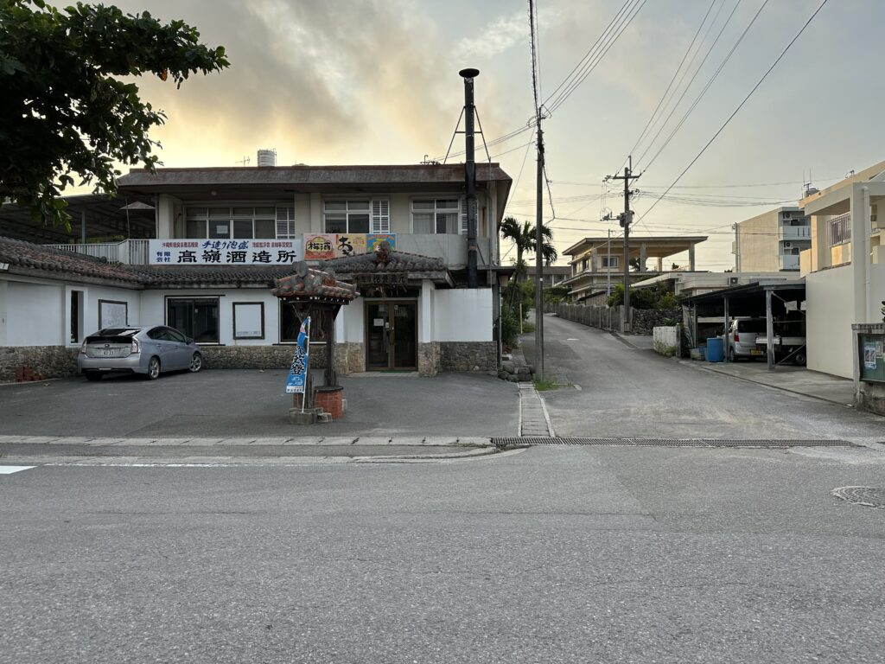
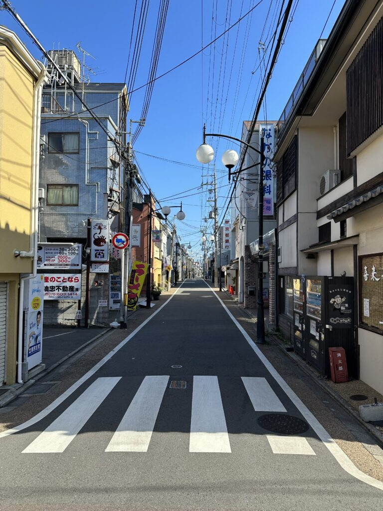
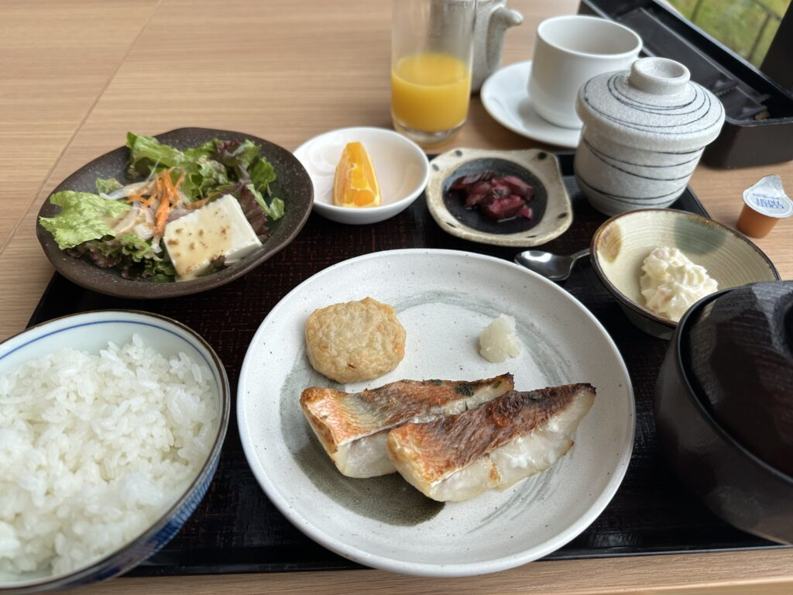
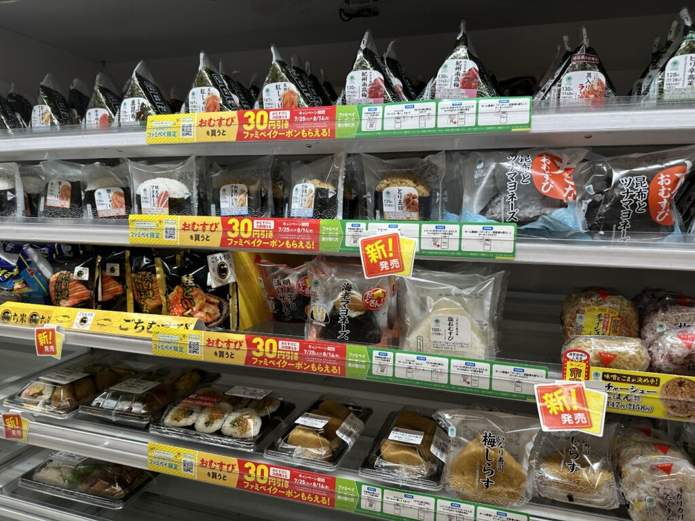
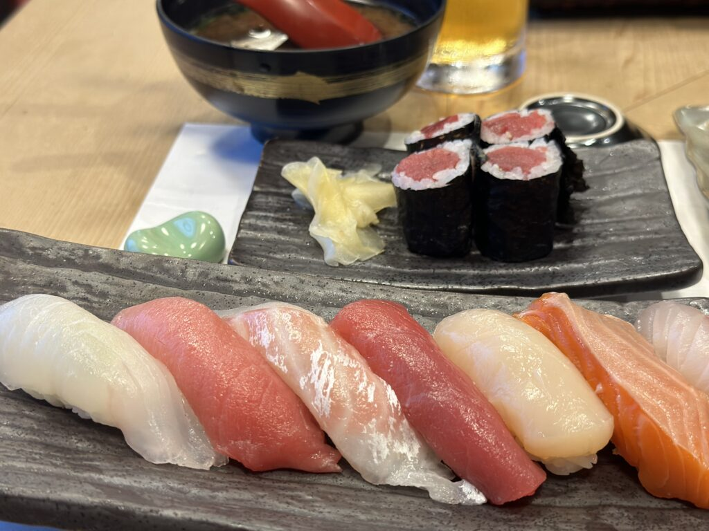

From August 6th to 19th, 2023, I was in Japan with my wife Julia. We had quite a few stops in the short 14 days. But we thought: Why should we travel Japan differently than how Japanese people travel Europe?

Our route:

- 08/06/2023: KIX – Transit
- 08/07/2023: Ishigaki – South Sea flair and diving
- 08/11/2023: Kyoto – Inari, Gion & [Tea plantation tour with owner](https://dmatcha.com/)
- 08/15/2023: Yakushima – 3000-year-old cedars & moss forests
- 08/19/2023: Tokyo – Kyushu, Shibuya & [teamLab Planets](https://www.teamlab.art/e/planets/)
- 08/21/2023: Return journey

We had relatively little planned (for our standards). And I approached the trip very open-minded and unprepared. The only expectation was that I would be amazed and leave my comfort zone.

I wasn't disappointed. Below are my thoughts that I had during the trip.

## Technology and Convenience

- Very practical is that there's a system called Suica Card here. We could set this up in Germany and use public transport directly with our Apple Watch.
- There are always five different ways to pay digitally, but Apple Pay is only accepted in half the cases.
- Interesting: Google Maps works here both indoors and underground. But that's also necessary.
- However, Google Maps location sometimes works very poorly. Probably because not many satellites are visible to the phone due to the high-rises. That's really a shame, because that's exactly when you need navigation most urgently.

## Cultural Peculiarities

- Unusual that you don't talk on the train. Everything goes very orderly and civilized. (Except for tourists from Europe and South America)
- The Japanese have this funny fake jogging when they pretend to hurry.
- But actually, they like to take their time. Better than doing something wrong. Sympathetic.
- Generally: Every shop or service puts incredible thought into their customers. Because here no one wants their customers to be able to do anything wrong. Hence top customer experience in most cases.
- Except at restaurants – here you have to make reservations if you want a table. And unfortunately still often by phone. So as a European, you often stay outside.
- Everything is plastered with warnings.
- And everything is also incredibly well signposted. Again: so that no one can do anything wrong. That would be the worst thing. For both sides.
- Even when something is challenging, it never becomes disorderly. But always remains very coordinated. Zen. In doubt, it just becomes painfully slow. But never disorderly.
- They do everything with much more seriousness than we do. Even the bus driver. But no unfriendly mood. Rather very professional. With a certain honor.
- In more rural areas, a song is played every evening at 5:00 PM over high-mounted megaphones. [This is the 5:00 PM song and a sign for children to come home.](https://youtu.be/1_FMta-NyvI)
- Great onsen culture. The approach: Rather share a large bath with a hot spring than have to shower in a cramped hotel room.

## Everyday Life and Environment

- The incredibly high temperature and humidity.
- You could actually take photos all the time. These characters that are so colorful and that you understand so little.
- Here there's waste separation into combustible and non-combustible waste. The problem: I don't know exactly what gets burned here and what doesn't.
- Even drain pipes are laid here aesthetically, instead of just nailing them somewhere.
- Showering here seems rather unusual. You wash yourself by sitting on a small stool, and the bathroom is a complete wet room. Then you either let water into the bowls or shower yourself while sitting on the stool. I find that quite relaxing, it combines the advantages of bathing and showering.
- They very much like to optimize things to the end here. Just one example: The seat rows in the Shinkansen are always turned in the direction of travel.

## Food and Drink

- Vending machines everywhere where you can buy drinks at fair prices. A large bottle of water costs about one euro.
- They love pork belly here. And I do too!
- A great concept is Onigiri: You can buy a larger piece of sushi and eat it with your hands. A delicious snack while waiting for the plane. Or also a great breakfast.
- Generally the convenience store culture: Simply having things heated up at the checkout.
- Often there are no napkins, but instead wet wipes wrapped in plastic. You use these to clean your hands before eating. That feels particularly clean and makes total sense, especially when eating with your hands.

## Personal Impressions

- Everything is unusually challenging, but you also approach everything completely open-mindedly. Because you don't understand anyway what this shop offers, for example. Whether it's good or bad (for the locals)
- I believe no other country is as well-developed and accessible and at the same time so incredibly foreign as Japan.
- The costs aren't even as high as you might think. In a tourist region. For food, you definitely pay less than if you were to eat a ramen soup in Berlin.
- Interesting. You seem to travel here without a toothbrush. In every hotel, it's standard that there's a toothbrush. Maybe that's just this face-losing thing again.
- The Japanese sweat differently and therefore don't smell even at 35 degrees. The only ones who smelled unpleasant were always Europeans.
- I really like the money and denominations. All bills the same size. Paying with bills at vending machines works reliably. I'm almost discovering a new love for cash.

## Conclusion

It was indeed a somewhat different trip than our previous vacations. It was definitely more exhausting, but I also have the feeling of taking more home with me than if you just lie around on the beach. Some decisions we made in advance, we certainly regretted somewhat. In between, we also had a good portion of luck when we escaped an approaching typhoon. We also learned a lot for future trips.

With many fascinating impressions and humility, we now travel back. Japan is probably the only place on earth where you sometimes feel very excluded and helpless as a white Western European.

But it was exactly right. As I wrote at the beginning,
