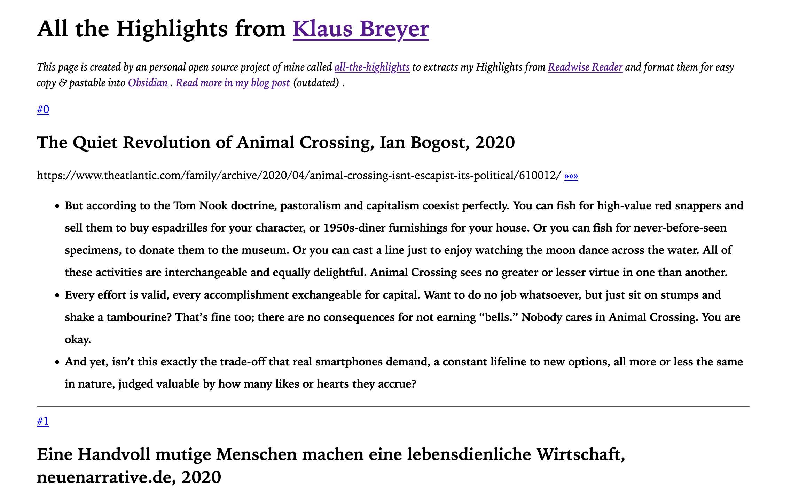

Managing book highlights efficiently is a challenge I've tackled with [All The Highlights](https://github.com/klausbreyer/all-the-highlights), a tool designed to fetch and format Readwise highlights for personal knowledge systems. This solution offers a streamlined approach to handling reading insights.

The essence of this project lies in its ability to take a raw data stream from Readwise and transform it into a structured, usable format. While I will personally review and integrate these highlights into my broader knowledge management system, the tool itself serves as a foundational step in this process.

My solution enhances my workflow by simplifying the process of copying article titles and links. With just a single click, these details are transferred to the clipboard. While other aspects, particularly those involving knowledge processing, remain manual, this is an intentional choice to reinforce learned repetition.

## Core Features

[All The Highlights](https://github.com/klausbreyer/all-the-highlights) is focused on:

- **Readwise Data Retrieval**: Connects to Readwise to pull highlight data.
- **Selective Organization**: Filters and organizes highlights for efficiency.
- **HTML Formatting**: Converts highlights for easier personal processing.

## How to Use

The tool is user-friendly and accessible:

- **Initial Setup**: Clone the repository and set up the Readwise token.
- **Local Execution**: Run the tool locally with a simple command.
- **Automated Updates**: Deployed to GitHub Pages for consistent access.
- **Publicly Accessible Highlights**: View my highlights at [https://highlights.v01.io](https://highlights.v01.io).

Alternatively, you can set up the script on your GitHub page with your own secret, as described on the GitHub page. This flexibility allows you to personalize how you access and manage your highlights.

[All The Highlights](https://github.com/klausbreyer/all-the-highlights) is more than just a personal tool; it's an open-source project aimed at aiding anyone in their knowledge management journey. By sharing my approach and the tool, I hope to inspire and facilitate a more organized way of handling reading insights.

[Explore All The Highlights on GitHub](https://github.com/klausbreyer/all-the-highlights) to start managing your book highlights more effectively.
