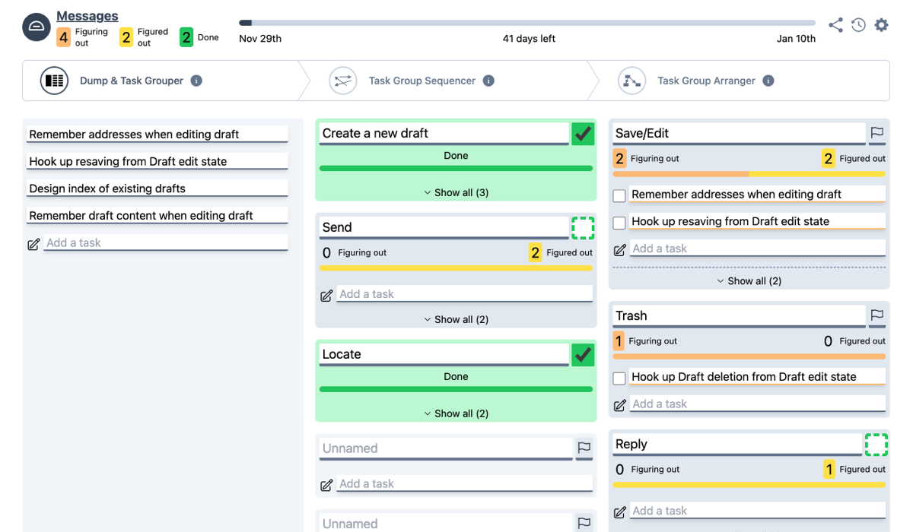

Imagine a scenario where a product and tech team, enthusiastic about the Shape Up methodology, find themselves grappling with the challenge of translating high-level projects into actionable tasks. This is a familiar scene in many tech teams, where the conceptual leap from the big picture to the granular details often becomes a stumbling block.

Today, I am thrilled to announce the beta-launch of [dumplink](https://dump.link), a tool designed to seamlessly bridge this gap, catering specifically to teams adopting or aiming to learn the Shape Up methodology.

## Introducing dumplink: A New Era in Project Management

[dumplink](https://dump.link) is more than just a project management tool; it's a strategic ally for teams embracing Shape Up. Its functionalities resonate deeply with the principles of Shape Up, enhancing the workflow from unstructured ideas to a well-organized project plan.

### Key Features of dumplink

1. **Dump**: Break down a project into an unstructured list of tasks. This phase allows for a free-flowing collection of all tasks, mirroring the brainstorming stage of a project.

2. **Cluster**: Organize this list into task groups. By clustering tasks, teams can see natural groupings and dependencies, aiding in more strategic planning.

3. **Sequence**: Arrange the task groups in a logical sequence. This helps in identifying the order in which tasks should be tackled, aligning with the project's overall timeline.

4. **Arrange**: Get a structured data visualization of the task groups as an unfolded network. This visual representation provides a clear overview of the project's structure, making it easier to manage and navigate.

5. **Set Appetites and See Risk Ratios**: Quickly assess progress risk, from unsolved to solved phases. This feature allows teams to align their efforts with the project's 'appetite' or time budget, making strategic decisions about scope and priorities.

## A Tool Shaped by Shape Up

[dumplink](https://dump.link) is not just another project management tool; it's a manifestation of the Shape Up methodology's core principles. It encourages teams to think in terms of big-picture goals and then methodically break them down into actionable steps. This approach not only aligns with Shape Up’s emphasis on flexible scopes and fixed timeframes but also enhances the overall efficiency and effectiveness of the process.

### Discover dumplink

I invite you to explore [dumplink](https://dump.link) and witness its capabilities firsthand. Visit our website to try [dumplink](https://dump.link) for free and watch the introductory video that not only explains the software but also delves into some of the underlying concepts of Shape Up.

Furthermore, for a deeper understanding, check out our recent episode on the Shape Up Podcast, where we discuss [dumplink](https://dump.link) in detail and provide a comprehensive tour of its features. Watch the episode on YouTube for the best experience.

In conclusion, [dumplink](https://dump.link) represents a significant stride in aligning product and tech teams under the Shape Up framework. By offering a structured yet flexible approach to project management, [dumplink](https://dump.link) stands as a testament to our commitment to enhancing teamwork and productivity in the tech sphere.

Experience [dumplink](https://dump.link) today and transform the way your team navigates through the complexities of project management.

Also mke sure to check out [our Shape Up Podcast Episode](https://shapersbuilders.transistor.fm/episodes/building-tools-for-shape-up-klaus-breyer-matt-lane-co-founders-of-dumplink).
