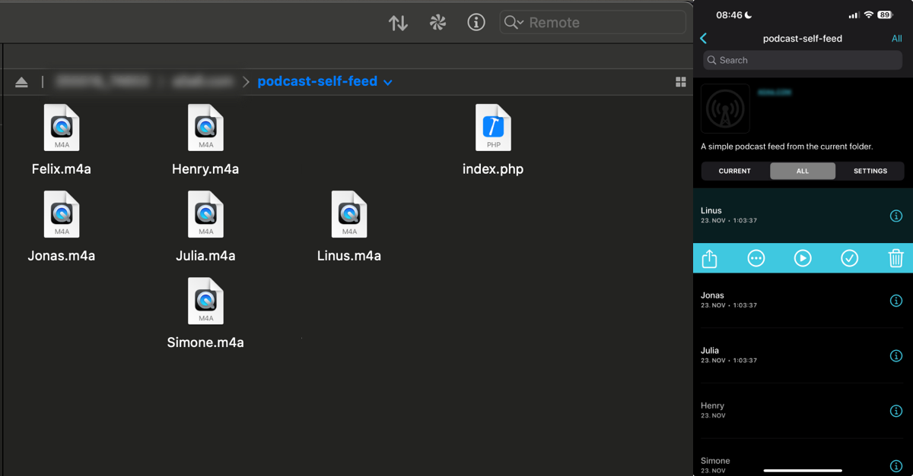

Imagine this: your favorite YouTube content creators have just uploaded a series of insightful podcasts. But there's a catch – they're all in video format. This is a familiar scenario in our digital age, where engaging audio content is often locked within visual media, posing a challenge for those with limited screen time or a preference for audio.

## Bridging the Gap: From Visual to Audio

Ever since I started using ChatGPT for coding, I've been spotting GPT-4 sized holes everywhere that I swiftly patch up.
Recognizing this gap I just described above, I've crafted a straightforward yet powerful PHP script: [Folder Feeder](https://github.com/klausbreyer/folder-feeder). This tool is a bridge, transforming any collection of audio files into a podcast feed. It's particularly effective for converting YouTube videos into podcast episodes, enabling seamless enjoyment of these videos, akin to traditional podcasts in your personal playlist.

### Key Features

- **Easy Conversion**: Converts a directory of audio files into a podcast feed.
- **Universal Compatibility**: Effortless setup on any web hosting service with PHP support.
- **Supports Multiple Formats**: Compatible with various audio formats, including MP3, M4A, MP4, and WAV.

### Requirements

- A web hosting service with PHP support.
- FTP or a similar method to upload files.
- Audio files ready to be included in your podcast feed.

## Creating Your Personal Podcast Feed

### Step 1: Preparing Audio Content

1. **Download YouTube Audio**: Utilize `yt-dlp` to download audio. For example, `yt-dlp https://www.youtube.com/watch?v=U9mJuUkhUzk`.
2. **Audio Conversion**: Use `ffmpeg` to convert video files into audio. Example: `ffmpeg -i input.mp4 -q:a 0 -map a output.mp3`.
3. **Uploading Files**: Employ FTP to upload the audio files to your web server.

### Step 2: Script Setup

1. **Script Acquisition**: Download the `index.php` script from the repository.
2. **Script Placement**: Upload `index.php` to your web server, in the same directory as your audio files.

### Step 3: Generating Your Podcast Feed

1. **Accessing the Script**: Visit your web server directory where `index.php` is located.
2. **Acquiring the Feed URL**: Use this directory URL as your new podcast feed.

### Step 4: Enjoying Your Podcast

1. **Adding to Your Player**: In your podcast player, add a new podcast using a URL.
2. **Feed URL Insertion**: Paste the previously obtained feed URL.
3. **Listening Experience**: Your audio files now appear as individual podcast episodes.

## Concluding Thoughts

In summary, the Folder Feeder script exemplifies how a simple code solution can significantly enhance our media consumption, bridging the gap between video and audio, and bringing your favorite content into a new, more accessible format.

## Copyright Reminder

Before using this tool, please ensure that you have the right to repurpose and distribute the content you are converting into a podcast format. Copyright laws vary by region and type of content, and it's essential to respect the intellectual property rights of creators. Unauthorized use or distribution of copyrighted material could result in legal consequences.
