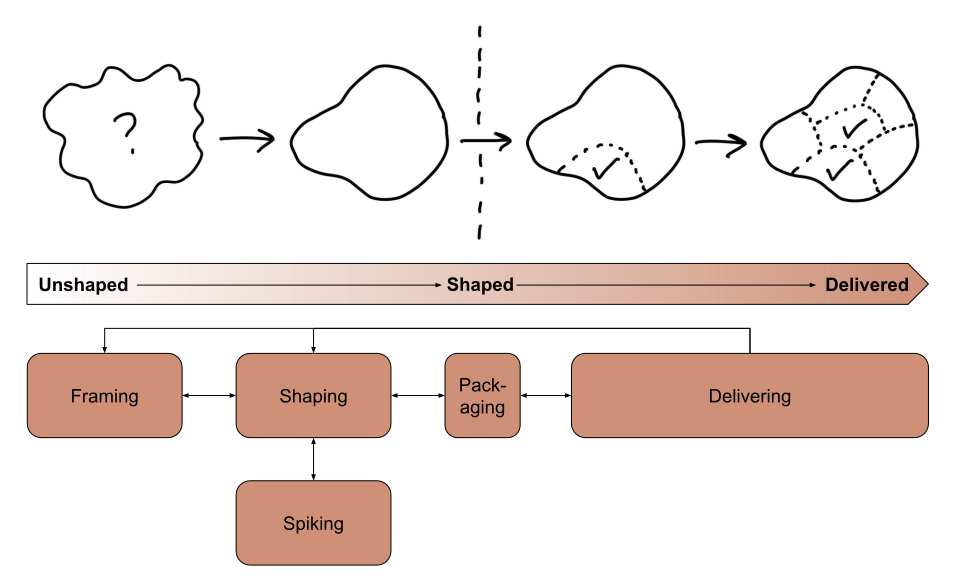
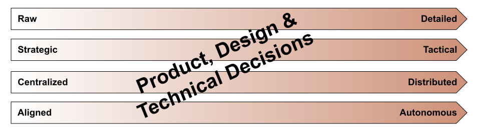

Shape Up emphasizes the importance of constantly de-risking a feature idea from its origins until implementation by making technical, design, and product decisions with all professions represented.

It is essential to state that this is more art - than science. But when I explain Shape Up, it comes down to fundamental principles across all team sizes and scale levels.

Let us unpack.

## Constant de-risking of a feature

One could imagine the Shape Up Process to de-risk a feature idea constantly. From the first origin until the final implementation, it is about **continually assessing and evaluating risks associated with each feature without pouring too much concrete too early.**

- Unshaped: The idea (as in the picture) is wobbly and fuzzy initially. So the de-risking must be done with broad strokes during [Framing][1] for a clear scope.
- Shaped: During the [Shaping][2], supported through Spikes, it gets more precise what the scope will be.
- Delivered: In the end, the idea is very detailed - and the de-risking is as well, down to the very decision where a button resides in an interface.

## Continuously driving Product, Design, and Technical Decisions

The Beautify of Shape Up is the fact that it **involves decisions from all trades,** from the beginning until the end, from raw to detailed.

As opposed to Scrum: Where a PO makes product decisions, maybe consulting with technical people, but without the full buy-in throughout the creative process.

In Shape Up, involving **technical people in the entire decision-making process with the goal that they do research, think about how to lay out the architecture, or write code for prototypes within the actual codebase very early on** is an essential factor in de-risking a feature.

By collaborating closely throughout the Framing and Shaping phase, the team can make more informed decisions and minimize technical and design issues that could arise later in development.

It is crucial to emphasize that in the early stages of a project, decision-making should be led by experienced individuals well-aligned with the company's strategy. On the other hand, as the process progresses, it is essential to grant greater autonomy to the delivery team as their decisions become more pertinent to their specific tasks. Furthermore, later in the project, onboarding junior team members into these autonomous teams becomes easier, providing them with valuable learning opportunities and contributing to the project's overall success.

## Conclusion

By adopting the Shape Up process to the specific needs and capabilities of the team, the team can ensure that they are delivering high-quality software that meets the needs of the end-users in an agile and effective manner.

If you want to learn more about Shape Up, feel free to have some [sparring with me][3]. Besides that, [I recommend the Online Course from Ryan that taught me those fundamentals.][4]

[1]: https://world.hey.com/rjs/20-framing-2f64ddca
[2]: https://basecamp.com/shapeup/1.1-chapter-02
[3]: https://www.v01.io/pages/shape-up/
[4]: https://feltpresence.com/srl/
