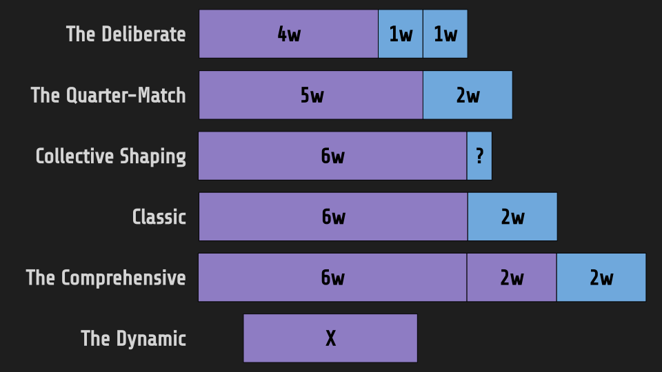

While I am currently bootstrapping a startup idea centered on Shape Up tooling, I've gathered multi-faceted insights: from interviewing 10 successful Shape Up teams to personal experiences and consulting roles. The Classic 6+2 model is prevalent, but intriguing variations exist, often featuring on-call or enablement teams.

## Classic (6+2)

**Method**: 6 weeks of building, followed by 2 weeks of cooldown.
**Cooldown**: 2 weeks
**Best For**: The staple for many, including Basecamp. Ideal for teams looking for a time-tested approach.

## Collective Shaping (6+?)

**Method**: Shaping until consensus, then a 6-week building cycle.
**Cooldown**: To be decided (indicated by "?")
**Best For**: Teams valuing collective decision-making with a flexible cooldown. On-call rotations or enablement teams are sometimes used here.

## The Dynamic (X)

**Method**: Entirely flexible cycle length, often with just one developer per project.
**Cooldown**: No fixed period
**Best For**: Small, agile teams where adaptability is key.

## The Deliberate (4+1+1)

**Method**: 4 weeks of building, followed by 1 week for framing adjustments, and another week for final solution shaping before starting with the building cycle.
**Cooldown**: 2 weeks segmented into framing and solution shaping
**Best For**: Teams needing precise planning and coordinated availability during cooldown.

## The Quarter-Match (5+2)

**Method**: 5 weeks of tech-only building to fit into fiscal quarters, followed by 2 weeks of cooldown.
**Cooldown**: 2 weeks
**Best For**: Corporate teams guided by fiscal calendars.

## The Comprehensive (6+2+2)

**Method**: 6 weeks of building, 2 weeks for release and polishing, followed by 2 weeks of cooldown.
**Cooldown**: 4 weeks (2 for release and polishing, 2 for cooldown)
**Best For**: Larger, mature teams desiring a comprehensive cycle, including a release phase.

## Conclusion

The timing notations — 6+2, 6+?, 4+1+1, and so on — signify more than just numbers; they encapsulate the rhythm of a development cycle. Shape Up offers a flexible framework that teams can tailor to their needs. Whether following the Classic model or venturing into custom territories like Collective Shaping or The Deliberate, the essence is in adapting the cycle to your team's unique needs and rhythms.
