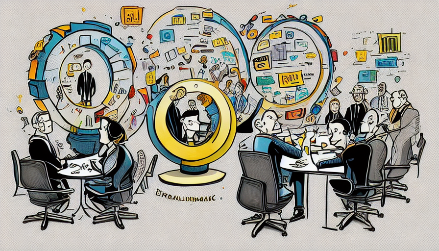

The world of agencies is dynamic, fast-paced, and ever-evolving. The Shape Up methodology can be a beacon of structure and strategy in such an environment. Initially crafted for product development, its principles are tailor-made for agencies eager to innovate, collaborate, and deliver consistently.

## Why Clients Should Opt for Shape Up

Shape Up shines brightest when clients tread into unknown territories, especially when they're sculpting new business models or trailblazing solutions. Its core ethos is rooted in continuous de-risking. This ensures that what's being built is aligned with the client's vision and resource-efficient. Clients are woven into the process, ensuring transparency, collaboration, and alignment. The beauty of Shape Up lies in its promise: _while the exact nature of the outcome might remain fluid, the delivery of a tangible result is unwavering._

## Crafting the Perfect Setup

1. **Trust the Team**: Clients must have faith in the capabilities of the designers and developers.
2. **Project Scale**: Shape Up requires projects of a certain magnitude and duration for effective implementation.
3. **Versatile Designers**: Opt for all-rounder designers rather than having separate UX and UI specialists.
4. **Full Stack Designers**: Designers proficient in HTML and CSS to a production-grade level, but not necessarily JavaScript.
5. **Dynamic Duos**: Ideally, projects should be tackled by teams of two.
6. **Robust Product Teams**: A competent product team is crucial, especially during shaping. Absent this, clients might inadvertently steer the project without adequately de-risking it.
7. **Leadership Buy-In**: Adopting Shape Up requires endorsement from the top echelons, given its cross-functional nature.
8. **Continuous Learning and Application**: Implementing Shape Up isn't a one-off task. It demands a thorough understanding of the methodology and its nuances.

## Marrying Agency Sales with Shape Up

The initial framing in Shape Up can be envisaged as a collaborative dance between the agency and the client. The objective is singular: to gauge genuine enthusiasm to tackle the identified problem. The conversation might revolve around a simple yet profound question: "If we could shape this into a feasible concept and bring it to life within a set timeframe, would that journey be valuable?" An affirmative response lights the path to the shaping phase.

In wrapping up, for agencies poised at the crossroads of innovation and delivery, Shape Up can be the compass they've been seeking. It offers a structured yet flexible roadmap, ensuring client involvement, trust, and guaranteed outcomes. In the bustling agency landscape, Shape Up can be the distinctive edge that sets an agency apart.
