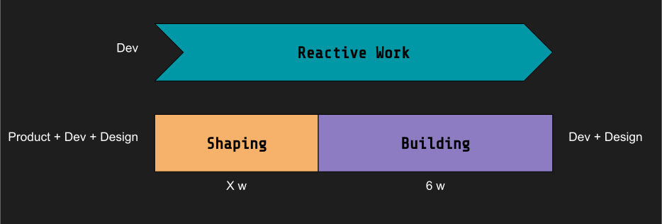

Shape Up, at its core, is a method for software development. However, its influence doesn't stop there. Today, I want to delve into the broader organizational implications that this methodology brings along, beyond its direct application in development.

## Reminder: Why Embrace Shape Up?

1. **Rekindling the Startup Spirit**: For organizations that feel they've plateaued, Shape Up brings back the agility and enthusiasm synonymous with startups.
2. **Efficient Scaling**: As growth ambitions soar, Shape Up provides a structured roadmap to scale without chaos.
3. **Maintaining Innovation**: Especially pertinent for product-centric organizations that need to consistently churn out fresh ideas and solutions.

## Foundational Principles

- **Synchronized Productivity**: Shape Up emphasizes the need for parallel workflows, especially as teams expand. This requires well-defined Presprictions for the building team and a strategic approach to feature planning (called Framing and Shaping)
- **Not Just Another Method**: Beyond its tools, Shape Up represents a paradigm shift in work culture and approach.
  - **Thinking in Appetite Instead of Estimates**: How would a project version look in 6 weeks? And in 1 week?
  - **Effective Shaping**: Incorporating techniques like Breadboarding and Fat Marker Sketches.
  - **Delaying Detailing**: An emphasis on de-risking and avoiding premature detailing.
  - **Anticipating Challenges**: Proactively addressing and defusing potential pitfalls.

## Product Org

- **Collaborative Accountability**: No longer are developers the bearers of trade-offs because of a looming deadline. A collective approach to de-risking during shaping ensures that everyone plays a part from inception to execution.
- **Balancing Four Pillars**: Shape Up stresses the importance of balancing Scope in favor of Cost, Time, and Quality. With a flexible scope, the other variables can be maneuvered effectively.
- **Quality at the Forefront**: Both from a strategic and product standpoint, quality takes center stage, facilitated by the synergy between designers and developers.
- **Establishing Cadence**: Shape Up fosters a rhythm where collaboration is essential during the initial phases, but autonomy during project cycles is equally championed.

## Operations

- **Team Dynamics with Shape Up**: Small Teams in Long Cycles vs. Large Teams in Small Cycles. This leads to more concentrated work on core tasks and structured appreciation during the shaping phase.
- **Creating the Right Environment**: Intellectual work cannot be orchestrated strictly based on resources. It's essential to craft an environment where such work can self-organize. This idea is beautifully captured in Cal Newport's [A World Without Email](https://amzn.to/45VA6mP), which underlines the significance of reducing communication overload in fostering such environments.
- **Beyond Mere Task Allocation**: Rather than just keeping teams busy, Shape Up focuses on aligning resources with strategic imperatives.
- **Streamlining Large Endeavors**: For extensive projects, Shape Up simplifies processes, reducing the reliance on hierarchical methods.

## HR

- **Talent Magnet**: A conducive environment, challenging assignments, and a blend of repetition make organizations more attractive to top talent.
- **Fostering Mentorship**: With Shape Up, there's a seamless blend of experience and fresh perspectives, creating an environment for mentorship and learning.

## Leadership

Given its distinctive approach, Shape Up cannot be implemented by Engineering or Product Teams alone. Successful adoption demands strong backing from Leadership. Their endorsement is crucial in establishing a consistent and predictable rhythm across the organization. By championing the methodology, leaders can ensure that the entire organization is aligned, facilitating smoother transitions and more effective collaborations.

In summary, Shape Up's ripple effects extend far beyond the realm of product development. By touching various facets of an organization, from team dynamics to operational efficiencies, Shape Up heralds a comprehensive organizational transformation.
