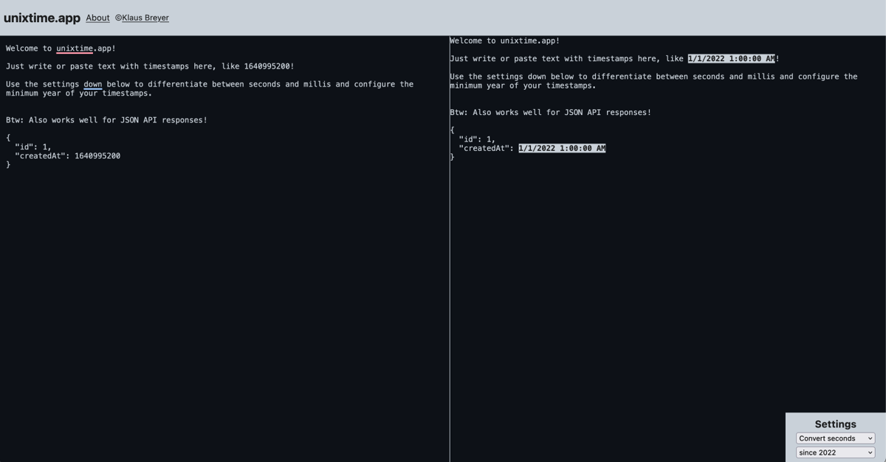

I am excited to announce that my app, [unixtime.app](https://www.unixtime.app), is now fully available for free in the web! This means that anyone can use it without any cost. I have made this decision because since the app was launched in the app stores, it did not generate enough revenue to cover the cost of the Apple Developer account.

Although the app has a small but smart feature set, it cannot be priced high enough to justify a marketing campaign. Therefore, I decided to make the best of the situation and offer the tool to everyone for free. This way, everyone can use it without any limitations, and I hope it can help people in their work and daily lives.

Additionally, I believe that offering [unixtime.app](https://www.unixtime.app) for free will allow me to receive valuable feedback and suggestions from the community. This feedback will help me make the app even better in the future.

I want to thank everyone who has already downloaded and used the app, and I look forward to seeing how the community can help improve it.

[Thank you for your support and happy contributing!](https://github.com/klausbreyer/unixtime.app)
