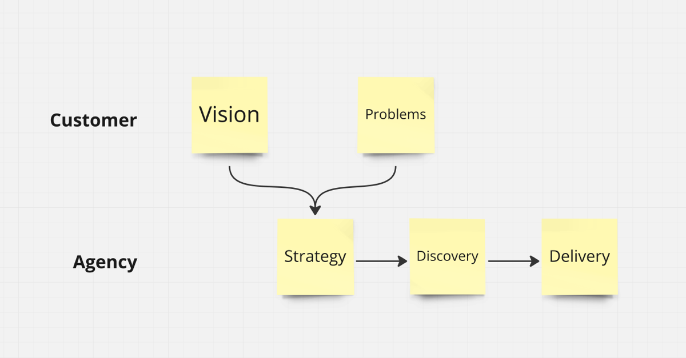

A client-side Product Owner isn't necessary for successful digital products—I even consider it harmful. What's crucial is proper and effective Product Management by the agency.

(The beloved "PO per proxy" won't cut it, either.)

Having experience with both sides, I would like to share some fictional letters.

## The biggest mistake clients of digital agencies can make is writing tickets.

Dear future client, please stop writing tickets.

Instead, insist on discussing how you could best contribute in harmony with a dedicated product team.

Leave the organization of the product team and the resources to the agency - they know how to do it best.

What are you then, instead? Well.

Sometimes, you are the *Subject Matter Expert*, having expertise and access to users.

Most importantly, you need to act like a *CEO*, owning the vision and mission and identifying the problems that must be addressed. You trust that the agency conducts effective discovery and identifies the features themselves.

Your most important job is ensuring the agency has the necessary monetary resources to staff the team sustainably.

In this regard, You can act like a *VC*, first investing small amounts until you have proof (in the team and the market) and then more significant amounts.

## The biggest mistake digital agencies can make is being satisfied with a briefing.

Dear future agencies, please take responsibility for the product and move away from the mindset that someone from the client should tell you what to build.

Most clients lack product management competence or cannot do it because they have too much detailed knowledge and get lost in details. In most cases, it's both.

Product management is a skill that must be learned over several years, for example, in a startup committed to a vision. It means responsibility for providing value to the customer (value risk) while being viable for the business.

Please take responsibility for all product risks (value risk, business viability risk, feasibility risk, usability risk) and staff and bill accordingly—only then can digital products succeed.

Everything else is money wasted for the client and opportunities for the product.

## Sketch of a a more successful model

