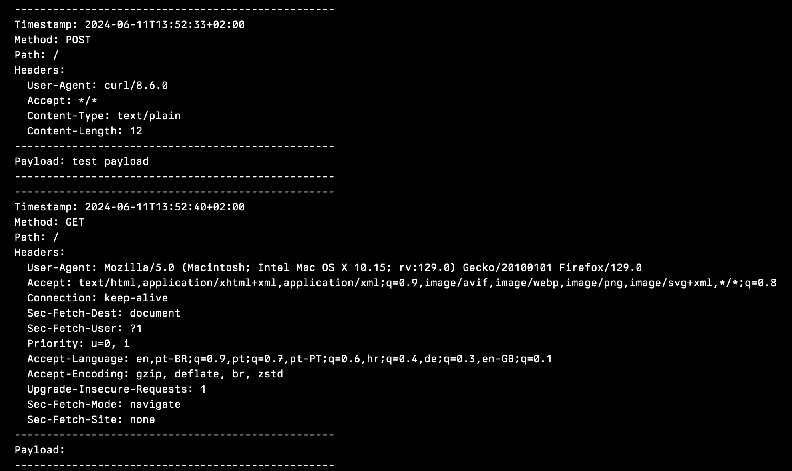

Out of my daily work during testing callbacks locally, I have created and released a new open-source project called [All The Requests](https://github.com/klausbreyer/all-the-requests). A simple HTTP server (built in Go) logs every incoming request. This tool captures details like timestamps, paths, headers, and payloads, making it great for debugging callbacks and webhooks.



## Why Use It?

- **Comprehensive Logging:** It logs request paths, headers, and bodies.
- **Timestamping:** Each request log includes a timestamp.
- **Customizable Ports:** You can set the port via command-line arguments.

## Example Usage

Start the server on port 9090:

```sh
./all-the-requests -port=9090
```

The server output:

```sh
Starting server on :9090
Server is ready to handle requests and display all details.
```

Send a POST request:

```sh
curl -X POST http://localhost:9090 -d "test payload" -H "Content-Type: text/plain"
```

Logged request details:

```sh
--------------------------------------------------
Timestamp: 2024-06-11T13:52:33+02:00
Method: POST
Path: /
Headers:
  User-Agent: curl/8.6.0
  Accept: */*
  Content-Type: text/plain
  Content-Length: 12
--------------------------------------------------
Payload: test payload
--------------------------------------------------
```

For technical details, downloads, and getting started instructions, visit the [GitHub repository](https://github.com/klausbreyer/all-the-requests).
