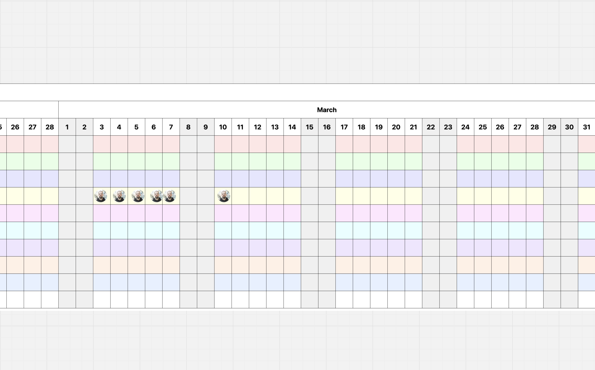

Effective planning and organization are crucial for team productivity. To assist in this, I’ve developed the [Whole Year Calendar for Online Whiteboards](https://github.com/klausbreyer/whole-year-calendar-for-online-whiteboards), a client-side tool that generates quarterly calendars tailored for online whiteboards.

**Key Features:**
- **Quarterly View:** Displays a calendar for a specific year and quarter, facilitating focused planning.
- **Weekend and Holiday Highlights:** Automatically marks weekends and German public holidays, including the applicable federal states, to aid in scheduling.
- **Customizable Rows:** Offers pastel-colored rows for team members or tasks, enhancing visual organization.
- **Responsive Design:** Ensures compatibility with modern web browsers for seamless integration into your workflow.

This tool is entirely client-side, requiring no server-side code, making it easy to integrate into various online whiteboard platforms.

For more details and to access the source code, visit the [GitHub repository](https://github.com/klausbreyer/whole-year-calendar-for-online-whiteboards).
