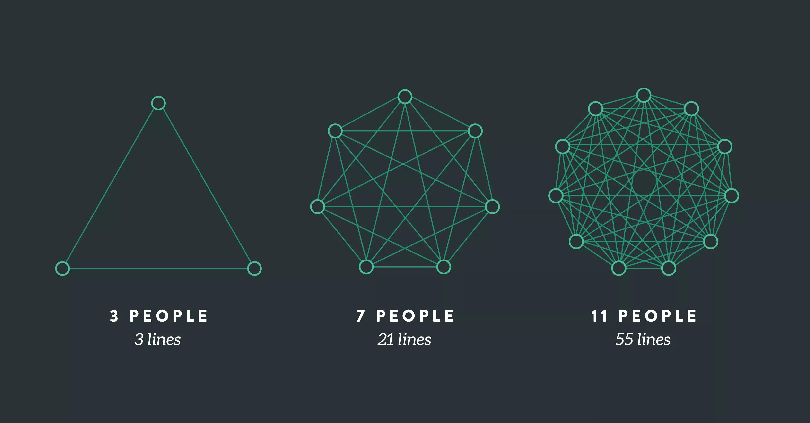

> The idea of the Centaur Programmer is based on the premise that a collaborative approach between humans and AI will be more effective than AI alone, as demonstrated in centaur chess tournaments where mixed teams of humans and AI beat sole computers.

([Pedro Alves, Bruno Pereira Cipriano, 2023](https://arxiv.org/abs/2304.11172))

Let's discuss the implications for product teams.

## Staffing: Full-Stack-Solo-Developer vs. Experts

AI is Lowering entry barriers and reducing dependency on years of accumulated knowledge. So, covering multiple domains becomes easier. However, the full-stack debate might pivot to two key roles:

1. **Full-Stack-Crossovers**: Professionals with a vast range of knowledge and understanding of technical implementation and product requirements. They will write the requirements in the AI chat prompts

2. **Specialized Experts**: These experts handle tasks that AI hasn't yet mastered. However, with AI's exponential learning curve, even these roles are not immune to obsolescence. They are the spearheads of their respective industry.

## Architecture and Feasibility while Shaping

AI code generation is still very weak with respect to code architecture.

Good architecture occurs when a new product idea is shaped—at the very beginning. *It is too late when there is a list of requirements or acceptance criteria*.

So (Senior) engineers need to have a seat at the table while a feature is shaped, and they need to be willing to participate by building fast AI-enhanced prototypes during discovery.

Methodologies like [Shape Up](https://www.feltpresence.com/) that embrace such working styles will be even more critical.

## Team Topologies:  Loosely coupled, highly aligned.

([Lines Of Communication and Team Size: Applying Brooks' Law](https://www.leadingagile.com/2018/02/lines-of-communication-team-size-applying-brooks-law/))

The smaller the team, the less communication. This fact boosts productivity even more (besides the fact that much of the code is now AI-generated).

So, smaller teams are a good thing. I estimate that we go down from a typical team size of 5-7 developers to 2-3 developers. A solo developer is undoubtedly possible, but some redundancy is essential for sick leave and vacations.

Given a centaur programmer's effectiveness, ensuring they do not waste time discussing things in Jira Tickets with other teams will be paramount.

Therefore, the two most important principles for team topologies apply:

1. **Loosely coupled:** A team can operate independently because there are minimal dependencies on other teams.
2. **Highly aligned:** One team's goals are strategically aligned with the goals of other teams by the product strategy.

None of this is new, but it is ever more crucial in smaller teams with high output.
