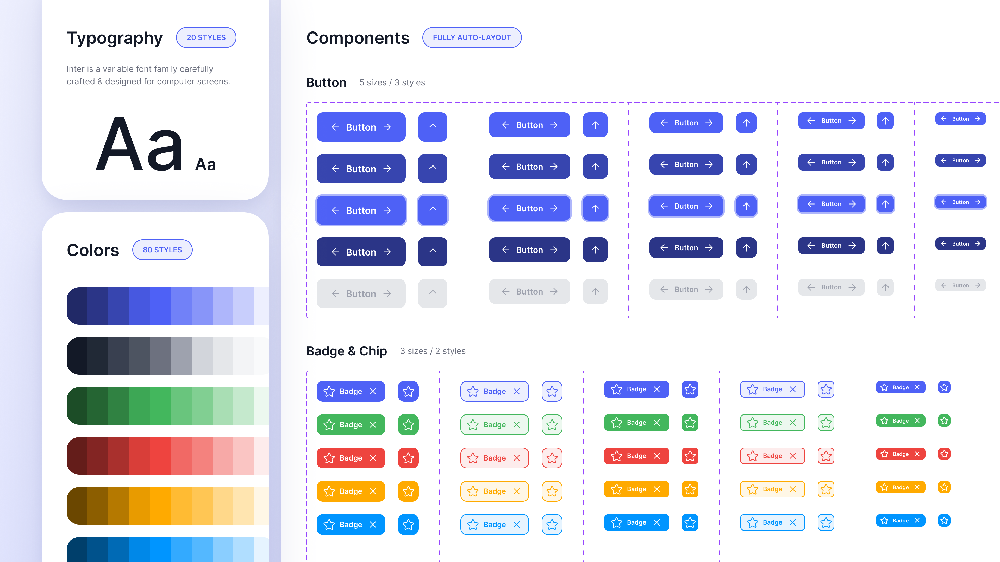
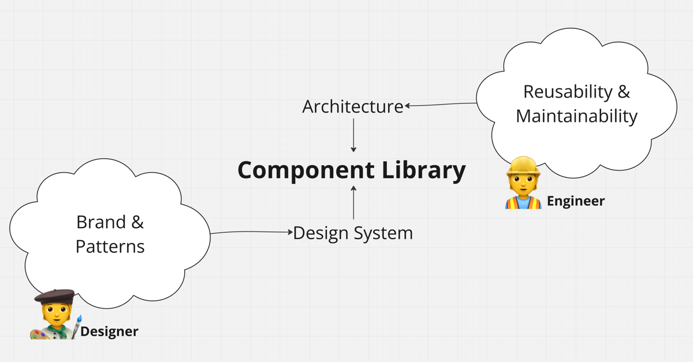

I for sure knew designers and engineers didn't think the same way. But I spent far too long trying to teach designers to think like engineers.

I assumed designers could "adapt" to the engineers to build the design system iteratively, "on the go," as they create reusable components: As we develop features, we identify patterns and gradually assemble a robust design system in sync with the component library.

It felt efficient and iteratively. But reality is humbling.

Fast forward to one messy sprint later: engineers waited, the designer felt rushed, and our laser-focused scope-by-scope working style (as prescribed by [Shape Up](https://basecamp.com/shapeup)) felt more like a lot of mini waterfalls.

The truth? Designers and engineers have fundamentally different needs; reconciling them is essential for smooth collaboration.

## What are a design system and a component library, anyway?

Okay, first things first.

- A **design system** is what designers create to define patterns, brand elements, and user experiences. This is Figma.
- A **component library** is what engineers implement to build the product. This is code.

Here is an example from [Figma](https://www.figma.com/community/file/1267195373409722424):

## They are not the same thing and need to be uncoupled.

Both concepts are often confused when discussing the need for a "design system". It is wrongly assumed that having a "design system" also means spending weeks implementing the component library.

This is wrong.

Seeing this decision as coupled with a binary yes ("we build a design system & component library") or no ("we do not implement a design system") leads to either of two extremes:

1. **If engineers implement the entire design system upfront,** they may build components that are never used. This creates a "net-negative" impact as the time spent building outweighs any long-term savings.
2. **If designers create components only when needed,** engineers are left waiting for the design. This slows development and leads to inefficiency and frustration.

The latter is what I experienced: The power lies in differentiating both things.

## Think broad, build narrow.

While writing code, engineers consider the bigger picture of the product's reusability and maintainability, resulting in the architecture.

Designers also think of the bigger picture and are also architects in a sense - but of the user experience. Their work involves working on the brand and finding patterns to ensure scalability and consistency over the product.

Both roles need to anticipate future needs in their regard but need to converge in what is shipped in the product - **but only what is required right now!**

Only then can a team focus its workflow on strategic feature development by focusing on what's essential and letting the component library grow naturally based on actual requirements.

## Try This Today: Use the Terms Right

Clear communication starts with the correct terminology:

- Use **design system** when referring to tools like Figma and the rules governing the product's look and feel.
- Use **component library** when referring to code and reusable components implemented by engineers.

Align your language, and you'll align your process.
